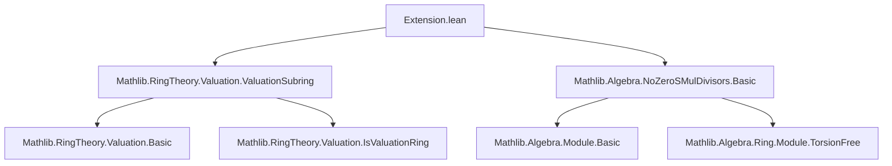
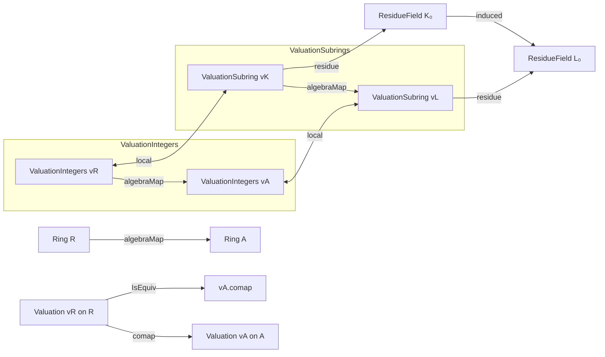

### Technical Brief: Extension of Valuations in Lean 4 (`Extension.lean`)

---

#### **1. Key Definitions & Theorems**

| Name | Type / Signature | Purpose |
|------|------------------|---------|
| `Valuation.HasExtension vR vA` | `Prop` | States that valuation `vA` on `A` extends `vR` on `R`, i.e., `vR` is equivalent to the comap of `vA` along `algebraMap R A`. |
| `val_isEquiv_comap` | `vR.IsEquiv (vA.comap (algebraMap R A))` | Witness of `HasExtension`: equivalence between `vR` and the pullback of `vA`. |
| `val_map_le_iff` | `vA (algebraMap R A x) ≤ vA (algebraMap R A y) ↔ vR x ≤ vR y` | Relates order structure via extension: comparisons in `A` reflect those in `R`. |
| `val_map_lt_iff` | `vA (algebraMap R A x) < vA (algebraMap R A y) ↔ vR x < vR y` | Strict order comparison counterpart. |
| `val_map_eq_iff` | `vA (algebraMap R A x) = vA (algebraMap R A y) ↔ vR x = vR y` | Equality of valuations lifts to equivalence. |
| `val_map_le_one_iff`, `val_map_lt_one_iff`, `val_map_eq_one_iff` | `vA (algebraMap R A x) ⋙ 1 ↔ vR x ⋙ 1` (`⋙ ∈ {≤, <, =}`) | Characterize membership in valuation integer rings via extension. |
| `ofComapInteger` | `(vA.integer.comap (algebraMap K A) = vK.integer) → vK.HasExtension vA` | Gives a sufficient condition for extension using equality of valuation integer subrings (when source is a field). |
| `instAlgebra_valuationSubring` | `Algebra K₀ L₀` | Induced algebra structure on valuation subrings (denoted `K₀`, `L₀`) under extension. |
| `algebraMap_mem_valuationSubring` | `x : K₀ → algebraMap K L x ∈ L₀` | Shows algebra map sends valuation integers to valuation integers. |
| `algebraMap_mem_maximalIdeal_iff` | `algebraMap K₀ L₀ x ∈ 𝔪_{L₀} ↔ x ∈ 𝔪_{K₀}` | Maximal ideal behavior under extension (crucial for local properties). |
| `maximalIdeal_comap_algebraMap_eq_maximalIdeal` | `(𝔪_{L₀}).comap (algebraMap K₀ L₀) = 𝔪_{K₀}` | Comap of maximal ideals coincides — key for lying-over. |
| `instIsLocalHom_valuationSubring` | `IsLocalHom (algebraMap K₀ L₀)` | Algebra map between valuation subrings is local. |
| `instance id` | `vR.HasExtension vR` | Reflexivity of extension (trivial case). |

---

#### **2. Naming Conventions**

- **Prefixes**:
  - `val_`: Relates to valuation maps (e.g., `val_map_le_iff`, `val_smul`).
  - `algebraMap_`: Pertains to induced maps from `R → A` or subrings (e.g., `algebraMap_injective`, `algebraMap_mem_...`).
  - `inst_`: Typeclass instances (e.g., `instAlgebra_valuationSubring`, `instIsScalarTower_valuationSubring`).
  - `of_`: Constructive introduction rules (e.g., `ofComapInteger`).
- **Suffixes**:
  - `_iff`: Biconditional characterizations (`val_map_le_iff`, `algebraMap_mem_maximalIdeal_iff`).
  - `_integer`: Refers to valuation integer subrings (`instAlgebraInteger`, `val_smul`).
  - `_valuationSubring`: Refers to valuation *subrings* (not just integers), denoted `K₀`, `L₀`.

---

#### **3. Tactic Stack**

Frequent tactics used in proofs:
- `simp` / `simp_rw`: Simplification using definitional equalities and lemmas (e.g., `val_map_le_one_iff`).
- `rw`: Rewriting with equivalences (`val_isEquiv_comap`, `isEquiv_iff_val_le_one`).
- `exact`, `intro`, `apply`: Basic proof construction.
- ` rfl`: For definitional equalities (e.g., coercion of smul).
- `and_congr`, `not_le`, `le_antisymm`: Logical manipulations for biconditionals and order.
- `subsingleton.elim`, `subtype.ext`: For equality in subtypes (e.g., valuation integers).
- `isUnit_map_iff`, `mem_integer_iff`: Valuation-specific lemmas from `Mathlib`.

---

#### **4. Proof Logic**

- **General Strategy**:
  - Most proofs reduce to properties of `IsEquiv`, especially via `val_isEquiv_comap`.
  - For statements about `R`, lift to `A` via `algebraMap R A`, then use equivalence.
  - When `R = K` is a field, use `ofComapInteger` to deduce extension from equality of integer rings.
  - For local ring properties (e.g., maximal ideals, residue fields), rely on:
    - `IsLocalHom` lemmas,
    - `mem_maximalIdeal`, `mem_nonunits`,
    - `algebraMap_mem_valuationSubring` to ensure maps land in correct subrings.

- **Inductive/Structural Flow**:
  - Often: `intro x`, `rw [val_isEquiv_comap]`, `simp`, `apply ...`.
  - For integer ring constructions: verify closure under smul using `val_map_le_one_iff`.
  - For residue field maps: use `rfl` after unfolding definitions.

---

#### **5. Imports & Dependencies**

| Module | Role |
|--------|------|
| `Mathlib.RingTheory.Valuation.ValuationSubring` | Core valuation theory: valuation rings, integers, maximal ideals, residue fields. |
| `Mathlib.Algebra.NoZeroSMulDivisors.Basic` | Ensures torsion-freeness and injectivity properties (e.g., `FaithfulSMul.algebraMap_injective`). |
| `Mathlib.Algebra.Module.Basic` (via `open Module`) | For `smul`, `algebra`, `IsScalarTower`, etc. |

---

#### **6. Mermaid Diagrams**

##### **Dependency Graph (Module-Level)**



##### **Conceptual Overview of Extension Theory**



##### **Proof Structure Flow (Typical Lemma)**

```mermaid
graph TD
  A[Goal: vA(algMap x) ⋙ vA(algMap y)] --> B[Use val_isEquiv_comap]
  B --> C[Reduce to vR x ⋙ vR y]
  C --> D[Apply hypothesis or definition]
  D --> E[Conclude via iff-intro]
```

---

#### **7. Summary**

This file formalizes the *extension of valuations* in the context of algebra extensions $ R \to A $, using *valuation equivalence* rather than strict equality to accommodate normalization freedom (e.g., uniformizer vs. prime $ p $). It establishes foundational properties (order, equality, integrality, local behavior) and constructs induced algebra structures on valuation subrings and integer rings. The theory is designed to support further development in algebraic number theory and local geometry, especially in contexts like discretely valued fields and their algebraic closures.

Let me know if you'd like a formalization roadmap or a list of missing lemmas for future work.
