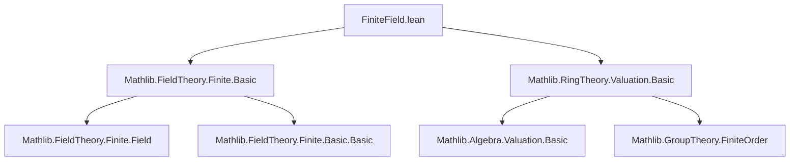
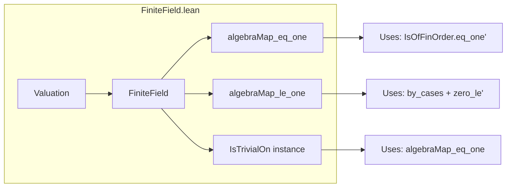

**Technical Brief: `FiniteField.lean` — Valuations on Algebras over Finite Fields**

---

### 1. **Key Definitions & Theorems**

| Name | Type / Signature | Purpose |
|------|------------------|---------|
| `algebraMap_eq_one` | `v (algebraMap Fq A a) = 1` for `a ≠ 0` | Shows that nonzero elements of the base finite field `Fq` map under the algebra map to elements of valuation `1`. |
| `algebraMap_le_one` | `v (algebraMap Fq A a) ≤ 1` for all `a : Fq` | Extends the above to include `a = 0`, giving a uniform bound. |
| `IsTrivialOn Fq` instance | `v.IsTrivialOn Fq` | Proves that the valuation is *trivial* on the image of `Fq` in `A`, i.e., it sends all nonzero elements of `Fq` to `1`. |

- **`v : Valuation A Γ₀`** is a valuation from ring `A` into a linearly ordered commutative monoid with zero `Γ₀`.
- **`algebraMap Fq A`** is the structure map of the `Fq`-algebra `A`.
- **`IsTrivialOn`** (from `Mathlib.Valuation.Basic`) means `v (algebraMap Fq A a) = 1` for all nonzero `a : Fq`.

---

### 2. **Naming Conventions**

- **Prefixes**:
  - `algebraMap_`: Relates to the algebra structure map.
  - `isOfFinOrder`: Refers to elements of finite order in a monoid.
- **Suffixes**:
  - `_eq_one`: Indicates equality to the multiplicative identity `1` in the value group/monoid.
  - `_le_one`: Indicates inequality `≤ 1`.
- **`grind` attribute**: Used in `@[grind =>]` to enable automated simplification via `grind` tactic (likely a custom or extended simplifier).

---

### 3. **Tactic Stack**

- `grind`: Used in `algebraMap_eq_one` to automate proof steps involving finite-order elements.
- `by_cases`: To split on `a = 0` or `a ≠ 0`.
- `simp_rw` (implicit via `grind` and `grind [zero_le']`): Rewriting using simplification rules and lemmas like `zero_le'`.
- `IsOfFinOrder.eq_one'`: A lemma from `Mathlib.GroupTheory.FiniteOrder` used to conclude equality to `1` for elements of finite order mapping to invertible elements.

---

### 4. **Proof Logic**

- **Core idea**: In a finite field, every nonzero element has finite multiplicative order. Since valuations are monoid homomorphisms into a *torsion-free* monoid (implicitly, as valuations are usually required to be trivial on roots of unity), such elements must map to `1`.
- **Proof sketch for `algebraMap_eq_one`**:
  1. `a ≠ 0` ⇒ `a` is a unit in `Fq`.
  2. `algebraMap Fq A a` is a unit in `A`.
  3. `v` is a monoid homomorphism ⇒ `v(algebraMap(a))` is a unit in `Γ₀`.
  4. Units in `Γ₀` that have finite order (since `a` has finite order) must be `1`, by `IsOfFinOrder.eq_one'`.
- **Proof sketch for `algebraMap_le_one`**:
  - Case split on `a = 0`:
    - If `a = 0`, then `algebraMap a = 0`, and `v 0 = 0 ≤ 1`.
    - If `a ≠ 0`, use `algebraMap_eq_one` and `le_refl`.

---

### 5. **Imports**

| Import | Purpose |
|--------|---------|
| `Mathlib.FieldTheory.Finite.Basic` | Provides basic facts about finite fields (e.g., every nonzero element has finite order, units form a finite cyclic group). |
| `Mathlib.RingTheory.Valuation.Basic` | Defines valuations, `Valuation`, `IsTrivialOn`, and related lemmas (e.g., `IsOfFinOrder.eq_one'`). |

---

### 8. **Mermaid Diagrams**

#### **Dependency Graph (Module-Level)**

#### **Overview of File Structure**

#### **Theoretical Context**

- This file sits in the *valuation theory* branch of `Mathlib`, specifically extending valuations to algebras over finite fields.
- It serves as a foundational lemma for later results where one wants to reduce questions about valuations on `Fq`-algebras to the base ring (e.g., in local class field theory or function field arithmetic).
- The triviality of valuations on finite fields is a key ingredient in ensuring that extensions of valuations are *unramified* or behave predictably over such bases.

--- 

Let me know if you'd like a formalized dependency graph for the entire `Mathlib` valuation or finite field modules.
