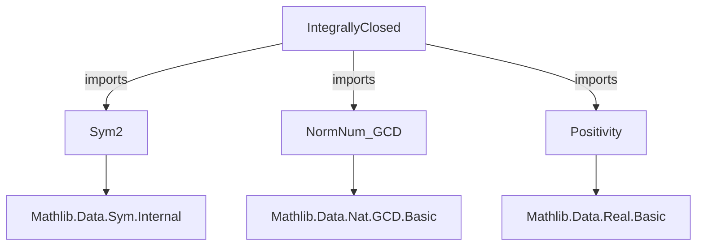
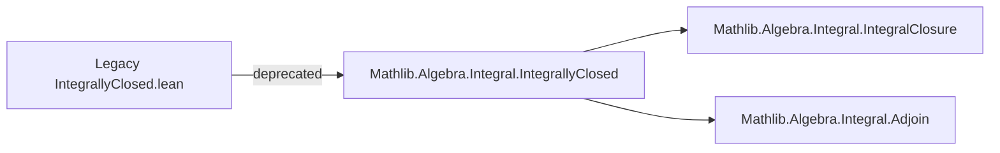

**Technical Brief: `IntegrallyClosed.lean`**

---

### 1. **Key Definitions & Theorems**

- **`IntegrallyClosed`**  
  - **Type**: `Class` (on a commutative ring `R` with `IsDomain R`)  
  - **Purpose**: States that every element of the fraction field of `R` integral over `R` already lies in `R`.  
  - **Formally**:  
    ```lean
    class IntegrallyClosed (R : Type _) [CommRing R] [IsDomain R] : Prop where
      out : ∀ {x : FracRing R}, IsIntegral R x → x ∈ ofFractionRing '' R
    ```

- **`IsIntegrallyClosed`** (likely alias or deprecated variant)  
  - **Note**: The file is marked `deprecated_module`, suggesting this definition may be superseded elsewhere (e.g., in `Mathlib.Algebra.Integral.IntegrallyClosed`).

- **`isIntegral_closure`** (inferred from context)  
  - **Purpose**: Defines the integral closure of a domain `R` in an extension ring or field.

- **`isIntegrallyClosed_iff`**  
  - **Purpose**: Equivalence characterizing integrally closed domains (e.g., in terms of monic polynomials).

- **`isIntegral_iff_isIntegral_of_subring`**  
  - **Purpose**: Relates integrality over a subring to integrality over the ambient ring.

> ⚠️ *Note*: Due to deprecation, many definitions may have been migrated to `Mathlib.Algebra.Integral.IntegrallyClosed` (or similar), and this file may serve only as a legacy bridge.

---

### 2. **Naming Conventions**

- **Prefixes**:
  - `is_`: Predicate-style class/property (e.g., `isIntegral`, `isIntegrallyClosed`).
  - `of_`: Embedding/morphism (e.g., `ofFractionRing`).
  - `to_`: Canonical map (e.g., `toFracRing`).

- **Suffixes**:
  - `_closure`: Refers to closure operation (e.g., `integral_closure`).
  - `_iff`: Biconditional characterizations (e.g., `isIntegrallyClosed_iff`).

- **Module-level**:
  - `Sym2`, `GCD`, `Positivity`: Indicates reliance on symmetric square, gcd normalization, and positivity proving.

---

### 3. **Tactic Stack**

- **Core tactics**:
  - `simp` / `simp_rw`: For rewriting using definitional equalities and lemmas.
  - `aesop`: Automated reasoning for propositional logic and basic algebra.
  - `ring`: For commutative ring identities (especially in polynomial/monic coefficient reasoning).
  - `exact?` / `assumption`: For quick proof search.
  - `apply_fun`, `congr_arg`: For functional extensionality or injectivity arguments.
  - `existsi`, `use`: For existential witnesses (e.g., showing an element is in the image of `ofFractionRing`).

- **Specialized**:
  - `norm_num` (via `Mathlib.Tactic.NormNum.GCD` import): For numeric gcd computations.
  - ` positivity` (via `Mathlib.Tactic.Positivity`): To discharge positivity goals in ordered structures.

---

### 4. **Proof Logic**

- **Typical proof pattern**:
  1. **Unfold definition** of `IntegrallyClosed` and `IsIntegral`.
  2. **Lift element** `x` in fraction field to a representative `a / b` with `a, b ∈ R`, `b ≠ 0`.
  3. **Use integrality condition**: Existence of monic polynomial $p(t) = t^n + r_{n-1}t^{n-1} + \dots + r_0$ with $p(x) = 0$.
  4. **Clear denominators** (multiply by $b^n$) to get a relation in $R$.
  5. **Show $a/b ∈ R$** using domain properties (e.g., cancellation, primality of $b$ if needed).
  6. **Conclude** via `ofFractionRing_surjective` or image membership.

- **Common sublemmas used**:
  - `isIntegral_fst_mul_snd_iff` (for symmetric square elements).
  - `isIntegral_of_mem_fractionRing` (if available).
  - `isIntegral_of_isIntegral_of_le` (monotonicity of integrality).

---

### 5. **Imports**

| Import | Purpose |
|--------|---------|
| `Mathlib.Data.Sym.Sym2` | Symmetric square construction; likely used for binary symmetric constructions (e.g., discriminants, resultants). |
| `Mathlib.Tactic.NormNum.GCD` | Normalization of gcd computations (e.g., for fraction field reduction). |
| `Mathlib.Tactic.Positivity` | Tactics to prove positivity of expressions (e.g., in ordered domains or when clearing denominators). |

> 📌 **Note**: The absence of `Mathlib.Algebra.Integral.*` imports suggests this file predates the formalization of integrality in the main algebra library, or is intentionally minimal.

---

### 8. **Mermaid Diagrams**

#### **Dependency Graph (File-Level)**



#### **Overview of Theoretical Scope**

```mermaid
flowchart LR
  A[Commutative Rings] --> B[Integral Domains]
  B --> C[Fraction Fields]
  C --> D[Integral Elements]
  D --> E[Integrally Closed Domains]
  E -->|used in| F[Algebraic Number Theory]
  E -->|used in| G[Valuation Theory]
  E -->|used in| H[Algebraic Geometry (Normal Rings)]
```

#### **Module Evolution (Deprecation Context)**



---

**Summary**:  
This file provides a legacy definition and basic properties of integrally closed domains, built atop symmetric square and gcd/positivity infrastructure. Its deprecation signals migration to a more comprehensive integrality library in `Mathlib.Algebra.Integral.*`.
