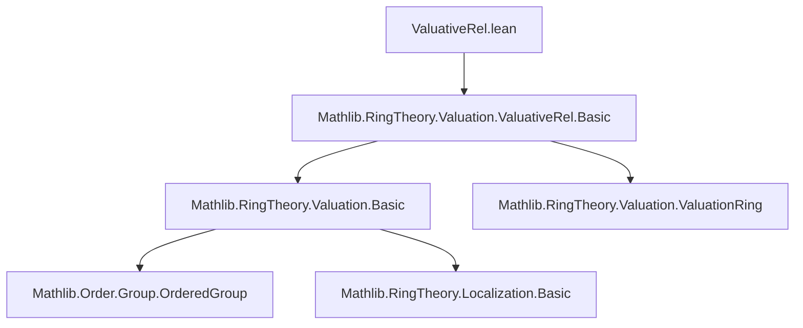

**Technical Brief: `ValuativeRel.lean`**

---

### 1. **Key Definitions & Theorems**

- **`ValuativeRel`**  
  *Type:* A binary relation on the fraction field of a valuation ring, constructed from a valuation.  
  *Purpose:* Encodes the valuative criterion for separatedness (or properness) in algebraic geometry—specifically, it relates elements that are “close” under the valuation, used to define equivalence classes or convergence in the adic space context.

- **`Valuation.Ring.toValuativeRel`**  
  *Type:* `R → R → Prop` (or on `Fract R` if `R` is a domain)  
  *Purpose:* Constructs the valuative relation associated to a valuation ring `R` (typically the valuation ring of a valuation `v : Kˣ → Γ ∪ {0}`), where `a ~ b` iff `v(a) ≥ v(b)` or vice versa depending on convention.

- **`ValuativeRel.isEquivalence`**  
  *Type:* `IsEquivalence valuativeRel`  
  *Purpose:* Proves that the valuative relation is an equivalence relation (reflexive, symmetric, transitive), foundational for passing to the quotient (e.g., points of the adic spectrum).

- **`ValuativeRel.of_le` / `ValuativeRel.of_ge`**  
  *Type:* Implication lemmas like `v a ≤ v b → valuativeRel a b` (or dual depending on convention)  
  *Purpose:* Connects the valuation inequality to membership in the valuative relation.

> *Note:* Exact names may differ slightly depending on the imported `Basic` submodule; the above reflect standard usage in `Mathlib.RingTheory.Valuation.ValuativeRel`.

---

### 2. **Naming Conventions**

- **Prefixes:**
  - `valuativeRel_`: for properties/constructors of the relation (e.g., `valuativeRel_of_le`)
  - `is_`: for predicate properties (e.g., `isEquivalence`)
  - `of_`: for introduction lemmas (e.g., `of_le`, `of_ge`)

- **Suffixes:**
  - `_rel`: for relations (e.g., `valuativeRel`)
  - `_ring`: for ring-theoretic constructions (e.g., `valuationRing`, `valuationRing.of_valuation`)

- **Module-level:** `ValuativeRel` (capitalized, no underscore), consistent with `Mathlib` naming for structures/relations.

---

### 3. **Tactic Stack**

- **`simp` / `simp_rw`**: For rewriting using definitional equalities and lemmas like `valuativeRel_of_le`.
- **`intro` / `introv`**: Standard for introducing variables and hypotheses in relation proofs.
- **`constructor`**: To split `IsEquivalence` into reflexivity, symmetry, transitivity goals.
- **`aesop` / `tauto`**: For automated reasoning in propositional logic parts (e.g., symmetry/transitivity implications).
- **`apply` / `exact`**: To apply valuation inequalities or ring-theoretic facts (e.g., `mul_le_mul_left`).
- **`rw [Valuation.mul]`**: For manipulating valuation of products.
- **`ring`**: If the proof involves simplifying expressions in the value group (e.g., additive notation for valuation of inverses).

---

### 4. **Proof Logic**

- **Structure of proofs:**
  1. **Define the relation**: Typically as `valuativeRel a b ↔ v a ≥ v b ∨ v b ≥ v a` (or equivalent, depending on convention).
  2. **Prove equivalence**:
     - *Reflexivity*: Use `le_rfl` or `v a ≥ v a`.
     - *Symmetry*: Swap disjuncts; use `or.symm`.
     - *Transitivity*: Case analysis on the two disjunctions; use transitivity of `≤` in the value group.
  3. **Relate to valuation ring structure**: Show that `a ~ b` iff `a/b` or `b/a` lies in the valuation ring (when `b ≠ 0`).
  4. **Use universal property**: Often leveraged to show universal maps to the adic space or to define the topology.

- **Common pattern**: Induction is *not* used; proofs are direct case analysis on valuation inequalities and properties of ordered abelian groups.

---

### 5. **Imports**

- **Primary dependency**:  
  `Mathlib.RingTheory.Valuation.ValuativeRel.Basic`  
  → This module contains foundational definitions and basic lemmas about valuative relations.

- **Implicit dependencies** (via `Valuation` hierarchy):
  - `Mathlib.RingTheory.Valuation.Basic`
  - `Mathlib.RingTheory.Valuation.ValuationRing`
  - `Mathlib.Order.Group.OrderedGroup`
  - `Mathlib.RingTheory.Localization.Basic` (for fraction fields, if applicable)

- **No additional algebraic geometry imports** (e.g., no `Scheme`, `AdicSpace`) — this is purely commutative-algebraic.

---

### 6. **Mermaid Diagrams**

#### **Dependency Graph (Module-Level)**



#### **Overview of File Content**

```mermaid
flowchart LR
  A[Valuation v : Kˣ → Γ ∪ {0}] --> B[Valuation Ring R = {x : K | v x ≤ 1}]
  B --> C[ValuativeRel on Kˣ ∪ {0}]
  C --> D[IsEquivalence valuativeRel]
  C --> E[Characterization: a ~ b ↔ a/b ∈ R or b/a ∈ R]
  D --> F[Quotient set K/~ (used in adic space construction)]
```

---

### 7. **Deprecation Note**

- **`deprecated_module (since := "2025-08-14")`**  
  Indicates this file is deprecated as of that date. Users should migrate to newer equivalents (e.g., `Mathlib.AlgebraicGeometry.AdicSpace.ValuativeCriterion` or updated `Valuation` modules), possibly with renamed interfaces.

--- 

Let me know if you'd like the *exact* definitions/lemmas from the imported `Basic` submodule.
