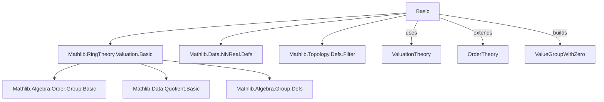

### Technical Brief: `Basic.lean` — Valuative Relations in Lean 4

---

#### **1. Key Definitions & Theorems**

| Name | Type / Signature | Purpose |
|------|------------------|---------|
| `ValuativeRel R` | `class (R : Type*) [CommRing R]` | Bundles a relation `vle : R → R → Prop` satisfying valuation-like axioms (total, transitive, additive, multiplicative compatibility, cancellation, and non-degeneracy). Notation: `x ≤ᵥ y`. |
| `vle` | `R → R → Prop` | The bundled preorder-like relation (valuation-induced). |
| `vlt` | `x <ᵥ y :↔ ¬ y ≤ᵥ x` | Strict valuative relation. |
| `veq` | `x =ᵥ y :↔ x ≤ᵥ y ∧ y ≤ᵥ x` | Valuative equality (equivalence relation). |
| `Compatible v` | `class [ValuativeRel R]` | Ensures `x ≤ᵥ y ↔ v x ≤ v y` for a valuation `v`. |
| `ValuativePreorder R` | `class [ValuativeRel R] [Preorder R]` | Says the given preorder coincides with `≤ᵥ`. |
| `ValuativeExtension A B` | *Not defined in this file* (mentioned in docstring) | Compatibility of algebra map `A → B` with valuations on `A`, `B`. |
| `IsValuativeTopology R` | *Not defined in this file* (mentioned in docstring) | Topology agrees with valuation-induced topology. |
| `posSubmonoid R` | `Submonoid R` | Submonoid of elements with positive valuation: `{ x | 0 <ᵥ x }`. |
| `valueSetoid R` | `Setoid (R × posSubmonoid R)` | Equivalence relation `(x, s) ~ (y, t) ↔ x * t ≤ᵥ y * s ∧ y * s ≤ᵥ x * t`. |
| `ValueGroupWithZero R` | `Type*` | Quotient `(R × posSubmonoid R) / valueSetoid R`. Canonical value group-with-zero. |
| `ValueGroupWithZero.mk x y` | `ValueGroupWithZero R` | Element `v(x)/v(y)` in the value group. |
| `valuation R` | `Valuation R (ValueGroupWithZero R)` | Canonical valuation associated to `ValuativeRel R`. |
| `ofValuation v` | `ValuativeRel R` | Constructs `ValuativeRel R` from any valuation `v`. |
| `isEquiv v₁ v₂` | `v₁.IsEquiv v₂` | Any two compatible valuations are equivalent (same `≤ᵥ`). |

**Key Theorems**:
- `vle_total`, `vle_trans`, `vle_add`, `mul_vle_mul_left`, `vle_mul_cancel`, `not_vle_one_zero`: Axioms of `ValuativeRel`.
- `zero_vle x`: `0 ≤ᵥ x` always holds.
- `zero_vlt_one`: `0 <ᵥ 1`.
- `mul_vle_mul_iff_left`, `mul_vlt_mul_iff_left`: Cancellation laws for multiplication by positive elements.
- `ValueGroupWithZero.linearOrder`: `ValueGroupWithZero R` is a linearly ordered commutative group with zero.
- `valuation_eq_zero_iff`: `valuation R x = 0 ↔ x ≤ᵥ 0`.
- `isEquiv`: All valuations compatible with `ValuativeRel R` are equivalent.

---

#### **2. Naming Conventions**

- **Prefixes**:
  - `vle_`, `vlt_`, `veq_`: For valuative relation, strict relation, equality.
  - `zero_`, `one_`: For special elements `0`, `1`.
  - `mul_`, `add_`: For operations.
  - `posSubmonoid_`, `valueSetoid_`, `ValueGroupWithZero_`: For constructions.
- **Suffixes**:
  - `_iff`: Equivalence with logical condition.
  - `_rfl`, `_refl`: Reflexivity lemmas.
  - `_trans`: Transitivity lemmas.
  - `_comm`: Commutativity lemmas.
  - `_ne_zero`, `_pos`: Positivity/nonzero lemmas.
- **Aliases**:
  - Deprecated aliases use `rel_`, `srel_` (old notation for `≤ᵥ`, `<ᵥ`).
  - `veq` = `AntisymmRel (· ≤ᵥ ·)`.

---

#### **3. Tactic Stack**

Frequently used tactics:
- `simp` (with `grind =`, `gcongr`, custom lemmas)
- `rw` / `simp_rw`
- `apply`, `exact`, `intro`, `cases`
- `contrapose!`, `by_cases`
- `gcongr` (for monotonicity under `≤ᵥ`)
- `ring` (for commutative ring arithmetic)
- `induction ... using ...ind` (for quotient types like `ValueGroupWithZero`)
- `apply ValueGroupWithZero.sound / exact ValueGroupWithZero.exact`
- `ext`, `propext`

---

#### **4. Proof Logic**

- **Inductive/Quotient Reasoning**: Proofs about `ValueGroupWithZero R` use `induction ... using ValueGroupWithZero.ind` to reduce to `mk x y` terms.
- **Cancellation via Positivity**: Key lemmas like `mul_vle_mul_iff_left` rely on `vle_mul_cancel` and positivity (`0 <ᵥ z`).
- **Equivalence via Compatibility**: `isEquiv` uses `vle_iff_le` to show two valuations induce same `≤ᵥ`.
- **Order-Theoretic Structure**: Linear order on `ValueGroupWithZero R` is built via `lift₂` and case analysis on zero/nonzero.
- **Canonical Valuation**: `valuation R` is defined via `mk x 1`, and its properties follow from `ValueGroupWithZero` structure.

---

#### **5. Imports**

| Module | Purpose |
|--------|---------|
| `Mathlib.RingTheory.Valuation.Basic` | Core valuation theory (definitions, `Valuation`, `map_add_le_max'`, etc.). |
| `Mathlib.Data.NNReal.Defs` | Possibly for examples or future use (NNReal is a linearly ordered semiring). |
| `Mathlib.Topology.Defs.Filter` | For `IsValuativeTopology` (not used directly in this file, but mentioned in docstring). |

---

#### **6. Mermaid Diagrams**

##### **Dependency Graph (Module-Level)**



##### **Overview of `Basic.lean` Structure**

```mermaid
flowchart LR
  A[ValuativeRel R] --> B[vle : R → R → Prop]
  A --> C[vle_total]
  A --> D[vle_trans]
  A --> E[vle_add]
  A --> F[mul_vle_mul_left]
  A --> G[vle_mul_cancel]
  A --> H[not_vle_one_zero]

  B --> I[vlt : x <ᵥ y ↔ ¬ y ≤ᵥ x]
  B --> J[veq : x =ᵥ y ↔ x ≤ᵥ y ∧ y ≤ᵥ x]

  A --> K[posSubmonoid R]
  A --> L[valueSetoid R]
  L --> M[ValueGroupWithZero R]
  M --> N[LinearOrderedCommGroupWithZero]
  M --> O[valuation R : Valuation R (ValueGroupWithZero R)]

  K --> P[valuation R (x : R) ≠ 0]
  O --> Q[Compatible v]
  Q --> R[isEquiv v₁ v₂]

  style A fill:#f9f,stroke:#333
  style M fill:#bbf,stroke:#333
  style O fill:#9f9,stroke:#333
```

---

#### **7. Future Work & Projects**

- **Refactor `Valued` → `ValuativeRel`**: As noted, `ValuativeRel` is intended to replace `Valued`.
- **Relax Axioms**: Consider dropping `vle_mul_cancel` and `not_vle_one_zero` to get a *value monoid*, then add them as mixins.
- **Topological Compatibility**: Formalize `IsValuativeTopology R`.
- **Algebra Extensions**: Formalize `ValuativeExtension A B`.
- **Valuative Spectra**: Build `ValSpec R` (space of valuative relations / equivalence classes of valuations).

---

#### **8. Notational Summary**

| Symbol | Meaning |
|--------|---------|
| `x ≤ᵥ y` | Valuative preorder (`vle x y`) |
| `x <ᵥ y` | Strict valuative order (`vlt x y`) |
| `x =ᵥ y` | Valuative equality (`veq x y`) |
| `0 <ᵥ x` | `x ∈ posSubmonoid R` |
| `v(x)` | Image of `x` under valuation `v` |
| `ValueGroupWithZero.mk x y` | `v(x)/v(y)` in value group |
| `valuation R x` | Canonical valuation `x ↦ ValueGroupWithZero.mk x 1` |

--- 

This file establishes the foundational framework for *valuative relations*, enabling reasoning about equivalence classes of valuations without fixing a specific codomain group. It is designed to be a drop-in replacement for `Valued`, with stronger algebraic structure (value *group* with zero) and better compatibility with Lean’s typeclass system.
