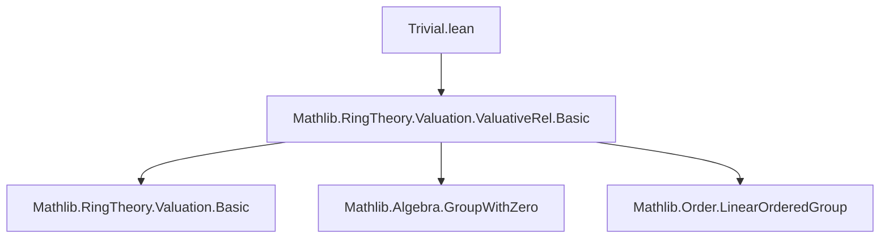
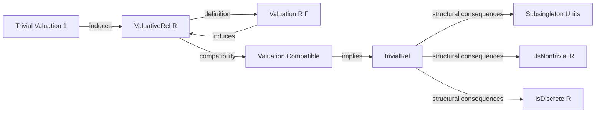
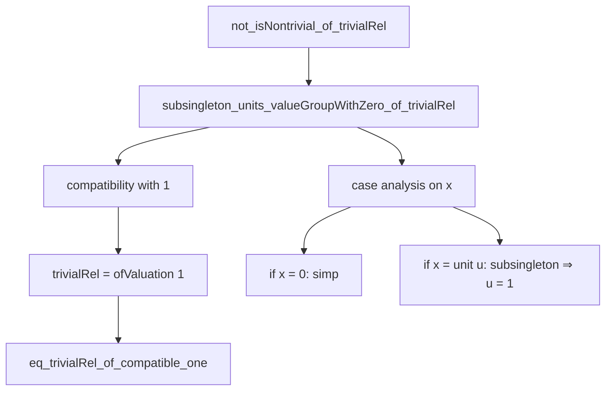

### Technical Brief: `Trivial.lean`

---

#### **1. Key Definitions & Theorems**

| Name | Type / Signature | Purpose |
|------|------------------|---------|
| `trivialRel` | `def trivialRel : ValuativeRel R` | Defines the *trivial valuative relation* on a domain `R`, where all non-zero elements are related (i.e., `vle x y ↔ y ≠ 0 ∨ x = 0`). |
| `eq_trivialRel_of_compatible_one` | `lemma` | Shows that any valuative relation compatible with the *trivial valuation* (sending all non-zero elements to `1`) must equal `trivialRel`. |
| `trivialRel_eq_ofValuation_one` | `lemma` | Identifies `trivialRel` as the valuative relation induced by the trivial valuation `1 : Valuation R Γ`. |
| `subsingleton_units_valueGroupWithZero_of_trivialRel` | `lemma` | Proves that under compatibility with the trivial valuation, the group of units of the value group with zero is subsingleton (i.e., at most one element). |
| `not_isNontrivial_of_trivialRel` | `lemma` | Shows that if `trivialRel` is compatible with some valuation, then `R` cannot have two distinct non-zero elements — i.e., `R` is not nontrivial. |
| `isDiscrete_trivialRel` | `lemma` | Proves that under the same assumptions, the valuative relation is *discrete*, i.e., there exists a minimal positive element (here `0 < 1`). |

---

#### **2. Naming Conventions**

- **Prefixes**:
  - `trivialRel_`: for definitions/lemmas about the trivial valuative relation.
  - `subsingleton_`, `not_isNontrivial_`, `isDiscrete_`: descriptive of structural consequences.
- **Suffixes**:
  - `_of_trivialRel`: indicates a property derived *from* the trivial relation.
  - `_of_compatible_one`: indicates compatibility with the trivial valuation.
- **General**:
  - `vle`, `vle_total`, `vle_trans`, etc.: standard `ValuativeRel` interface components.
  - `ofValuation`: standard constructor for valuative relations from valuations.

---

#### **3. Tactic Stack**

Frequent tactics used in proofs:

- `split_ifs`: to decompose `if ... then ... else ...` hypotheses.
- `simp_all`: simplification with local hypotheses and definitional equalities.
- `ext`: extensionality for equality of relations/functions.
- `convert`: to reduce proof goals via definitional equality.
- `rw [Units.ext_iff, ← ...]`: rewriting using unit extensionality and reversed equalities.
- `rcases ... with rfl | ⟨u, rfl⟩`: case analysis on `eq_zero_or_unit`.
- `simp [one_apply_posSubmonoid]`: simplification using properties of the trivial valuation on posSubmonoids.

---

#### **4. Proof Logic**

The logical flow across lemmas follows a consistent pattern:

1. **Characterization**: Prove `trivialRel` satisfies the `ValuativeRel` axioms (definitional verification).
2. **Uniqueness**: Show any valuative relation compatible with the trivial valuation must be `trivialRel`.
3. **Structural Consequences**:
   - Use compatibility to deduce that the value group’s unit group is subsingleton.
   - From that, deduce `R` has at most one non-zero element (`not_isNontrivial`).
   - Then show discreteness via existence of minimal positive element (`0 < 1`).

Induction is not used; instead, the proofs rely on:
- Case analysis on `x = 0 ∨ x ≠ 0` (via `GroupWithZero.eq_zero_or_unit`).
- Rewriting using `Valuation` and `ValuativeRel` interface lemmas.
- Simplification with definitional facts about the trivial valuation.

---

#### **5. Imports**

- `Mathlib.RingTheory.Valuation.ValuativeRel.Basic`: core theory of valuative relations.

This module builds on the foundational theory of valuative relations, focusing on the special case of *trivial* valuative relations.

---

#### **6. Mermaid Diagrams**

##### **Dependency Graph (Module-Level)**

##### **Overview of Theory Flow**

##### **Proof Dependency Tree (for `not_isNontrivial_of_trivialRel`)**

---

#### **7. Summary**

This file formalizes the theory of *trivial valuative relations*, showing their equivalence to the valuative relation induced by the trivial valuation, and deriving strong structural constraints on the ring `R` (e.g., non-nontriviality, discreteness). It serves as a foundational lemma block for understanding degenerate cases in valuation theory.
