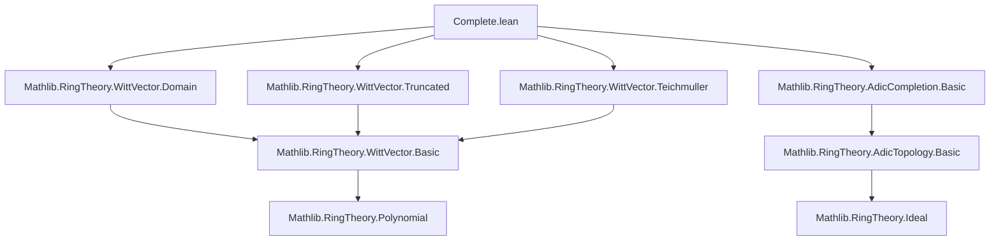
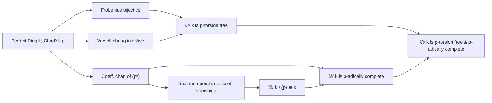

**Technical Brief: `Complete.lean` — Witt Vectors over Perfect Rings**

---

### 1. **Key Definitions & Theorems**

| Name | Type / Signature | Purpose |
|------|------------------|---------|
| `𝕎` | `ℕ → k → k` (via `WittVector p`) | Ring of *p*-typical Witt vectors over a commutative ring `k` |
| `eq_zero_of_p_mul_eq_zero` | `x * p = 0 → x = 0` | Proves `𝕎 k` is *p*-torsion free when `k` is perfect of char `p` |
| `mem_span_p_iff_coeff_zero_eq_zero` | `x ∈ (p) ↔ x.coeff 0 = 0` | Characterizes membership in the principal ideal `(p)` via vanishing of 0th coefficient |
| `mem_span_p_pow_iff_le_coeff_eq_zero` | `x ∈ (pⁿ) ↔ ∀ m < n, x.coeff m = 0` | Generalizes above to powers of `p`, linking ideal membership to initial coefficient vanishing |
| `ker_constantCoeff` | `RingHom.ker constantCoeff = (p)` | Identifies kernel of constant coefficient map with ideal `(p)` |
| `quotientPEquiv` | `𝕎 k ⧸ (p) ≃+* k` | Explicit isomorphism between mod-*p* Witt vectors and base ring `k` |
| `isAdicCompleteIdealSpanP` | `IsAdicComplete (p) (𝕎 k)` | Main result: `𝕎 k` is *p*-adically complete under perfectness and char `p` assumptions |

---

### 2. **Naming Conventions**

- **`is_` / `mem_` / `eq_` / `ker_` / `quotient_` / `le_` / `coeff_`**: Standard Lean/Mathlib naming for properties, membership, equality, kernels, quotients, and coefficient-related lemmas.
- **`_pow` suffix**: Denotes statements involving powers (e.g., `mem_span_p_pow_iff_le_coeff_eq_zero`).
- **`_iff_` suffix**: Biconditional characterizations (e.g., `mem_span_p_iff_coeff_zero_eq_zero`).
- **`_coeff_zero` / `_coeff`**: Reference to coefficient extraction at specific indices.
- **`iterate_` / `frobenius_` / `verschiebung_`**: Functional iteration and Frobenius/Verschiebung maps (standard Witt vector operations).

---

### 3. **Tactic Stack**

| Tactic | Usage Frequency | Role |
|--------|------------------|------|
| `simp_rw` | High | Rewriting with definitional equalities and simplification lemmas |
| `simp only [...]` | High | Fine-grained simplification using explicit lemmas |
| `ext` | Medium | Extensionality for function/ideal equality |
| `rwa` | Medium | Rewrite + assumption (used in `eq_zero_of_p_mul_eq_zero`) |
| `congr` | Medium | Congruence closure for functional equality |
| `calc` | Medium | Chain of equalities/relations (e.g., in `le_coeff_eq_iff_le_sub_coeff_eq_zero`) |
| `exact` / `apply` | Implicit | Used in proof scripts (e.g., via `have`, `exact` in `isAdicCompleteIdealSpanP`) |
| `ring` / `abel` | Not present | Not needed due to Witt-specific algebraic structure |

---

### 4. **Proof Logic**

- **Structure**: Modular, with two main sections:
  1. **Torsion-freeness**: Uses bijectivity of Frobenius and injectivity of Verschiebung to reduce `x * p = 0` to `x = 0`.
  2. **Ideal membership & completeness**:
     - First establishes correspondence between `(pⁿ)` and vanishing of first `n` coefficients.
     - Then proves `ker(constantCoeff) = (p)`, yielding `𝕎 k / (p) ≅ k`.
     - Finally, constructs a diagonal limit Witt vector to show Cauchy sequences converge — using `mem_span_p_pow_iff_le_coeff_eq_zero` to verify convergence coefficient-wise.

- **Inductive/Iterative Reasoning**:
  - `iterate_verschiebung_iterate_frobenius`, `eq_iterate_verschiebung`, and functional composition lemmas (`Function.Commute`, `iterate`) are used to handle higher powers of `p`.

- **Constructive Completeness Proof**:
  - Given a Cauchy sequence `x : ℕ → 𝕎 k` w.r.t. `(p)`, define limit `w` by `w.coeff n = (x (n+1)).coeff n`.
  - Show `x n → w` by checking coefficient-wise convergence using `mem_span_p_pow_iff_le_coeff_eq_zero`.

---

### 5. **Imports & Dependencies**

| Import | Role |
|--------|------|
| `Mathlib.RingTheory.WittVector.Domain` | Basic theory of Witt vectors over domains |
| `Mathlib.RingTheory.WittVector.Truncated` | Truncation maps, coefficient extraction, `truncate` |
| `Mathlib.RingTheory.WittVector.Teichmuller` | Teichmüller representatives, Frobenius, Verschiebung |
| `Mathlib.RingTheory.AdicCompletion.Basic` | Adic topology, completeness, Hausdorffness definitions |

**Core dependencies**:
- `CharP`, `PerfectRing`, `RingTheory.Ideal`, `RingTheory.AdicTopology`, `RingTheory.Frobenius`, `RingTheory.Verschiebung`.

---

### 6. **Mermaid Diagrams**

#### **Dependency Graph (Module-Level)**

#### **Overview of Theory Flow**

---

### 7. **Summary**

This file establishes foundational structural properties of Witt vectors over perfect rings of characteristic `p`. It shows:
- **Algebraic torsion-freeness** via Frobenius/verschiebung interplay.
- **Ideal-theoretic control** of powers of `p` via coefficient conditions.
- **Topological completeness** by constructing limits coefficient-wise.

These results are essential for deeper applications (e.g., construction of `p`-adic Hodge theory objects like `B_{dR}`, `C_{\mathrm{st}}`, etc.), where `𝕎 k` serves as a lift of `k` to characteristic zero.

--- 

Let me know if you'd like a formalized dependency graph (e.g., for `leanproject`), or a summary of related files in the Witt vector hierarchy.
