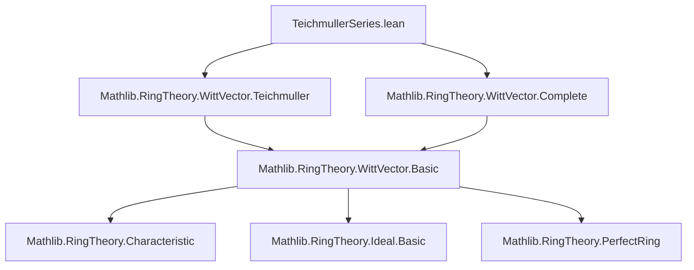
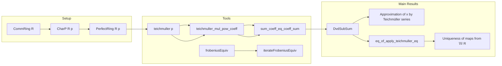

### Technical Brief: `TeichmullerSeries.lean`

---

#### **1. Key Definitions & Theorems**

| Name | Type / Signature | Purpose |
|------|------------------|---------|
| `teichmuller p x` | `R → 𝕎 R` | Teichmüller lift: canonical section of the Frobenius on Witt vectors over a perfect ring. |
| `frobeniusEquiv R p` | `R ≃ₐ[𝔽ₚ] R` (when `PerfectRing R p`) | Frobenius automorphism on a perfect ring of characteristic `p`. |
| `sum_coeff_eq_coeff_sum` | `(∑ s ∈ S, x s).coeff n = ∑ s ∈ S, (x s).coeff n` | Interchange finite sum and coefficient extraction under disjoint support condition. |
| `teichmuller_mul_pow_coeff` | `(teichmuller p x * p ^ n).coeff n = x ^ p ^ n` | Coefficient formula for Teichmüller lift multiplied by `pⁿ`. |
| `teichmuller_mul_pow_coeff_of_ne` | `(teichmuller p x * p ^ n).coeff m = 0` if `m ≠ n` | Support of `teichmuller p x * pⁿ` is concentrated at degree `n`. |
| `dvd_sub_sum_teichmuller_iterateFrobeniusEquiv_coeff` | `p^(n+1) ∣ x - ∑_{i ≤ n} teichmuller p (Frob⁻ⁱ(x.coeff i)) * p^i` | Approximation of `x` by partial Teichmüller series up to order `n`. |
| `eq_of_apply_teichmuller_eq` | `f = g` if `f ∘ teichmuller = g ∘ teichmuller` and `p` nilpotent in codomain | Uniqueness of ring maps from `𝕎 R` when `p` is nilpotent and they agree on Teichmüller lifts. |

---

#### **2. Naming Conventions**

- **Prefixes**:
  - `teichmuller_`: functions/properties related to the Teichmüller lift.
  - `dvd_sub_`: divisibility statements involving subtraction from a sum.
  - `eq_of_apply_`: uniqueness lemmas for maps determined by their values on a generating set.

- **Suffixes**:
  - `_coeff`: refers to coefficient-level behavior.
  - `_of_ne`: conditional version when indices differ.
  - `_iter`: indicates iteration of Frobenius (e.g., `iterateFrobeniusEquiv`).

- **Notation**:
  - `𝕎 R` for `WittVector p R`.
  - `teichmuller p x` often abbreviated as `[x]` in literature; here kept explicit.

---

#### **3. Tactic Stack**

- **Core tactics**:
  - `simp`, `rw`, `ext`, `intro`, `cases`, `induction`, `refine`, `choose`
- **Specialized**:
  - `Finset.sum_congr`, `Finset.sum_eq_add_sum_diff_singleton`
  - `Ideal.mem_span_singleton`, `mem_span_p_pow_iff_le_coeff_eq_zero`
  - `Nat.lt_or_lt_of_ne`, `Nat.zero_lt_sub_of_lt`, `zero_pow`
- **Automation**:
  - `aesop` not used explicitly — proofs are mostly manual and coefficient-focused.
  - `ring` not used — arithmetic handled via `simp` + lemmas like `mul_pow_charP_coeff_succ`.

---

#### **4. Proof Logic**

- **Structure of main proofs**:
  - **`dvd_sub_sum_teichmuller_iterateFrobeniusEquiv_coeff`**:
    1. Reduce divisibility to coefficient-wise vanishing modulo `p^(n+1)`.
    2. Use `sum_coeff_eq_coeff_sum` to commute sum and coefficient.
    3. Isolate the `i = n+1` term using `Finset.sum_eq_add_sum_diff_singleton`.
    4. Apply `teichmuller_mul_pow_coeff_of_ne` to kill off-diagonal terms.
    5. Conclude coefficient vanishes.

  - **`eq_of_apply_teichmuller_eq`**:
    1. Use nilpotence: pick `n` s.t. `pⁿ = 0`.
    2. Apply `dvd_sub_sum_teichmuller_iterateFrobeniusEquiv_coeff` to get `x - Sₙ = pⁿ·y`.
    3. Apply `f` and `g`; use `pⁿ = 0` to kill error term.
    4. Expand `Sₙ` as finite sum; use hypothesis `f ∘ teichmuller = g ∘ teichmuller`.
    5. Conclude `f(x) = g(x)`.

- **Induction**: Used only in `sum_coeff_eq_coeff_sum`, via `Finset.induction`.

---

#### **5. Imports & Dependencies**

- **Core imports**:
  ```lean
  Mathlib.RingTheory.WittVector.Complete
  Mathlib.RingTheory.WittVector.Teichmuller
  ```
- **Key underlying theories**:
  - Witt vectors over rings of characteristic `p`.
  - Frobenius automorphism and perfect rings.
  - Ideal theory: divisibility, `p`-adic topology, nilpotence.
  - Finite sums over `Finset`, coefficient extraction.

---

#### **6. Mermaid Diagrams**

##### **Dependency Graph (Module-Level)**



##### **Overview of Theory Flow**



---

#### **7. Future Work (from TODO)**

- **Uniqueness of Teichmüller series expansion**: Show that if  
  $x = \sum_{i=0}^\infty [a_i] p^i = \sum_{i=0}^\infty [b_i] p^i$,  
  then $a_i = b_i$ for all $i$.  
  Likely requires showing coefficient extraction via Frobenius iterations.

---

#### **8. Summary**

This module formalizes the foundational theory of **Teichmüller expansions** of Witt vectors over perfect rings of characteristic `p`. It establishes:
- A precise approximation property (`dvd_sub_sum_teichmuller_iterateFrobeniusEquiv_coeff`),
- A rigidity result (`eq_of_apply_teichmuller_eq`) for ring homomorphisms out of `𝕎 R`,
- Technical lemmas on coefficient behavior of `teichmuller p x * pⁿ`.

The proofs rely heavily on the interplay between the Frobenius automorphism, `p`-adic topology, and finite support properties of the Teichmüller lift. The formalization is precise, with minimal automation, and sets the stage for deeper structural results (e.g., uniqueness of expansion, structure of `𝕎 R` as a complete topological ring).
