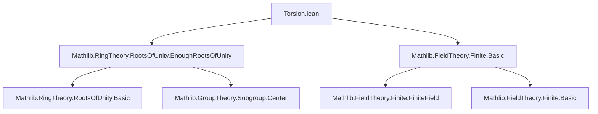

**Technical Brief: `Torsion.lean` — Torsion Group of `ZMod p` for Prime `p`**

---

### 1. **Key Definitions & Theorems**

| Name | Type / Signature | Purpose |
|------|------------------|---------|
| `rootsOfUnity_eq_top` | `∀ {p : ℕ} [Fact p.Prime], rootsOfUnity (p - 1) (ZMod p) = ⊤` | Shows that all nonzero elements of `ZMod p` are `(p−1)`-th roots of unity; i.e., the group of `(p−1)`-th roots of unity equals the entire ring (viewed additively as a `ℤ`-module, but multiplicatively as the unit group). |
| `HasEnoughRootsOfUnity.of_card_le` | (Instance constructor) | A general criterion to prove `HasEnoughRootsOfUnity` by bounding the number of roots of unity from below. |
| `MulEquiv.subgroupCongr` | `MulEquiv (units : subgroup G) ≃* units G` | Used to transport structure via equivalence of subgroups. |
| `pow_card_sub_one_eq_one` | `∀ u : ZMod pˣ, u ^ (p - 1) = 1` | Fermat’s little theorem in multiplicative form for units in `ZMod p`. |

---

### 2. **Naming Conventions**

- **Prefixes**:
  - `rootsOfUnity_`: for lemmas about the `rootsOfUnity` subgroup.
  - `pow_`: for exponentiation lemmas (e.g., `pow_card_sub_one_eq_one`).
- **Suffixes**:
  - `_eq_top`: indicates equality with the top element (i.e., the full group/ring).
  - `_congr`: for equivalences induced by group/ring isomorphisms.
- **Typeclass suffixes**:
  - `HasEnoughRootsOfUnity`: standard naming in Mathlib for typeclasses encoding existence of many roots of unity.

---

### 3. **Tactic Stack**

- `ext`: extensionality (to prove equality of subgroups/sets).
- `simpa [Units.ext_iff] using …`: simplifies using a given lemma and rewrites using unit extensionality.
- `have : … := …; grind`: uses `grind` (a `Lean` tactic for solving arithmetic goals, especially with `Nat` inequalities).
- `refine …`: to construct an instance with a hole to be filled later.
- `rw [Nat.card_eq_fintype_card]`: rewrites cardinality of finite types.
- `simp [Fintype.card_units]`: simplifies using known cardinalities of unit groups.

---

### 4. **Proof Logic**

The proof proceeds as follows:

1. **Goal**: Show `rootsOfUnity (p − 1) (ZMod p) = ⊤`.
   - Use `ext` to reduce to element-wise inclusion.
   - Apply `pow_card_sub_one_eq_one`, which says every unit $u$ satisfies $u^{p-1} = 1$, hence lies in `rootsOfUnity (p−1)`.
   - Since `ZMod p` is a field, all nonzero elements are units, and `rootsOfUnity` is defined as a subgroup of the *additive* group but interpreted multiplicatively via units — the `simpa` step uses `Units.ext_iff` to conclude equality with `⊤`.

2. **Instance**: `HasEnoughRootsOfUnity (ZMod p) (p − 1)`
   - First, show `p − 1 ≠ 0` using `grind` and `Nat.Prime.two_le`.
   - Use `HasEnoughRootsOfUnity.of_card_le` to reduce to showing:
     $$
     \# \mu_{p-1}(ZMod\,p) \ge p - 1
     $$
   - Apply `MulEquiv.subgroupCongr` to get an equivalence between the roots-of-unity subgroup and the unit group.
   - Use `Nat.card_congr` to equate cardinalities.
   - Simplify using `Fintype.card_units`, which gives $\#(ZMod\,p)^\times = p - 1$.

---

### 5. **Imports**

- `Mathlib.RingTheory.RootsOfUnity.EnoughRootsOfUnity`: provides the `HasEnoughRootsOfUnity` typeclass and related lemmas (e.g., `of_card_le`, `rootsOfUnity` definition).
- `Mathlib.FieldTheory.Finite.Basic`: provides `pow_card_sub_one_eq_one`, structure of finite fields, and facts about `ZMod p` for prime `p`.

---

### 8. **Mermaid Diagrams**

#### **Dependency Graph (Module-Level)**



#### **Overview of Theoretical Flow**

```mermaid
flowchart LR
  A[Prime p] --> B[ZMod p is a field]
  B --> C[Units of ZMod p have order p−1]
  C --> D[Every unit satisfies x^(p−1) = 1]
  D --> E[All nonzero elements are (p−1)-th roots of unity]
  E --> F[rootsOfUnity(p−1) = ⊤]
  F --> G[HasEnoughRootsOfUnity holds]
```

---

**Summary**: This module formalizes the classical result that the multiplicative group of the finite field $\mathbb{F}_p$ is cyclic of order $p-1$, and hence contains exactly $p-1$ roots of unity — i.e., all nonzero elements. It leverages `HasEnoughRootsOfUnity` to encode this algebraic richness for future use in cyclotomic or representation-theoretic developments.
