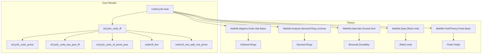
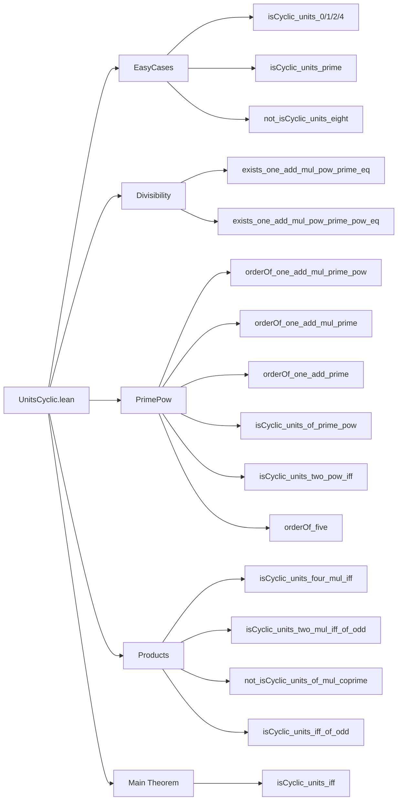

### Technical Brief: `UnitsCyclic.lean`

---

#### **1. Key Definitions & Theorems**

| Name | Type / Signature | Purpose |
|------|------------------|---------|
| `isCyclic G` | `Class.IsCyclic (G : Type _) [Group G]` | States that group `G` is cyclic (has a generator). |
| `ZMod.isCyclic_units_zero` | `IsCyclic (ZMod 0)ˣ` | Units of `ℤ` (via `ZMod 0 ≃* ℤ`) form a cyclic group of order 2. |
| `ZMod.isCyclic_units_one` | `IsCyclic (ZMod 1)ˣ` | Trivial group is cyclic. |
| `ZMod.isCyclic_units_two` | `IsCyclic (ZMod 2)ˣ` | Units of `𝔽₂` is trivial → cyclic. |
| `ZMod.isCyclic_units_four` | `IsCyclic (ZMod 4)ˣ` | Units of `ℤ/4ℤ` ≅ `C₂`, cyclic. |
| `ZMod.isCyclic_units_prime` | `p.Prime → IsCyclic (ZMod p)ˣ` | Multiplicative group of finite field `𝔽ₚ` is cyclic. |
| `ZMod.not_isCyclic_units_eight` | `¬ IsCyclic (ZMod 8)ˣ` | Units modulo 8 form `C₂ × C₂`, not cyclic. |
| `ZMod.orderOf_one_add_mul_prime` | `p.Prime ∧ p ≠ 2 ∧ ¬ p ∣ a → orderOf (1 + p * a) = p ^ n` | Order of `1 + pa` mod `p^(n+1)` is `p^n`. |
| `ZMod.orderOf_one_add_mul_prime_pow` | `p.Prime ∧ m ≠ 0 ∧ m+2 ≤ p*m ∧ ¬ p ∣ a → orderOf (1 + p^m * a) = p^n` | Generalization for higher powers. |
| `ZMod.orderOf_five` | `orderOf (5 : ZMod (2^(n+2))) = 2^n` | Key generator for 2-power units when `n ≥ 0`. |
| `ZMod.isCyclic_units_of_prime_pow` | `p.Prime ∧ p ≠ 2 → IsCyclic (ZMod (p^n))ˣ` | Odd prime power units are cyclic. |
| `ZMod.isCyclic_units_two_pow_iff` | `IsCyclic (ZMod (2^n))ˣ ↔ n ≤ 2` | Units modulo `2^n` cyclic only for `n ≤ 2`. |
| `ZMod.isCyclic_units_iff` | Main theorem: `(ZMod n)ˣ` cyclic ⇔ `n ∈ {0,1,2,4} ∪ {p^m, 2p^m | p odd prime, m ≥ 1}` | Full classification. |

---

#### **2. Naming Conventions**

- **Prefixes**:
  - `isCyclic_units_`: for unit-group cyclicity results.
  - `orderOf_`: for explicit order computations.
  - `not_isCyclic_`: negative cyclicity results.
- **Suffixes**:
  - `_iff`: biconditional characterizations.
  - `_pow`: for statements involving powers (e.g., `prime_pow`, `two_pow`).
- **Variables**:
  - `p`: usually a prime.
  - `n`, `m`: natural exponents.
  - `a`: integer coefficient, often with coprimality or non-divisibility condition.

---

#### **3. Tactic Stack**

Frequently used tactics:
- `inferInstance`: for trivial cyclic instances (e.g., small moduli).
- `simp` / `simp_rw`: simplification with definitions (`card_units_eq_totient`, `ZMod.isUnit_iff_coprime`, etc.).
- `rw`: rewriting using lemmas like `orderOf_map_dvd`, `totient_prime_pow_succ`.
- `obtain ⟨x, hx⟩`: destruct existential hypotheses.
- `congr!` / `congr 1`: for congruence-based simplifications.
- `ring`: polynomial simplifications in `ℤ` or `ZMod`.
- `lia`: linear integer arithmetic (e.g., bounding exponents).
- `have / suffices`: intermediate lemma introduction.
- `apply mt` / `intro`: for contradiction proofs (e.g., `not_isCyclic_units_eight`).
- `convert`: for flexible equality proofs (e.g., `orderOf_five`).
- `grind`: final automation for arithmetic goals.

---

#### **4. Proof Logic**

The proofs follow a **structured case analysis** guided by number-theoretic structure:

1. **Base Cases** (`n = 0,1,2,4,8`):
   - Verified via `inferInstance`, `simp`, or contradiction (`not_isCyclic_units_eight`).

2. **Odd Prime Powers**:
   - Construct explicit generators:
     - `1 + p` has order `p^n` (via `orderOf_one_add_prime`).
     - Lift primitive root mod `p` to `p^n` via Hensel lifting (`ZMod.unitsMap_surjective`).
   - Combine generators using coprimality of orders (`orderOf_mul_eq_mul_orderOf_of_coprime`).

3. **2-Power Cases**:
   - Use `orderOf_five` to generate units modulo `2^(n+2)`.
   - Show cyclicity only for `n ≤ 2` via `isCyclic_units_two_pow_iff`.

4. **General `n` via CRT & Factorization**:
   - Decompose `n = 2^k * m` with `m` odd.
   - Use `chineseRemainder` to split `ZMod n ≃ ZMod 2^k × ZMod m`.
   - Apply `isCyclic_prod_iff` and analyze parity of `φ(n)`.

5. **Contrapositive Arguments**:
   - For non-cyclic cases (e.g., `n = 8`, or `n = m*n` with two odd coprime factors >1), use surjectivity of unit maps and product structure.

All arguments rely heavily on:
- Structure of `ZMod n` as a product via CRT.
- Totient function properties (`φ(p^k) = p^{k-1}(p-1)`).
- Order computations in cyclic groups and lifting.

---

#### **5. Imports**

| Module | Purpose |
|--------|---------|
| `Mathlib.Algebra.Order.Star.Basic` | Ordered star rings (used for `*`-structure, e.g., in `ZMod`). |
| `Mathlib.Analysis.Normed.Ring.Lemmas` | Normed ring lemmas (e.g., for `ZMod` as a quotient). |
| `Mathlib.Data.Nat.Choose.Dvd` | Divisibility properties of binomial coefficients (key for `exists_one_add_mul_pow_prime_eq`). |
| `Mathlib.Data.ZMod.Units` | Basic facts about units in `ZMod n`. |
| `Mathlib.FieldTheory.Finite.Basic` | Finite field theory (e.g., cyclicity of `𝔽ₚˣ`). |

---

#### **6. Mermaid Diagrams**

##### **Dependency Graph (High-Level)**

##### **Overview of File Structure**

---

#### **7. Theory Context**

This file formalizes a classical result in elementary number theory: the classification of integers `n` for which the multiplicative group of units modulo `n` is cyclic. It is foundational for:
- Structure theory of finite abelian groups.
- Constructive Galois theory (e.g., existence of primitive roots).
- Cryptography (e.g., cyclic groups for Diffie–Hellman).

The proofs are constructive in nature (e.g., explicit generators like `5` for `2^(n+2)`), and rely on:
- Chinese Remainder Theorem.
- Hensel-type lifting for orders.
- Properties of Euler’s totient function.

The formalization closely follows Ireland & Rosen’s *A Classical Introduction to Modern Number Theory*, Chapter 4.

--- 

Let me know if you'd like a **dependency graph of theorems** or a **proof sketch for `isCyclic_units_iff`** in natural language.
