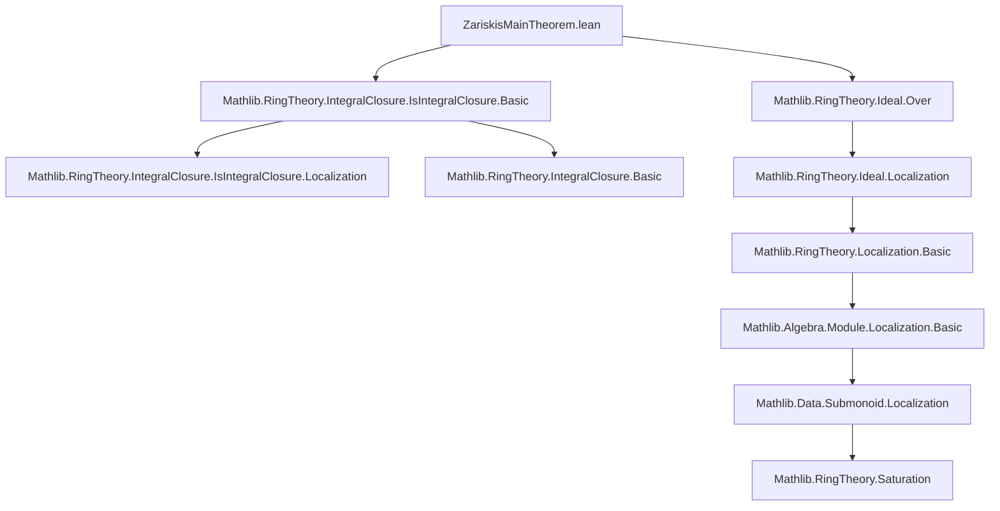
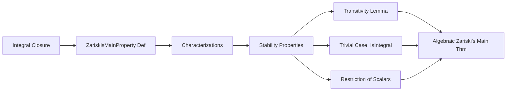

### Technical Brief: `ZariskisMainTheorem.lean`

---

#### **1. Key Definitions & Theorems**

| Name | Type / Signature | Purpose |
|------|------------------|---------|
| `ZariskisMainProperty` | `Ideal S → Prop` | Defines the *Zariski main property* at a prime ideal `p ⊆ S`: existence of a unit `r ∉ p` in the integral closure `S'` such that localization at `r` trivializes the extension `S' → S`. |
| `zariskisMainProperty_iff` | `ZariskisMainProperty R p ↔ ∃ r ∉ p, IsIntegral R r ∧ ∀ x, ∃ m, IsIntegral R (r ^ m * x)` | Equivalence reformulating the property in terms of integrality and powers — useful for constructive proofs. |
| `zariskisMainProperty_iff'` | `ZariskisMainProperty R p ↔ ∃ r ∉ p, ∀ x, ∃ m, IsIntegral R (r ^ m * x)` | Simplified version dropping explicit `IsIntegral R r` (since it follows from `r ∈ integralClosure`). |
| `zariskisMainProperty_iff_exists_saturation_eq_top` | `ZariskisMainProperty R p ↔ ∃ r ∉ p, ∃ h, (integralClosure R S).saturation (.powers r) = ⊤` | Connects the property to *saturation* of submonoids — aligns with geometric intuition (open immersion = saturation = whole ring). |
| `ZariskisMainProperty.restrictScalars` | `[Algebra S T] → IsScalarTower R S T → IsIntegral R S → ZariskisMainProperty S p → ZariskisMainProperty R p` | Base-change compatibility: if property holds over `S`, and `S/R` is integral, then it holds over `R`. |
| `ZariskisMainProperty.trans` | `[IsScalarTower R S T] → p : Ideal T → p.IsPrime → ZariskisMainProperty R (p.under S) → (∃ r ∉ p.under S, … = ⊤) → ZariskisMainProperty R p` | Transitivity: gluing property along intermediate algebras using saturation condition. |
| `ZariskisMainProperty.of_isIntegral` | `[p.IsPrime] → IsIntegral R S → ZariskisMainProperty R p` | Trivial case: if `S` is integral over `R`, then property holds everywhere. |

---

#### **2. Naming Conventions**

- **Prefixes**:
  - `zariskisMainProperty_`: lemmas about the core definition.
  - `ZariskisMainProperty.`: lemmas about *properties* of the predicate (e.g., stability under base change).
- **Suffixes**:
  - `_iff`, `_iff'`, `_iff_exists_saturation_eq_top`: characterizations of the predicate.
  - `restrictScalars`, `trans`, `of_isIntegral`: structural lemmas (functoriality, transitivity, degenerate case).
- **Variables**:
  - `r`, `s`, `t`: elements in integral closure or base rings.
  - `m`, `n`, `k`: natural exponents for powers.
  - `H`, `Hs`, `Ht`: hypotheses from previous lemmas or assumptions.

---

#### **3. Tactic Stack**

| Tactic | Usage Frequency | Role |
|--------|-----------------|------|
| `simp only` / `simp` | High | Simplify using definitions (`integralClosure`, `ZariskisMainProperty`, `saturation`, `Localization.awayMap`). |
| `rw` | High | Rewrite using equivalences (`zariskisMainProperty_iff`, etc.). |
| `exact` / `convert_to` | Medium | Construct witnesses or adjust terms up to definitional equality. |
| `obtain ⟨…⟩ := …` | High | Destruct existential/universal quantifiers and hypotheses. |
| `ring` | Medium | Simplify polynomial expressions in exponents (e.g., `(m + 1) * n`). |
| `simpa` | Medium | Simplify goals using assumptions (e.g., `simpa using …`). |
| `convert_to` + `ring` | Medium | Adjust target to match integrality conditions via algebra homomorphism properties. |
| `exact .algebraMap (...)` | Low | Use `IsIntegral.algebraMap` to lift integrality along algebra maps. |

---

#### **4. Proof Logic**

The proofs follow a **constructive-existential pattern**, often involving:

1. **Unfolding definitions** via `simp` and `rw`.
2. **Extracting witnesses** (`obtain ⟨r, hrp, H⟩`) from equivalences.
3. **Constructing new elements** (e.g., `s ^ (m + 1) * t`) to satisfy the required properties.
4. **Verifying non-membership** in primes using `primeCompl` and multiplicative closure.
5. **Leveraging integrality closure properties**:
   - `IsIntegral.pow_iff`
   - `IsIntegral.algebraMap`
   - `isIntegral_trans`
6. **Saturation-based reasoning** for localization triviality.

**Typical flow** (e.g., in `ZariskisMainProperty.trans`):
- Use `h₁` to get `s ∉ p.under S` controlling integrality over `R`.
- Use `h₂` to get `t ∉ p.under S` controlling triviality over `S → T`.
- Combine them into `s^{m+1} * t` to dominate both conditions.
- Prove non-membership via primality and multiplicative closure.
- Show integrality of arbitrary `x ∈ T` by expressing it via `a ∈ S` and `t`, using powers to absorb denominators.

---

#### **5. Imports & Dependencies**

| Module | Role |
|--------|------|
| `Mathlib.RingTheory.Ideal.Over` | For `Ideal.under`, extension/contraction of ideals along algebra maps. |
| `Mathlib.RingTheory.IntegralClosure.IsIntegralClosure.Basic` | For `integralClosure`, `IsIntegral`, and basic localization theory. |
| `Mathlib.Algebra.Module.Localization.Basic` (implicit via `Localization.awayMap`) | For localization at multiplicative sets (powers of `r`). |
| `Mathlib.RingTheory.Saturation` (implicit via `.saturation`) | For saturation of submonoids and its relation to localization. |
| `Mathlib.Data.Polynomial.Basic` (via `open Polynomial`) | For `pow`, `mul`, etc., in exponent arithmetic. |

---

#### **6. Mermaid Diagrams**

##### **Dependency Graph (Module-Level)**



##### **Overview of Theoretical Flow**



##### **Proof Strategy Skeleton (for `trans`)**

```mermaid
flowchart TD
  A[h₁: ZMP over R at p.under S] --> B[Get s ∉ p.under S, control integrality]
  C[h₂: saturation condition over S] --> D[Get t ∉ p.under S, control triviality]
  B & D --> E[Combine: r := s^{m+1} * t]
  E --> F[Prove r ∉ p via primality]
  E --> G[Show ∀x, ∃k: IsIntegral R(r^k * x)]
  F & G --> H[ZariskisMainProperty R p]
```

---

#### **7. Open Tasks (TODO)**

- **Final theorem statement** is not yet proven — only the *property* and its basic properties are formalized.
- The target theorem (as per comment) is:
  ```lean
  example {R S : Type*} [CommRing R] [CommRing S] [Algebra R S] [Algebra.FiniteType R S]
      (p : Ideal S) [p.IsPrime] [Algebra.QuasiFiniteAt R p] : ZariskiMainProperty R p
  ```
  This requires:
  - Formalizing `Algebra.QuasiFiniteAt`
  - Proving that finite type + quasi-finite ⇒ ZMP (the core content of Zariski’s Main Theorem).
- Likely intermediate steps involve:
  - Noether normalization
  - Generic freeness
  - Decomposition into étale + integral parts

---

#### **8. Summary**

This file formalizes the *local* algebraic condition underlying Zariski’s Main Theorem: the existence of a “witness” element `r` in the integral closure that trivializes the algebra after localization. It establishes foundational lemmas (equivalences, stability under base change, transitivity), setting up for the full theorem, which will relate *quasi-finiteness* to *open immersion* in the context of finite type algebras.

The formalization is clean, modular, and aligns with the Stacks Project’s algebraic approach (tag [00PI](https://stacks.math.columbia.edu/tag/00PI)).
