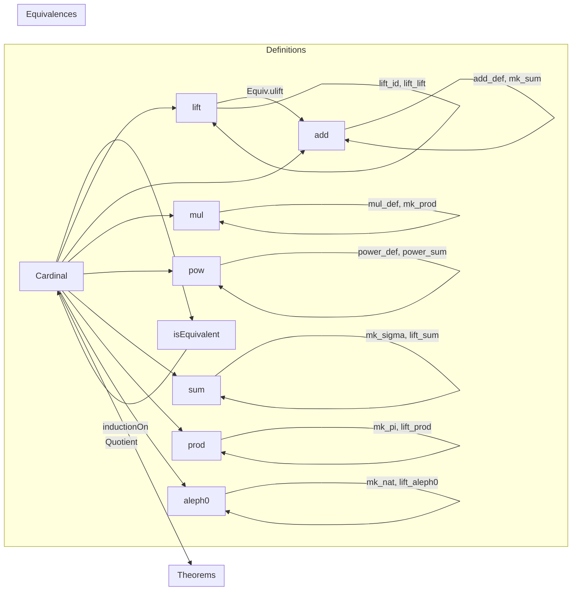

**Technical Brief: `Defs.lean` — Cardinal Numbers in Lean 4 (Mathlib)**  
*Based on `Mathlib.Data.Cardinal.Defs`*

---

### 1. KEY DEFINITIONS & THEOREMS

| Name | Type / Signature | Purpose |
|------|------------------|---------|
| `Cardinal.isEquivalent` | `Setoid (Type u)` | Equivalence relation on types: `α ≈ β ↔ Nonempty (α ≃ β)` |
| `Cardinal` | `Type (u + 1)` | Quotient `Quotient Cardinal.isEquivalent`; type of cardinals in universe `u` |
| `Cardinal.mk` | `Type u → Cardinal` | Maps a type to its cardinality; notation `#α` |
| `Cardinal.lift` | `Cardinal.{v} → Cardinal.{max v u}` | Universe lift operation; `#α` ↦ `#ULift α` |
| `Cardinal.add` | `Cardinal → Cardinal → Cardinal` | Defined via disjoint sum: `#α + #β = #(α ⊕ β)` |
| `Cardinal.mul` | `Cardinal → Cardinal → Cardinal` | Defined via product: `#α * #β = #(α × β)` |
| `Cardinal.pow` | `Cardinal → Cardinal → Cardinal` | Defined via function space: `#α ^ #β = #(β → α)` |
| `Cardinal.sum` | `(ι → Cardinal) → Cardinal` | Indexed sum = cardinality of `Σ i, (f i).out` |
| `Cardinal.prod` | `(ι → Cardinal) → Cardinal` | Indexed product = cardinality of `Π i, (f i).out` |
| `Cardinal.aleph0` | `Cardinal.{u}` | `lift #ℕ`; universe-polymorphic ℵ₀ |
| `Cardinal.outMkEquiv` | `(#α).out ≃ α` | Canonical equivalence between representative and original type |
| `Cardinal.mk_congr` | `α ≃ β → #α = #β` | Congruence of cardinals under equivalence |
| `Cardinal.inductionOn` | Induction principle for `Cardinal` | Quotient induction: prove property for all `#α` |
| `Cardinal.mk_eq_zero_iff` | `#α = 0 ↔ IsEmpty α` | Characterizes zero cardinal |
| `Cardinal.mk_ne_zero_iff` | `#α ≠ 0 ↔ Nonempty α` | Characterizes nonzero cardinal |
| `Cardinal.prod_eq_zero` | `prod f = 0 ↔ ∃ i, f i = 0` | Product is zero iff some factor is zero |
| `Cardinal.power_sum` | `a ^ sum f = prod (λ i ↦ a ^ f i)` | Exponentiation distributes over indexed sum |
| `Cardinal.lift_power` | `lift (a ^ b) = lift a ^ lift b` | Lift commutes with exponentiation |

---

### 2. NAMING CONVENTIONS

- **Prefixes**:
  - `mk_`: constructions from types to cardinals (`mk`, `mk_eq_zero`, `mk_sum`, `mk_prod`, `mk_sigma`, `mk_pi`, `mk_arrow`, `mk_uLift`)
  - `lift_`: universe lifting (`lift`, `lift_id`, `lift_zero`, `lift_aleph0`, `lift_sum`, `lift_prod`, `lift_power`)
  - `inductionOn`: elimination principles (`inductionOn`, `inductionOn₂`, `inductionOn₃`, `induction_on_pi`)
  - `out_`: representative extraction (`outMkEquiv`, `mk_out`)
  - `congr`: congruence lemmas (`mk_congr`, `mk_congr_lift`, `mk_sum_congr`, `mk_prod_congr`, etc.)

- **Suffixes**:
  - `_def`: defining equalities (`add_def`, `mul_def`, `power_def`)
  - `_equiv`: existence of equivalences (e.g., `outMkEquiv`)
  - `_iff`: biconditional characterizations (`mk_eq_zero_iff`, `prod_eq_zero`, `mk_ne_zero_iff`)
  - `_congr`: congruence under equivalence (`mk_congr`, `mk_sum_congr`, `mk_prod_congr`, `mk_sigma_congr`, `mk_pi_congr`)
  - `_congr'`, `_congr_lift`: variants for cross-universe or lifted equality

- **Notation**:
  - `#α` for `Cardinal.mk α`
  - `ℵ₀` for `Cardinal.aleph0`
  - `+`, `*`, `^` for cardinal arithmetic (scoped in `Cardinal` locale)

---

### 3. TACTIC STACK

- **Core tactics**:
  - `inductionOn`, `inductionOn₂`, `inductionOn₃`, `induction_on_pi` — custom elimination principles
  - `simp_rw` — for rewriting with definitional equalities (e.g., `power_sum`)
  - `rw` / `apply` — for congruence and equivalence-based rewrites
  - `exact` / `refine` — especially with `Equiv.cardinal_eq`, `Quotient.sound`, `Quotient.inductionOn`
  - `cases` / `intro` — for destructing `Nonempty`/`IsEmpty` hypotheses
  - `convert` / `congr'` — for matching up equivalences (e.g., `Equiv.ulift`, `Equiv.sumCongr`, `Equiv.prodCongr`)
  - `lift` — for universe lifting in proofs (e.g., `lift f to ι → Type u`)
  - `classical` — for choice in `Classical.choice` (e.g., in `mk_sigma_congr`)

- **Simp lemmas**:
  - `mk_sum`, `mk_prod`, `mk_sigma`, `mk_pi`, `mk_arrow`, `mk_uLift`, `mk_option`, `mk_psum`
  - `power_zero`, `power_one`, `one_power`, `power_add`, `mul_power`, `lift_power`, `lift_add`, `lift_one`, `lift_zero`
  - `prod_eq_zero`, `prod_ne_zero`, `mk_eq_zero_iff`, `mk_ne_zero_iff`

---

### 4. PROOF LOGIC

- **Standard pattern**:
  1. **Induction on cardinals** using `Cardinal.inductionOn` (or variants) to reduce to case `#α`.
  2. **Unfold definitions** (`add_def`, `mul_def`, `power_def`, `sum`, `prod`) to get type-level expressions.
  3. **Construct equivalences** using:
     - `Equiv.sumCongr`, `Equiv.prodCongr`, `Equiv.arrowCongr`, `Equiv.piCongr`, `Equiv.sigmaCongr`
     - `Equiv.ulift`, `Equiv.ulift.symm`, `Equiv.outMkEquiv`
  4. **Apply `mk_congr`** (or `Equiv.cardinal_eq`) to conclude equality of cardinals.
  5. **Simplify** using `simp` with `mk_*` lemmas and universe laws (`lift_id`, `lift_lift`, `lift_mk_eq`).

- **Common subproofs**:
  - `Equiv.ulift.trans (Equiv.ulift.arrowCongr Equiv.ulift).symm` — for lifting exponentials
  - `Equiv.sigmaEquivProd` / `Equiv.piCurry` — for reindexing sums/products
  - `Equiv.optionEquivSumPUnit` — for `Option α ≃ α ⊕ Unit`

- **Universe management**:
  - Heavy use of `lift.{u, v}`, `max u v`, and lemmas like `lift_umax`, `lift_id'`, `lift_mk_eq'`.
  - `mk_sigma_congr_lift`, `mk_pi_congr_lift` handle cross-universe indexing.

---

### 5. IMPORTS & DEPENDENCIES

- **Core imports**:
  ```lean
  Mathlib.Data.ULift
  Mathlib.Util.Delaborators
  ```
- **Implicit dependencies** (via `Quotient`, `Equiv`, `Function`, `Set`, `List`, `Nonempty`, `IsEmpty`, `Subsingleton`, `Unique`, `Pi`, `Sigma`, `Option`, `ULift`, `Fin`, `PUnit`, `PEmpty`, `PLift`, etc.)
- **Related theory files** (not imported here, but logically adjacent):
  - `Mathlib.SetTheory.Cardinal.Ordinal` — arithmetic for infinite cardinals (e.g., `κ * κ = κ`)
  - `Mathlib.SetTheory.Cardinal.Basic` — order, comparison, Cantor–Bernstein, König’s theorem
  - `Mathlib.SetTheory.Cardinal.Continuum` — `2^ℵ₀`, continuum cardinal
  - `Mathlib.SetTheory.Cardinal.Regular` — regular/singular cardinals

---

### 6. MERMAID DIAGRAMS

#### Dependency Graph (High-Level)

```mermaid
graph TD
  A[Type u] -->|Quotient by ≃| B[Cardinal.{u}]
  B -->|lift| C[Cardinal.{max u v}]
  D[Type u × Type v] -->|Sum, Prod, Arrow| E[Type w]
  E -->|mk| B
  B -->|add, mul, pow| B
  F[ι → Cardinal] -->|sum, prod| B
  G[ℕ] -->|mk| H[ℵ₀]
  B -->|outMkEquiv| A
```

#### Overview of `Defs.lean`



---

### 7. KEY PROOF TECHNIQUES

- **Quotient induction**: Prove properties for all `#α`, then extend to all cardinals.
- **Equivalence lifting**: Use `Equiv.ulift` to move between universes and simplify universe constraints.
- **Congruence closure**: Build complex equivalences from simpler ones (`sumCongr`, `prodCongr`, `arrowCongr`, `piCongr`, `sigmaCongr`).
- **Universe balancing**: Use `lift_mk_eq'` and `lift_mk_eq` to compare lifted cardinals across universes.
- **Choice usage**: `Classical.choice` in congruence proofs for dependent types (`mk_sigma_congr`, `mk_pi_congr`).

---

### 8. REMARKS

- **Noncomputability**: `Cardinal` is noncomputable (as expected for quotients over types).
- **Universe polymorphism**: All operations are universe-polymorphic; explicit universe parameters often needed.
- **Definitional equality**: `#α + #β = #(α ⊕ β)` holds definitionally (`rfl`), enabling `simp`-based automation.
- **Zero/One normalization**: `0 = lift #(Fin 0)`, `1 = lift #(Fin 1)` — ensures compatibility with `natCast`.

--- 

*End of Technical Brief*
