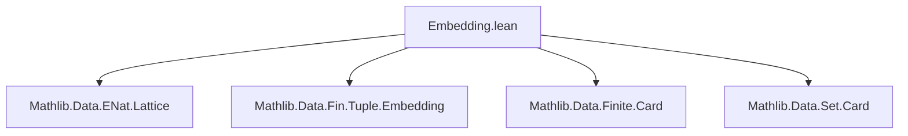
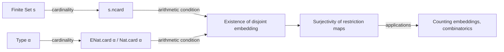

**Technical Brief: `Embedding.lean` — Finite Type Embeddings with Disjoint Range**

---

### 1. KEY DEFINITIONS & THEOREMS

| Name | Type / Signature | Purpose |
|------|------------------|---------|
| `Fin.Embedding` | `Fin n ↪ α` | Embeddings from `Fin n` into `α`, i.e., injective functions `Fin n → α`. |
| `s.ncard` | `ℕ∞` (or `ℕ` when `s` is finite) | Cardinality of a set `s : Set α`, possibly extended natural (`ENat`) valued. |
| `ENat.card α` | `ℕ∞` | Cardinality of type `α` as an extended natural number (0, 1, ..., ∞). |
| `Nat.card α` | `ℕ` | Cardinality of a *finite* type `α`. Defined only when `[Finite α]`. |

#### Theorems

| Name | Type | Purpose |
|------|------|---------|
| `exists_embedding_disjoint_range_of_add_le_ENat_card` | `[Finite s] → s.ncard + n ≤ ENat.card α → ∃ y : Fin n ↪ α, Disjoint s (range y)` | If the sum of the size of a finite set `s` and `n` does not exceed the cardinality of `α`, then there exists an embedding of `Fin n` into `α` avoiding `s`. |
| `exists_embedding_disjoint_range_of_add_le_Nat_card` | `[Finite α] → s.ncard + n ≤ Nat.card α → ∃ y : Fin n ↪ α, Disjoint s (range y)` | Same as above, but using *finite* cardinality (`Nat.card`). |
| `restrictSurjective_of_add_le_ENatCard` | `m + n ≤ ENat.card α → Surjective (fun x ↦ (Fin.castAddEmb n).trans x)` | The restriction map `Fin (m+n) ↪ α → Fin m ↪ α` (by precomposing with `castAddEmb n`) is surjective when `m+n ≤ |α|`. |
| `restrictSurjective_of_le_ENatCard` | `m ≤ n ∧ n ≤ ENat.card α → Surjective (fun x ↦ (castLEEmb hmn).trans x)` | A weaker restriction (forgetting last `k` elements) is surjective under the same cardinal bound. |
| `restrictSurjective_of_add_le_natCard` | `[Finite α] → m + n ≤ Nat.card α → Surjective (fun x ↦ (castAddEmb n).trans x)` | Same as `restrictSurjective_of_add_le_ENatCard`, but for finite types. |
| `restrictSurjective_of_le_natCard` | `[Finite α] → m ≤ n ∧ n ≤ Nat.card α → Surjective (fun x ↦ (castLEEmb hmn).trans x)` | Same as `restrictSurjective_of_le_ENatCard`, finite case. |

---

### 2. NAMING CONVENTIONS

- **Prefixes**:
  - `exists_embedding_…`: asserts existence of an embedding with a property.
  - `restrictSurjective_…`: asserts surjectivity of a restriction map on embeddings.
- **Suffixes**:
  - `_of_add_le_ENat_card`: condition involves `ENat.card`.
  - `_of_add_le_Nat_card` / `_of_add_le_natCard`: condition uses `Nat.card`.
  - `_of_le_ENatCard` / `_of_le_natCard`: condition is `m ≤ n ≤ |α|`.
- **Embedding combinators**:
  - `castAddEmb n`: embedding `Fin m ↪ Fin (m+n)` (injects into first `m` positions).
  - `castLEEmb hmn`: embedding `Fin m ↪ Fin n` when `m ≤ n`.
  - `append hxy`: constructs an embedding `Fin (m+n) ↪ α` from two disjoint embeddings.

---

### 3. TACTIC STACK

| Tactic | Usage |
|--------|-------|
| `rcases` / `obtain` | To decompose existential or conjunction hypotheses. |
| `rw` / `rwa` | Rewriting using equalities (e.g., `ncard_coe_set_eq`, `card_eq_fintype_card`). |
| `simp` / `simpa` | Simplification with custom lemmas (e.g., `mem_compl_iff`, `range_of_injective`). |
| `apply` / `use` | Constructing witnesses for existential goals. |
| `ext` | Extensionality for functions/embeddings (proving two embeddings equal by extensionality). |
| `classical` | To enable classical choice when needed (e.g., for `Fintype.ofFinite`). |
| `exact` / `assumption` | Rarely used; mostly replaced by `simp`/`aesop`. |
| `aesop` | Not present in this file — proof is mostly manual. |

---

### 4. PROOF LOGIC

- **Core strategy**: Reduce to cardinal arithmetic and use known embeddings of finite sets.
- **Existence proofs** (`exists_embedding_…`):
  - Reduce to constructing an embedding into the complement `sᶜ`.
  - Split into two cases: `α` finite or infinite.
    - *Finite*: use `Fintype.card` and `ncard` arithmetic.
    - *Infinite*: use `ENat.card α = ∞`, so `sᶜ` is nonempty and infinite ⇒ admits an embedding from `Fin n`.
- **Surjectivity proofs** (`restrictSurjective_…`):
  - Given `x : Fin m ↪ α`, construct `y : Fin (m+n) ↪ α` extending `x`.
  - Use `exists_embedding_disjoint_range_…` to find an embedding of `Fin n` disjoint from `range x`.
  - Combine via `append` (or `Fin.appendEmb`) to get an embedding of `Fin (m+n)` extending `x`.
- **Inductive/recursive structure**: Not used — all proofs are direct constructions.

---

### 5. IMPORTS

| Module | Purpose |
|--------|---------|
| `Mathlib.Data.ENat.Lattice` | Extended naturals, lattice structure, arithmetic. |
| `Mathlib.Data.Fin.Tuple.Embedding` | Embeddings between `Fin n`, including `castAddEmb`, `castLEEmb`, `append`. |
| `Mathlib.Data.Finite.Card` | Cardinality for finite types (`Nat.card`, `Fintype.card`). |
| `Mathlib.Data.Set.Card` | Cardinality for sets (`s.ncard`, `ncard_add_ncard_compl`, etc.). |

---

### 6. DEPENDENCY & THEORY OVERVIEW (Mermaid Diagrams)

#### Dependency Graph (Module-Level)



#### Theory Flow (Conceptual)



#### Proof Structure (High-Level)

```mermaid
graph TD
  Goal[∃ y : Fin n ↪ α, Disjoint s (range y)] -->|Case split| Finite[α finite]
  Goal -->|Case split| Infinite[α infinite]
  Finite -->|Fintype.card arithmetic| FinEmb[Fin n ↪ α avoiding s]
  Infinite -->|Complement infinite| InfEmb[Fin n ↪ sᶜ ↪ α]
  FinEmb & InfEmb -->|append + disjointness| Surj[Surjectivity of restriction]
```

---

### 7. SUMMARY

This module formalizes foundational results about embeddings of finite types into arbitrary types, emphasizing control over the *range* of embeddings relative to a given finite subset. It leverages cardinal arithmetic (both finite and extended natural) to guarantee existence and surjectivity of extension/restriction maps. The proofs are constructive in the finite case, and rely on classical reasoning (via `classical`) in the infinite case. The results are foundational for combinatorial arguments involving finite subsets and embeddings, e.g., in Ramsey theory or finite model theory.

--- 

Let me know if you'd like a formalized dependency graph (e.g., for `leanproject`), or a summary of how these theorems interact with `Mathlib.Data.Fin.Embedding` or `Mathlib.Data.Fintype.Basic`.
