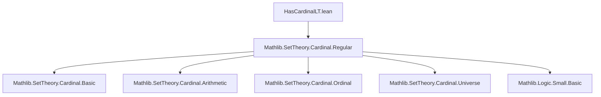

### Technical Brief: `HasCardinalLT` in Lean 4 (Mathlib)

---

#### **1. Key Definitions & Theorems**

| Name | Type | Purpose |
|------|------|---------|
| `HasCardinalLT` | `Type u → Cardinal.{v} → Prop` | Predicate expressing that the cardinality of a type `X` is strictly less than a cardinal `κ`, after lifting both to a common universe `v`. Formally: `lift.{v} (mk X) < lift κ`. |
| `hasCardinalLT_iff_cardinal_mk_lt` | `HasCardinalLT X κ ↔ mk X < κ` | Simplifies the definition when `κ` lives in the same universe as `X`. |
| `small` | `h : HasCardinalLT X κ → Small.{v} X` | Shows that if `X` has cardinality less than `κ`, then `X` is `v`-small. |
| `of_le` | `κ ≤ κ' → HasCardinalLT X κ'` | Monotonicity: if `X` is less than `κ`, it's less than any larger `κ'`. |
| `of_injective` | `f : Y ↪ X → HasCardinalLT Y κ` | Subtypes/injective images inherit the bound. |
| `of_surjective` | `f : X ↠ Y → HasCardinalLT Y κ` | Surjective images inherit the bound. |
| `hasCardinalLT_iff_of_equiv` | `X ≃ Y → HasCardinalLT X κ ↔ HasCardinalLT Y κ` | Invariance under equivalence (bijection). |
| `hasCardinalLT_aleph0_iff` | `HasCardinalLT X ℵ₀ ↔ Finite X` | Characterizes finiteness via `ℵ₀`. |
| `hasCardinalLT_of_finite` | `Finite X → ℵ₀ ≤ κ → HasCardinalLT X κ` | Finite types are bounded by any uncountable cardinal. |
| `hasCardinalLT_lift_iff`, `hasCardinalLT_ulift_iff` | Equivalences under universe lifting/upgrading. |
| `hasCardinalLT_sum_iff` | `HasCardinalLT (X ⊕ Y) κ ↔ HasCardinalLT X κ ∧ HasCardinalLT Y κ` (when `ℵ₀ ≤ κ`) | Finite sums preserve the bound under regularity/uncountability. |
| `hasCardinalLT_option_iff` | Same as sum with `Unit`, using `Option X ≃ X ⊕ Unit`. |
| `hasCardinalLT_subtype_max` | Union of two subtypes bounded by `κ` is bounded by `κ`, assuming `ℵ₀ ≤ κ`. |
| `hasCardinalLT_union` | Union of two sets bounded by `κ` is bounded by `κ`. |
| `hasCardinalLT_sigma'` / `hasCardinalLT_sigma` | Boundedness of dependent sums under regularity: if index and fibers are `< κ`, so is the sum. |
| `hasCardinalLT_subtype_iSup` | Boundedness of supremum of subtypes (i.e., union of subtypes) under regularity. |
| `hasCardinalLT_iUnion` | Boundedness of countable (or indexed) union of sets. |
| `hasCardinalLT_prod'` / `hasCardinalLT_prod` | Boundedness of product under `ℵ₀ ≤ κ` and regularity. |
| `exists_regular_cardinal` | For any `Small X`, ∃ regular `κ` s.t. `HasCardinalLT X κ`. |
| `exists_regular_cardinal_forall` | For a small family of small types, ∃ regular `κ` bounding all. |

---

#### **2. Naming Conventions**

- **Prefixes**:
  - `hasCardinalLT_`: for lemmas about the predicate `HasCardinalLT`.
  - `of_`: for derived properties (e.g., `of_injective`, `of_le`).
- **Suffixes**:
  - `_iff`: characterizations as biconditionals.
  - `_lift`, `_ulift`, `_sum`, `_prod`, `_sigma`, `_subtype`, `_union`, `_iUnion`: indicate the construction involved.
  - `'` (prime): often denotes the *same-universe* version of a lemma (e.g., `hasCardinalLT_sigma'` vs `hasCardinalLT_sigma`).
- **`_max`, `_iSup`**: for lattice-theoretic constructions (suprema, unions).

---

#### **3. Tactic Stack**

Frequently used tactics:
- `simp` / `simp only`: to simplify using definitions and lemmas.
- `rw`: rewriting using equivalences or equalities.
- `exact`: closing goals directly.
- `apply`: applying lemmas with unification.
- `dsimp`: definitional simplification (often before `rw`).
- `convert`: for approximate unification (e.g., set vs subtype).
- `aesop`: for automated reasoning (used in `hasCardinalLT_iUnion`).
- `infer_instance`: for typeclass resolution.
- `obtain` / `rintro`: destructuring proofs.
- `refine`: partial proof construction.

---

#### **4. Proof Logic**

- **Inductive/structural reasoning**: Most proofs proceed by:
  1. Unfolding `HasCardinalLT` via `dsimp` or `rw [hasCardinalLT_iff_cardinal_mk_lt]`.
  2. Lifting to a common universe using `Cardinal.lift_lift`, `Cardinal.lift_lt`.
  3. Applying known cardinal arithmetic lemmas:
     - `Cardinal.mk_le_of_injective`, `mk_le_of_surjective`
     - `add_lt_of_lt`, `mul_lt_of_lt`, `sum_lt_lift_of_isRegular`
  4. Using monotonicity (`lt_of_le_of_lt`) and regularity assumptions (e.g., `Fact κ.IsRegular`).
- **Regular cardinals** are crucial for closure under sums/products/unions (via `sum_lt_lift_of_isRegular`, `mul_lt_of_lt`).
- **Universe management** is handled via `ULift`, `lift`, and universe polymorphism (`max u v`, etc.).
- **Equivalence-based reasoning**: Many lemmas reduce to `hasCardinalLT_iff_of_equiv`, avoiding direct cardinal arithmetic.

---

#### **5. Imports & Dependencies**

- **Core dependency**: `Mathlib.SetTheory.Cardinal.Regular`
  - Provides `Cardinal.IsRegular`, `sum_lt_lift_of_isRegular`, etc.
- Implicit dependencies (via `Cardinal`):
  - `Mathlib.SetTheory.Cardinal.Basic`
  - `Mathlib.SetTheory.Cardinal.Arithmetic`
  - `Mathlib.SetTheory.Cardinal.Ordinal`
  - `Mathlib.SetTheory.Cardinal.Universe`
  - `Mathlib.Logic.Small.Basic`
  - `Mathlib.Tactic.Default`

---

#### **6. Mermaid Diagrams**

##### **Dependency Graph (Module Level)**



##### **Overview of `HasCardinalLT` Theory**

```mermaid
flowchart LR
  A[Type X] -->|mk X| B[Cardinal]
  C[Cardinal κ] -->|lift| D[Cardinal.{v}]
  B -->|lift| D
  D -->|<| E[Predicate: HasCardinalLT X κ]

  subgraph ClosureProperties
    F[Sum] --> A
    G[Product] --> A
    H[Sigma] --> A
    I[Subtype/Union] --> A
    J[Option/ULift] --> A
  end

  subgraph RegularityLemmas
    K[exists_regular_cardinal] --> L[Small X ⇒ ∃κ reg, HCLT X κ]
    M[exists_regular_cardinal_forall] --> N[Small family ⇒ ∃κ reg, ∀i, HCLT (X i) κ]
  end

  E -->|Monotonicity| C
  E -->|Injective/Surj| A'
  E -->|Equiv| A''
```

---

#### **7. Summary**

This module formalizes a *relative boundedness* predicate `HasCardinalLT X κ`, enabling reasoning about types whose cardinality is strictly less than a given cardinal `κ`, after universe lifting. It is foundational for handling *large* categories where objects are bounded by regular cardinals (e.g., in accessible categories, presentable categories, or Grothendieck universes). The theory is carefully structured to support closure under standard constructions (sums, products, subtypes, unions) under regularity assumptions, and provides existence of bounding regular cardinals for small types.

--- 

Let me know if you'd like a formalized dependency graph for the entire `Mathlib.SetTheory.Cardinal` hierarchy.
