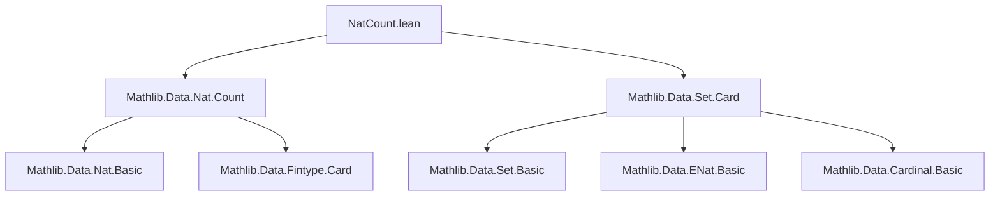
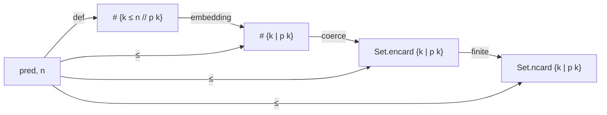

**Technical Brief: `NatCount.lean`**

---

### 1. **Key Definitions & Theorems**

| Name | Type | Purpose |
|------|------|---------|
| `count` | `ℕ → (ℕ → Prop) → ℕ` | Counts how many natural numbers ≤ `n` satisfy predicate `p`. Defined in `Mathlib.Data.Nat.Count`. |
| `Cardinal.mk` | `α → Cardinal` | Cardinality of a type/set. |
| `Set.encard` | `Set ℕ → ENat` | Extended natural cardinality (allows ∞). |
| `Set.ncard` | `FiniteSet ℕ → ℕ` | Finite cardinality (returns `ℕ`, requires finiteness). |
| `count_le_cardinal` | `(count p n : Cardinal) ≤ Cardinal.mk { k | p k }` | Relates finite count up to `n` to the *total* cardinality of the set `{k | p k}`. |
| `count_le_setENCard` | `count p n ≤ Set.encard { k | p k }` | Same as above, but expressed in `ENat` (extended naturals). |
| `count_le_setNCard` | `count p n ≤ Set.ncard { k | p k }` | Same, but for *finite* sets, using `Set.ncard`. Requires `h : {k | p k}.Finite`. |

---

### 2. **Naming Conventions**

- **Prefixes**:
  - `count_`: All theorems relate to `Nat.count`.
- **Suffixes**:
  - `_le_cardinal`: Inequality into `Cardinal`.
  - `_le_setENCard`: Inequality into `Set.encard` (`ENat`).
  - `_le_setNCard`: Inequality into `Set.ncard` (`ℕ`, finite case).
- **Predicate variable**: `p : ℕ → Prop` with `[DecidablePred p]` — standard for counting predicates.

---

### 3. **Tactic Stack**

- `rw [...]`: Rewriting using definitions (`count_eq_card_fintype`, `Set.encard`, etc.).
- `simp only [...]`: Simplification with precise lemmas (avoids over-simplification).
- `exact ...`: Direct proof term injection.
- `intro`/`intro x hx`: Implicit in lambda terms (e.g., `fun x hx ↦ hx.2`).
- `simpa`: Used to discharge side conditions (e.g., `by simpa` for finiteness or typeclass resolution).

No heavy automation (e.g., `linarith`, `omega`) — proofs are mostly definitional.

---

### 4. **Proof Logic**

- **Structure**: All three theorems follow a *monotonicity* pattern:
  1. Express `count p n` as the cardinality of a *finite subtype* (`{k ≤ n // p k}`).
  2. Use monotonicity of cardinality under inclusion:  
     `{k ≤ n // p k} ↪ {k | p k}` → `#finite ≤ #total`.
  3. Translate between `Cardinal`, `ENat`, and `ℕ` via known coercion/inequality lemmas.

- **Typical flow**:
  - `count_le_cardinal`:  
    `count p n = #fintype {k ≤ n // p k}`  
    → embed into `{k | p k}` → apply `Cardinal.mk_subtype_mono`.
  - `count_le_setENCard`:  
    Convert to `ENat` via `Set.encard = ENat.card ∘ coe`.
  - `count_le_setNCard`:  
    Use finiteness to convert `Set.ncard` to `Set.encard`, then apply previous result.

---

### 5. **Imports**

| Import | Role |
|--------|------|
| `Mathlib.Data.Nat.Count` | Defines `Nat.count`, `count_eq_card_fintype`, etc. |
| `Mathlib.Data.Set.Card` | Defines `Set.encard`, `Set.ncard`, `Set.card`, and their relations. |

No additional dependencies beyond core `Mathlib` set/cardinality infrastructure.

---

### 6. **Mermaid Diagrams**

#### **Dependency Graph (File-Level)**

#### **Theoretical Overview (Conceptual Flow)**

---

### 7. **Summary**

This module formalizes the intuitive idea that *the number of elements ≤ `n` satisfying `p` cannot exceed the total number of elements satisfying `p`*, across three cardinality representations: `Cardinal`, `Set.encard` (extended), and `Set.ncard` (finite). It leverages monotonicity of cardinality under subtype inclusion and standard coercion lemmas between `ℕ`, `ENat`, and `Cardinal`. The proofs are minimal, definitional, and rely on `Mathlib`’s well-established cardinality infrastructure.
