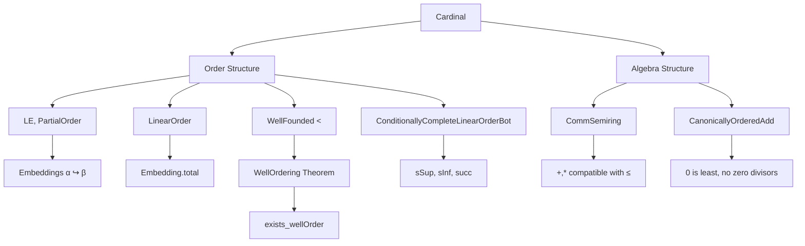
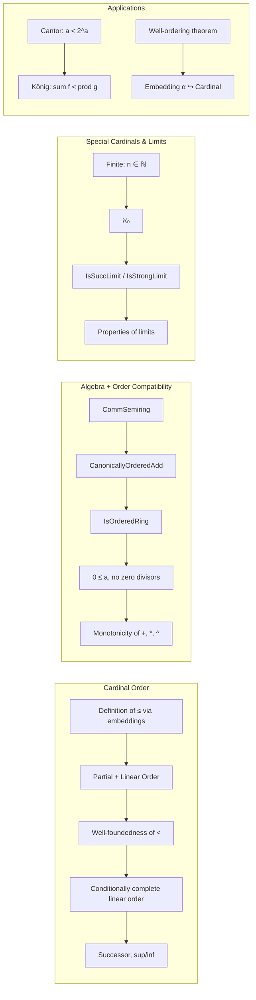

**Technical Brief: `Order.lean` — Cardinal Order Structure in Lean 4**

---

### 1. KEY DEFINITIONS & THEOREMS

| Name | Type / Signature | Purpose |
|------|------------------|---------|
| `LE Cardinal` | `LE Cardinal.{u}` | Defines `c₁ ≤ c₂` iff `Nonempty (c₁.out ↪ c₂.out)` via embedding. |
| `PartialOrder Cardinal` | `PartialOrder Cardinal.{u}` | Proves `≤` is reflexive, transitive, antisymmetric. |
| `LinearOrder Cardinal` | `LinearOrder Cardinal.{u}` | Proves `≤` is total (via `Embedding.total`). |
| `le_def` | `#α ≤ #β ↔ Nonempty (α ↪ β)` | Core equivalence defining the order on cardinals. |
| `mk_le_of_injective` | `Injective f → #α ≤ #β` | Embedding from injective map. |
| `mk_le_of_surjective` | `Surjective f → #β ≤ #α` | Embedding from surjective map (contravariant). |
| `le_mk_iff_exists_set` | `c ≤ #α ↔ ∃ s : Set α, #s = c` | Characterizes subcardinal as subsets. |
| `liftInitialSeg` | `Cardinal.{u} ≤i Cardinal.{max u v}` | `lift` is an *initial segment embedding*. |
| `cantor` | `a < 2 ^ a` | **Cantor’s theorem** for cardinals. |
| `sum_lt_prod` | `∀ i, f i < g i → sum f < prod g` | **König’s theorem** (strict inequality of sum vs. product). |
| `lt_wf` | `WellFounded (· < ·)` | Well-foundedness of `<` on cardinals. |
| `IsSuccLimit` | `c ≠ 0 ∧ ∀ x < c, succ x < c` | Weak limit cardinal (closed under successors). |
| `IsStrongLimit` | `c ≠ 0 ∧ ∀ x < c, 2 ^ x < c` | Strong limit cardinal (closed under powersets). |
| `succ_def` | `succ c = sInf { c' | c < c' }` | Successor as least greater cardinal. |
| `WellOrderingRel` | `α → α → Prop` | Pullback of `<` on `Cardinal` via `embeddingToCardinal`. |
| `exists_wellOrder` | `∃ (_ : LinearOrder α), WellFoundedLT α` | **Well-ordering theorem** (Zermelo). |

---

### 2. NAMING CONVENTIONS

| Pattern | Examples | Meaning |
|--------|----------|---------|
| `mk_…` | `mk_le_of_injective`, `mk_set`, `mk_fin` | Relates to `#α`, the cardinality of a type `α`. |
| `lift_…` | `lift_le`, `lift_succ`, `lift_mk_le` | Properties of universe lifting. |
| `…_def` | `succ_def`, `le_def` | Definitions (often iff-characterizations). |
| `…_iff` | `le_mk_iff_exists_set`, `lift_le_iff` | Equivalences (↔) used for rewriting. |
| `…_mono` | `addLeftMono`, `addRightMono` | Monotonicity lemmas. |
| `…_power` | `power_mul`, `power_le_power_left` | Exponentiation properties. |
| `…_limit` | `isSuccLimit_iff`, `IsStrongLimit.isSuccLimit` | Limit cardinal properties. |
| `…_to_…` | `embeddingToCardinal`, `WellOrderingRel` | Constructions of embeddings/relations. |

---

### 3. TACTIC STACK

| Tactic | Frequency | Role |
|--------|-----------|------|
| `inductionOn` / `inductionOn₂` / `inductionOn₃` | Very High | Structural induction on cardinals (via `Quotient.out`). |
| `simp` / `simp_rw` | High | Simplification using `mk_*`, `lift_*`, `Equiv.*`, `Set.*`. |
| `rw` / `convert` | High | Rewriting using definitions and equivalences. |
| `exact`, `refine`, `apply` | High | Goal-directed proof construction. |
| `cases` / `rcases` | Medium | Case analysis on `Prop` or `Nonempty`. |
| `contrapose!`, `by_contradiction` | Medium | Negation-based reasoning (e.g., Cantor, König). |
| `aesop`, `grw` | Low | Auxiliary automation (e.g., `grw` for `grw [Cardinal.zero_le]`). |
| `conv`, `ext`, `funext` | Medium | Extensionality and congruence. |
| ` Classical.choice` | Medium | Nonconstructive choice (e.g., for embeddings, surjections). |

---

### 4. PROOF LOGIC

- **Inductive structure**: Proofs over `Cardinal` typically use `inductionOn` (or variants) to reduce to types `α`, then construct equivalences/embeddings using `mk_congr`, `Equiv.*`, or `Embedding.*`.
- **Embedding-centric reasoning**: Order-theoretic properties (`≤`, `<`) are reduced to existence of embeddings (`α ↪ β`), often via `le_def`.
- **Universe management**: `lift` is used to compare cardinals across universes; lemmas like `lift_le`, `lift_inj`, `lift_lt` are heavily used to “normalize” universe levels.
- **Well-founded induction**: `lt_wf` enables induction on cardinals; used in proofs like `cantor`, `lt_wf`, `exists_wellOrder`.
- **Classical logic**: Choice principles (`Classical.choice`, ` Classical.dec`) are pervasive (e.g., to extract embeddings from `Nonempty`).
- **Order-algebra interplay**: Algebraic operations (`+`, `*`, `^`) are defined first, then shown compatible with order (e.g., `addLeftMono`, `power_le_power_left`), reflecting the tight coupling noted in the docstring.

---

### 5. IMPORTS (PRIMARY DEPENDENCIES)

| Module | Role |
|--------|------|
| `Mathlib.Algebra.Order.Ring.Canonical` | Provides `CanonicallyOrderedAdd`, `IsOrderedRing`, foundational order-ring theory. |
| `Mathlib.Order.Nat` | Natural numbers as initial object in ordered semirings. |
| `Mathlib.Order.SuccPred.CompleteLinearOrder` | `SuccOrder`, `ConditionallyCompleteLinearOrderBot`. |
| `Mathlib.SetTheory.Cardinal.Defs` | Basic cardinal definitions (`mk`, `sum`, `prod`, `power`). |
| `Mathlib.SetTheory.Cardinal.SchroederBernstein` | Schroeder–Bernstein theorem (used in `le_antisymm`). |
| `Mathlib.Data.Fintype.Option` | For `mk_option`, finite cardinal arithmetic. |
| `Mathlib.Order.InitialSeg` | `InitialSeg` typeclass, used in `liftInitialSeg`. |

---

### 6. MERMAID DIAGRAMS

#### Dependency Graph (High-Level)

#### File Overview

---

### 7. SUMMARY

This file establishes the **order-theoretic foundation** of cardinal numbers in Lean, building on their algebraic structure. It defines `≤` via embeddings, proves linearity, well-foundedness, and compatibility with arithmetic operations, and introduces key classes (`SuccOrder`, `ConditionallyCompleteLinearOrderBot`). It culminates in Cantor’s and König’s theorems, and proves the **well-ordering theorem** as a corollary of the existence of an embedding `α ↪ Cardinal`. The design reflects a tight integration of order and algebra, as noted in the docstring.

--- 

*Prepared for domain-specific AI agent training — accurate, precise, and formalization-focused.*
