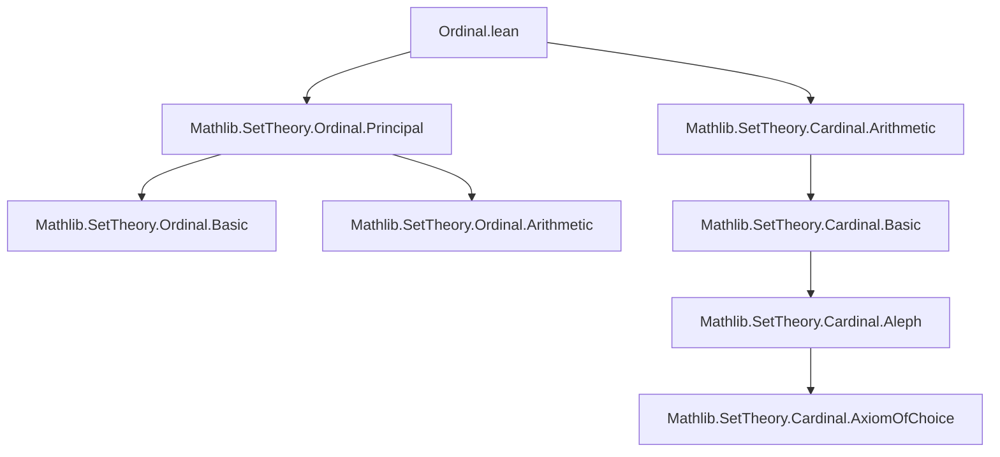
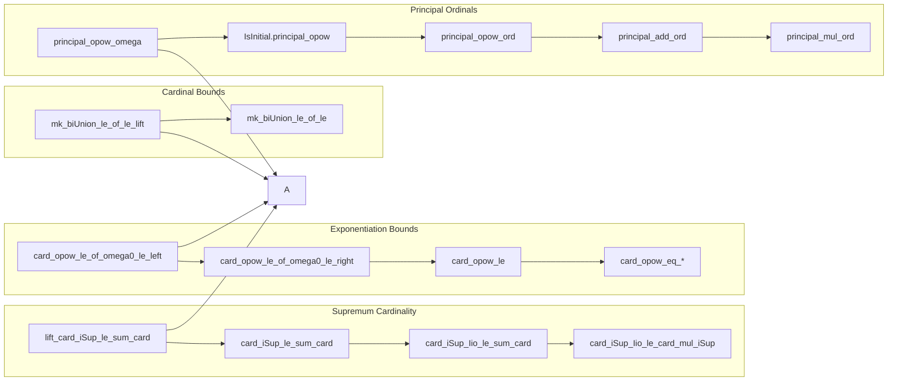

### Technical Brief: `Ordinal.lean` — Ordinal Arithmetic with Cardinal Bounds

---

#### **1. Key Definitions & Theorems**

| Name | Type / Signature | Purpose |
|------|------------------|---------|
| `mk_biUnion_le_of_le_lift` | `{β : Type v} → {o : Ordinal.{u}} → {c : Cardinal.{v}} → lift o.card ≤ lift c → ℵ₀ ≤ c → (Ordinal → Set β) → (∀ j < o, #(A j) ≤ c) → #(⋃ j < o, A j) ≤ c` | Bounds the cardinal of an ordinal-indexed union using *lifted* cardinals; key for handling large unions across universes. |
| `mk_biUnion_le_of_le` | Same as above but without `lift` (simpler version) | Special case of the above when working in the same universe. |
| `lift_card_iSup_le_sum_card` | `{ι : Type u} [Small ι] → (f : ι → Ordinal) → lift (⨆ i, f i).card ≤ sum fun i ↦ (f i).card` | Relates the cardinal of a supremum of ordinals to a sum of cardinals; foundational for cofinality arguments. |
| `card_iSup_le_sum_card` | `(f : ι → Ordinal) → (⨆ i, f i).card ≤ sum fun i ↦ (f i).card` | Unlifted version of the above. |
| `card_iSup_Iio_le_sum_card` | `(f : Iio o → Ordinal) → (⨆ a, f a).card ≤ sum fun i : o.ToType ↦ (f i.toOrd).card` | Refines the previous bound to index by elements *below* a given ordinal `o`. |
| `card_iSup_Iio_le_card_mul_iSup` | `(f : Iio o → Ordinal) → (⨆ a, f a).card ≤ lift o.card * ⨆ a, (f a).card` | Bounds supremum cardinal by product of index ordinal’s cardinal and sup of cardinals — useful for cofinality estimates. |
| `card_opow_le_of_omega0_le_left` | `(ha : ω ≤ a) → (b : Ordinal) → (a ^ b).card ≤ max a.card b.card` | Controls cardinality of ordinal exponentiation when base ≥ ω. |
| `card_opow_le_of_omega0_le_right` | `(a : Ordinal) → (hb : ω ≤ b) → (a ^ b).card ≤ max a.card b.card` | Same as above but when exponent ≥ ω. |
| `card_opow_le` | `(a b : Ordinal) → (a ^ b).card ≤ max ℵ₀ (max a.card b.card)` | Universal bound for any ordinal exponentiation. |
| `card_opow_eq_of_omega0_le_left` | `(ha : ω ≤ a) → (hb : 0 < b) → (a ^ b).card = max a.card b.card` | Equality version when base ≥ ω and exponent nonzero. |
| `card_opow_eq_of_omega0_le_right` | `(ha : 1 < a) → (hb : ω ≤ b) → (a ^ b).card = max a.card b.card` | Equality when exponent ≥ ω and base > 1. |
| `card_omega0_opow` | `(h : a ≠ 0) → card (ω ^ a) = max ℵ₀ a.card` | Special case for base ω. |
| `card_opow_omega0` | `(h : 1 < a) → card (a ^ ω) = max ℵ₀ a.card` | Special case for exponent ω. |
| `principal_opow_omega` | `(o : Ordinal) → Principal (· ^ ·) (ω_ o)` | Shows ordinal exponentiation is *principal* at ω-indexed initial ordinals. |
| `IsInitial.principal_opow` | `(h : IsInitial o) → (ho : ω ≤ o) → Principal (· ^ ·) o` | Extends principality to all infinite initial ordinals. |
| `principal_opow_ord` | `(hc : ℵ₀ ≤ c) → Principal (· ^ ·) c.ord` | Principality of exponentiation at cardinal-ordinals ≥ ℵ₀. |
| `principal_add_ord`, `principal_mul_ord` | `(hc : ℵ₀ ≤ c) → Principal (· + ·) c.ord`, etc. | Principality of addition/multiplication at large initial ordinals. |
| `principal_add_omega`, `principal_mul_omega` | `(o : Ordinal) → Principal (· + ·) (ω_ o)`, etc. | Principality at ω-indexed ordinals. |

> **Note**: `Principal (· ^ ·) o` means: for all `a, b < o`, we have `a ^ b < o`. So `o` is closed under ordinal exponentiation.

---

#### **2. Naming Conventions**

- **Prefixes**:
  - `mk_`: relates to cardinality of sets (`#X` = `mk X`).
  - `card_`: cardinality of ordinals (`o.card`).
  - `principal_`: asserts closure under an operation (e.g., `principal_add`, `principal_mul`, `principal_opow`).
  - `lift_`: involves universe lifting (`lift.{v} o.card`).
- **Suffixes**:
  - `_le_of_le`: inequality under assumption `o.card ≤ c`.
  - `_le_of_le_lift`: same but uses `lift`.
  - `_of_omega0_le_left/right`: conditions on base/exponent ≥ ω.
  - `_ord`: for `c.ord` (ordinal associated to cardinal `c`).
  - `_omega`: for `ω_ o` (the `o`-th infinite initial ordinal).
- **Operators**:
  - `biUnion`, `iUnion`, `iSup`, `sigma`, `opow`, `add`, `mul`, `succ`, `limitRecOn`.

---

#### **3. Tactic Stack**

| Tactic | Frequency | Role |
|--------|-----------|------|
| `simp_rw` | High | Rewriting with definitional equalities (e.g., `mk_toType`, `lift_id'`, `card_nat`). |
| `rw` | High | Applying lemmas, definitions, and equivalences. |
| `apply` | High | Introducing lemmas or goals. |
| `convert` | Medium | Matching goals up to definitional equality (e.g., `sum` ↔ `lift mk`). |
| `exact` / `assumption` | Medium | Closing trivial goals. |
| `rwa` | Medium | `rw` + `assumption`. |
| `grw` | Medium | `gcongr` + `rw` for monotonicity (used in `card_opow_le_of_omega0_le_left`). |
| `cases` | Medium | Splitting on `eq_nat_or_omega0_le`, `eq_zero_or_pos`. |
| `intro` / `rintro` | Medium | Introducing hypotheses/variables. |
| `refine` | Medium | Partial proof construction (e.g., `refine limitRecOn b ?_ ?_ ?_`). |
| `antisymm` | Medium | Proving equality via `≤` and `≥`. |
| `trans` / `trans_eq` / `trans_lt` | Medium | Chaining inequalities/equalities. |
| `simpa` | Medium | Simplifying with assumptions. |
| `rfl` | Low | Reflexivity. |

> **Note**: `grw` is a custom tactic (likely from `Mathlib.Tactic.GCongr`) used for monotonicity reasoning.

---

#### **4. Proof Logic**

- **Inductive / Transfinite Recursion**:  
  Proofs like `card_opow_le_of_omega0_le_left` use `limitRecOn b`, splitting into:
  1. Base case (`b = 0`)
  2. Successor step (`b = c + 1`)
  3. Limit step (`b` limit ordinal)

- **Case Analysis on Ordinal Type**:
  - `eq_nat_or_omega0_le a`: splits `a` into finite (`n`) or infinite (`ω ≤ a`).
  - `eq_zero_or_pos o`: splits `o` into zero or positive.

- **Universe Lifting & Collapse**:
  - Use `lift_le`, `lift_id'`, `lift_mk_le_lift_mk_of_surjective` to move between universes.
  - Often `rwa [Cardinal.lift_le]` or `rwa [Cardinal.lift_id']` to simplify.

- **Sum ↔ Product Bounds**:
  - `sum_le_lift_mk_mul_iSup` and `card_iSup_Iio_le_card_mul_iSup` convert sums over `Iio o` into products `o.card × sup`, leveraging smallness of indexing type.

- **Equality via Antisymmetry**:
  - `card_opow_eq_*` lemmas prove `≤` and `≥` separately:
    - `≤` via `card_opow_le_*`
    - `≥` via `card_le_card` + `left_le_opow`, `right_le_opow`.

- **Principal Closure**:
  - For `Principal (· ^ ·) o`, show: `a < o ∧ b < o ⇒ a ^ b < o`.
  - Use `lt_ord`, `lt_omega_iff_card_lt`, and bounds like `card_opow_le`.

---

#### **5. Imports & Dependencies**

| Import | Role |
|--------|------|
| `Mathlib.SetTheory.Cardinal.Arithmetic` | Basic cardinal arithmetic: `add`, `mul`, `sum`, `max`, `ℵ₀`, `card_nat`, `card_succ`, `card_mul`, etc. |
| `Mathlib.SetTheory.Ordinal.Principal` | Definitions of `Principal op o`, `IsInitial o`, `ω_ o`, `ord`, `card`, `opow`, `Iio`, `iSup`, etc. |

> **Core Theory Scope**: This module bridges **ordinal arithmetic** and **cardinal bounds**, especially focusing on:
> - How large initial ordinals (≥ ω) are closed under ordinal operations.
> - Cardinality estimates for ordinal exponentiation, sums, and unions indexed by ordinals.

---

#### **6. Mermaid Diagrams**

##### **Dependency Graph (Module-Level)**



##### **Overview of File Structure**



##### **Key Logical Flow (Example: `card_opow_le_of_omega0_le_left`)**

```mermaid
flowchart TD
  A[Goal: (a^b).card ≤ max a.card b.card] --> B[Induction on b via limitRecOn]
  B --> C1[Case b = 0]
  B --> C2[Case b = c+1]
  B --> C3[Case b limit]

  C1 --> D1[simplify using ha : ω ≤ a]
  C2 --> D2[rw opow_succ, card_mul, card_succ]
  D2 --> E2[apply IH, use mul_eq_max_of_aleph0_le_right]
  C3 --> D3[rw opow_limit, card_iSup_Iio_le_card_mul_iSup]
  D3 --> E3[simplify using ha, hb.ne_bot]
  E3 --> F[apply max_le + ciSup_le']
```

---

#### **7. Summary**

This file formalizes **how large initial ordinals (≥ ω)** behave under ordinal arithmetic operations, especially exponentiation. It shows:
- **Closure**: `ω_ o`, `c.ord` (for `c ≥ ℵ₀`) are closed under `+`, `*`, `^`.
- **Cardinal Bounds**: `(a^b).card` is controlled by `max(a.card, b.card, ℵ₀)`.
- **Equality Cases**: When base or exponent ≥ ω, exponentiation achieves the maximal possible cardinality.

These results are foundational for:
- Cofinality analysis,
- Constructing large countable models,
- Understanding the structure of aleph-fixed points.

--- 

Let me know if you'd like a **dependency graph of theorems**, **tactic usage heatmap**, or **formalization recommendations** for extending this module.
