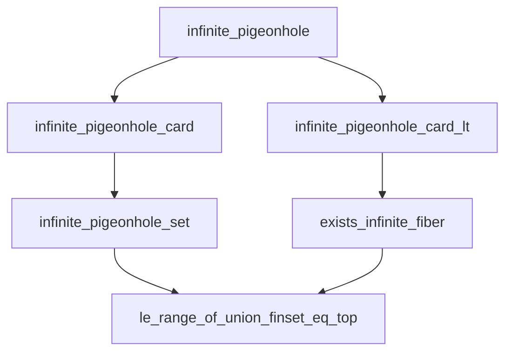
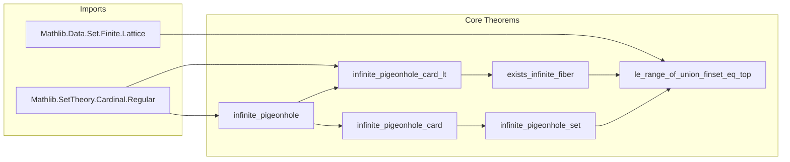

**Technical Brief: `Pigeonhole.lean` — Infinite Pigeonhole Principle in Lean 4**

---

### 1. **Key Definitions & Theorems**

| Name | Type | Purpose |
|------|------|---------|
| `infinite_pigeonhole` | `{β α : Type u} → (f : β → α) → ℵ₀ ≤ #β → #α < (#β).ord.cof → ∃ a, #(f ⁻¹' {a}) = #β` | Core infinite pigeonhole principle: if domain is uncountable and codomain’s cardinality is strictly less than the cofinality of the domain’s cardinal, then some fiber has full domain cardinality. |
| `infinite_pigeonhole_card` | `{β α : Type u} → (f : β → α) → θ : Cardinal → θ ≤ #β → ℵ₀ ≤ θ → #α < θ.ord.cof → ∃ a, θ ≤ #(f ⁻¹' {a})` | Generalized version: fiber size at least any intermediate cardinal θ ≤ #β satisfying ℵ₀ ≤ θ and #α < θ.cof. |
| `infinite_pigeonhole_set` | `{β α : Type u} → {s : Set β} → (f : s → α) → θ ≤ #s → ℵ₀ ≤ θ → #α < θ.ord.cof → ∃ a t, t ⊆ s ∧ θ ≤ #t ∧ ∀ x ∈ t, f x = a` | Set-theoretic variant: fiber over a ∈ α contains a subset t ⊆ s of size ≥ θ where f is constant. |
| `infinite_pigeonhole_card_lt` | `(f : β → α) → #α < #β → ℵ₀ ≤ #α → ∃ a, #α < #(f ⁻¹' {a})` | Stronger fiber lower bound: if codomain is infinite and strictly smaller than domain, some fiber is *strictly larger* than codomain. |
| `exists_infinite_fiber` | `(f : β → α) → #α < #β → Infinite α → ∃ a, Infinite (f ⁻¹' {a})` | Immediate corollary: under same hypotheses, some fiber is infinite. |
| `le_range_of_union_finset_eq_top` | `[Infinite β] → (f : α → Finset β) → ⋃ a, f a = ⊤ → #β ≤ #range f` | If an infinite type β is covered by countably many finite sets, the index set must be at least size β. |

---

### 2. **Naming Conventions**

- **Prefixes**:
  - `infinite_pigeonhole_*`: all theorems in this module follow this naming scheme.
  - `mk_`, `preimage_`, `iUnion_`, `sum_`, `iSup_`, `cof_`, `ord_`: standard cardinal arithmetic and order-theoretic prefixes.
- **Suffixes**:
  - `_card`: refers to cardinality-based statements.
  - `_set`: refers to set-theoretic refinements (e.g., subsets, inclusion).
  - `_lt`: indicates strict inequality conclusions (e.g., `#α < #(f ⁻¹' {a})`).
- **Variable naming**:
  - `f`: function (often the “coloring” or “labeling” map).
  - `β`, `α`: domain and codomain types.
  - `θ`: intermediate cardinal parameter.
  - `s`, `t`: subsets of domain/codomain.

---

### 3. **Tactic Stack**

- **Core tactics**:
  - `by_contra!`: for contradiction arguments (e.g., in `infinite_pigeonhole`).
  - `rw [← ...]`: extensive use of rewriting with cardinal equalities (e.g., `preimage_univ`, `iUnion_of_singleton`).
  - `exact`, `refine`, `obtain`, `rcases`: standard for constructing witnesses and decomposing hypotheses.
  - `simp_rw`: used in `infinite_pigeonhole_card_lt` and `exists_infinite_fiber` to simplify with definitional equalities.
  - `aesop`, `ring`, `linarith`: not present — proofs rely on cardinal arithmetic lemmas, not arithmetic simplification.
  - `Equiv.trans`, `Equiv.subtypeSubtypeEquivSubtypeExists`, `Quotient.sound`: for set-theoretic equivalences and subtype reasoning.
  - `inclusion`, `inclusion_injective`: for embedding subset arguments.

---

### 4. **Proof Logic**

- **General proof strategy**:
  1. **Contrapositive + union bound**: In `infinite_pigeonhole`, assume all fibers are small → bound total domain size via union of fibers → contradict assumption on cofinality.
  2. **Reduction to previous case**: `infinite_pigeonhole_card` reduces to `infinite_pigeonhole` via restriction to a subset `s ⊆ β` of size θ.
  3. **Set-theoretic refinement**: `infinite_pigeonhole_set` constructs the subset `t ⊆ s` explicitly as the preimage of `{a}` under `f`.
  4. **Cardinal arithmetic**: Use of cofinality properties (`cof_ord_le`, `isRegular_succ`), monotonicity of cardinal operations (`sum_le_mk_mul_iSup`, `mk_iUnion_le_sum_mk`), and regularity of successor cardinals.
  5. **Covering lemma**: `le_range_of_union_finset_eq_top` uses `exists_infinite_fiber` on the map `u' : β → range f` to derive a contradiction if range is too small.

- **Induction**: Not used — all proofs are direct cardinal arithmetic arguments.

---

### 5. **Imports**

| Import | Purpose |
|--------|---------|
| `Mathlib.Data.Set.Finite.Lattice` | Finite sets, lattice operations, finiteness lemmas (e.g., `union_finset_finite`). |
| `Mathlib.SetTheory/Cardinal/Regular` | Regular cardinals, cofinality, ordinal arithmetic (`ord.cof`, `isRegular_succ`). |

---

### 6. **Mermaid Diagrams**

#### **Dependency Graph (Theorems)**

#### **Overview of File Structure**

---

### 7. **Domain & Theory Scope**

- **Domain**: Set theory, cardinal arithmetic, combinatorics of infinite sets.
- **Theory**: Infinite pigeonhole principle, cofinality, regular cardinals, fiber size lower bounds.
- **Applications**: Used in combinatorial set theory, model theory (e.g., saturation arguments), and topology (e.g., countable coverings of uncountable spaces).

--- 

*End of Technical Brief.*
