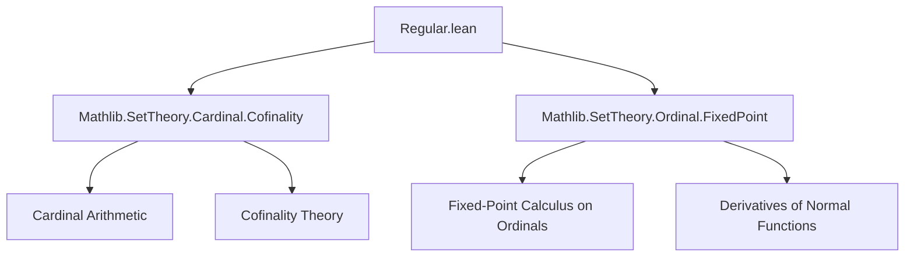
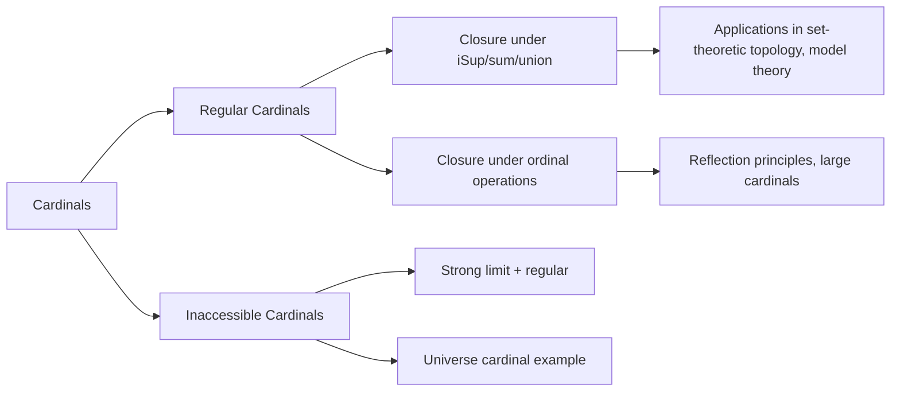

### Technical Brief: Regular and Inaccessible Cardinals in Lean 4 (Mathlib)

---

#### **1. Key Definitions & Theorems**

| Name | Type | Purpose |
|------|------|---------|
| `IsRegular (c : Cardinal)` | `Prop` | Defines a cardinal $ c $ as *regular*: $ \aleph_0 \le c \land c \le \mathrm{cof}(c) $. |
| `IsInaccessible (c : Cardinal)` | `Prop` | Defines a cardinal $ c $ as *strongly inaccessible*: $ \aleph_0 < c \land \mathrm{cof}(c) = c \land \forall x < c,\ 2^x < c $. |
| `IsRegular.aleph0_le` | `ℵ₀ ≤ c` | Extracts the infinitude condition from regularity. |
| `IsRegular.cof_eq` | `c.ord.cof = c` | Regular cardinals equal their cofinality (by antisymmetry). |
| `isRegular_aleph0` | `IsRegular ℵ₀` | $ \aleph_0 $ is regular. |
| `isRegular_succ` | `ℵ₀ ≤ c → IsRegular (succ c)` | Successor cardinals above $ \aleph_0 $ are regular. |
| `isRegular_aleph_one` | `IsRegular ℵ₁` | $ \aleph_1 $ is regular (as $ \aleph_1 = \mathrm{succ}(\aleph_0) $). |
| `isRegular_aleph_succ` | `IsRegular (ℵ_{α+1})` | All successor alephs are regular. |
| `isRegular_cof` | `IsSuccLimit o → IsRegular o.cof` | Cofinalities of limit ordinals are regular. |
| `iSup_lt_of_isRegular` | `#ι < c → (∀ i, f i < c) → iSup f < c` | Bounded indexed suprema over index sets smaller than a regular cardinal stay below it. |
| `card_iUnion_lt_iff_forall_of_isRegular` | Equivalence for unions: $ \#(\bigcup_i t_i) < c \iff \forall i,\ \#t_i < c $, when $ \#ι < c $ and $ c $ regular. |
| `IsInaccessible.univ` | `IsInaccessible univ` | The universe cardinal is inaccessible (provable in ZFC + Inaccessible Axiom). |
| `deriv_lt_ord` | `a < c.ord → deriv f a < c.ord` | Derivatives of normal functions bounded by a regular cardinal stay below it. |

---

#### **2. Naming Conventions**

- **Predicates**: `isRegular_`, `isInaccessible_`, `IsRegular.`, `IsInaccessible.`  
- **Properties**: `lt`, `le`, `eq`, `ne_zero`, `pos`, `nat_lt`, `ord_pos`, `lift`, `succ`, `aleph`, `omega`, `deriv`, `nfpFamily`, `derivFamily`, `blsub`, `bsup`, `iSup`, `sum`, `card_iUnion`, `biUnion`.
- **Quantifier-style lemmas**: `forall_of_`, `iff_forall_of_`, `lt_iff_forall_of_`.
- **Universe lifting**: `lift`, `lift_id`, `lift_le`.
- **Ordinal constructions**: `ord`, `cof`, `aleph`, `omega`, `deriv`, `nfpFamily`, `derivFamily`.

Prefixes like `isRegular_`, `isInaccessible_`, `card_`, `iSup_`, `sum_`, `deriv_`, `nfp_` indicate domain-specific operations or properties.

---

#### **3. Tactic Stack**

- `simp`, `rw`, `apply`, `exact`, `refine`, `intro`, `cases`, `induction`
- `aesop` (for basic logic and order reasoning)
- `linarith`, `omega` (for arithmetic inequalities)
- `rcases`, `obtain`, `set` (for destructing existential/structure proofs)
- `convert`, `trans`, `antisymm`, `lt_of_lt_of_le`, `lt_of_le_of_lt`
- `rwa`, `simpa`, `convert`, `ext`, `funext`
- `ord_eq`, `mk_out`, `typein_lt_type`, `mul_eq_self`, `sum_const'`, `mk_sigma`, `card_typein`

Most proofs rely on:
- Cofinality properties (`cof_ord_le`, `cof_cof`, `cof_eq'`)
- Cardinal arithmetic lemmas (`mul_le_mul_left`, `sum_le_sum`, `iSup_lt`, `bsup_lt_ord`)
- Ordinal recursion principles (`limitRecOn`, `nfpFamily_lt_ord`, `derivFamily_lt_ord`)

---

#### **4. Proof Logic**

- **Inductive/Recursive Structure**: Many proofs use ordinal recursion (`limitRecOn`) for fixed-point constructions (`nfpFamily`, `derivFamily`, `deriv`).
- **Cofinality Reduction**: Regularity is used to reduce bounds on suprema (`iSup_lt_of_isRegular`, `bsup_lt_ord_of_isRegular`) via `hc.cof_eq`.
- **Cardinal Inequalities**: Chain of inequalities using `lt_of_lt_of_le`, `lt_of_le_of_lt`, `trans`, `mul_lt_of_lt`.
- **Equivalence Proofs**: Often split into `⟨, ⟩` or `mp, mpr` for biconditionals.
- **Universe Management**: `lift` lemmas (`lift_id`, `lift_le`) used to adjust universe levels; `univ`-based facts (e.g., `IsInaccessible.univ`) rely on `univ` being a Grothendieck universe.

---

#### **5. Imports & Dependencies**

- `Mathlib.SetTheory.Cardinal.Cofinality`: Provides `cof`, `cof_ord_le`, `cof_cof`, `lsub_lt_ord`, `bsup_lt_ord`, etc.
- `Mathlib.SetTheory.Ordinal.FixedPoint`: Provides `nfp`, `deriv`, `derivFamily`, `nfpFamily`, `limitRecOn`, `iSup_Iio_eq_bsup`.

These imports define the foundational ordinal/cofinality machinery needed for regularity arguments.

---

#### **6. Mermaid Diagrams**

##### **Dependency Graph (Module-Level)**

##### **Overview of Theoretical Flow**

---

#### **7. Summary**

This module formalizes the theory of *regular* and *inaccessible* cardinals in Lean 4, building on cofinality and ordinal fixed-point theory. It emphasizes closure properties of regular cardinals under bounded suprema and unions, and provides foundational lemmas for reasoning about large cardinals. The file is well-structured, with clear separation between definitions, basic properties, and advanced closure lemmas. It serves as a cornerstone for further development in set theory and category theory (e.g., Grothendieck universes, accessible categories).
