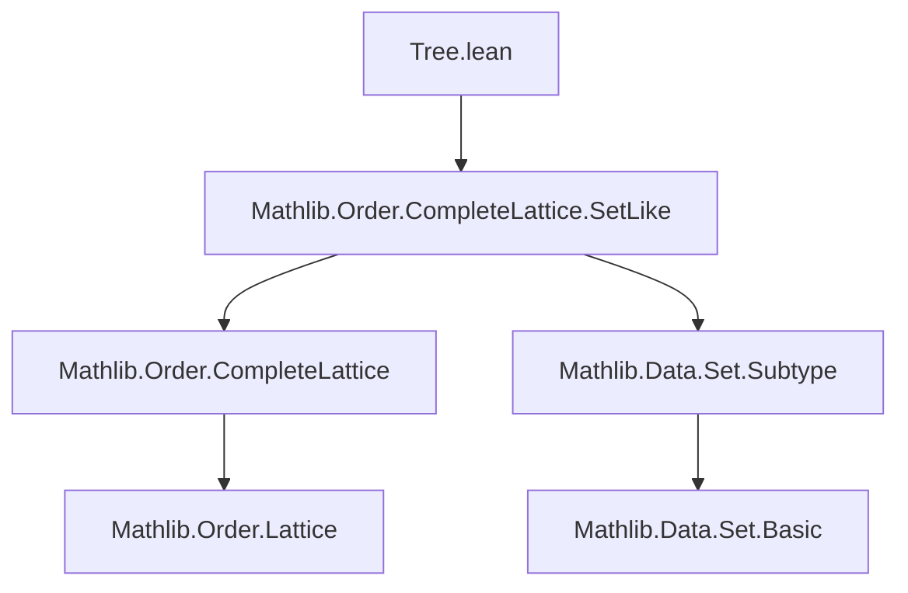
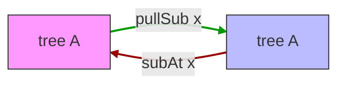

### Technical Brief: `Tree.lean` — Descriptive Set Theory Trees in Lean 4

---

#### **1. Key Definitions & Theorems**

| Name | Type / Signature | Purpose |
|------|------------------|---------|
| `tree A` | `CompleteSublattice (Set (List A))` | Defines a *tree* as a set of finite lists over `A`, closed under taking prefixes (via `x ++ [a] ∈ T → x ∈ T`). Implemented as a complete sublattice. |
| `mem_of_append` | `x ++ y ∈ T → x ∈ T` | Shows that if a concatenation is in the tree, then the prefix is too — core closure property. |
| `mem_of_prefix` | `x <+: y → y ∈ T → x ∈ T` | Immediate corollary: trees are downward-closed under the prefix order. |
| `take n x` | `x : T → T` | Truncates a tree element `x` to its first `n` nodes, staying within the tree. |
| `drop n x` | `x : T → subAt T (take n x).val` | Removes the first `n` nodes, returning a tree element in the *residual* tree rooted at `take n x`. |
| `subAt T x` | `tree A` | Residual tree: all lists `y` such that `x ++ y ∈ T`. Models “tree above node `x`”. |
| `pullSub T x` | `tree A` | Adjoint to `subAt`: pastes `x` in front of all paths in `T`. Elements are prefixes of `x` or `x ++ y` with `y ∈ T`. |
| `subAt_pullSub` | `subAt (pullSub T x) x = T` | Left-inverse law: pulling then sub-at returns original tree. |
| `pullSub_subAt` | `pullSub (subAt T x) x ≤ T` | Right-adjoint inequality: sub-at then pull-sub gives a subtree. |
| `pullSub_adjunction` | `pullSub S x ≤ T ↔ S ≤ subAt T x` | Galois connection (adjunction) between `pullSub x` and `subAt x`. |
| `singleton_mem` | `a :: x ∈ T → [a] ∈ T` | If a list of length >1 is in `T`, then its first-element singleton is too. |
| `tree_eq_bot` | `T = ⊥ ↔ [] ∉ T` | Characterizes the bottom (empty tree) via non-membership of the empty list. |

---

#### **2. Naming Conventions**

- **Prefixes**:
  - `mem_`: membership lemmas (e.g., `mem_of_append`, `mem_of_prefix`)
  - `take_`, `drop_`, `subAt_`, `pullSub_`: operations on trees
  - `singleton_`, `take_take`, `take_eq_take`: structural properties
- **Suffixes**:
  - `_mono`: monotonicity lemmas (`subAt_mono`, `pullSub_mono`)
  - `_adjunction`: adjunction properties (`pullSub_adjunction`)
  - `_nil`, `_append`: behavior under `[]` or `++`
- **Notable patterns**:
  - `subAt` and `pullSub` are dual constructions; their names reflect categorical adjunction.
  - `take`/`drop` are *internalized* to the tree type via subtypes.

---

#### **3. Tactic Stack**

Frequently used tactics in proofs:
- `simp` / `simp_rw`: simplification with definitional equalities and lemmas (`[Subtype.ext_iff]`, `List.take_drop`, etc.)
- `intro`, `exact`, `apply`: basic intro/elimination
- `induction`: especially on lists (`List` induction with `generalizing`)
- `rcases` / `obtain`: destructing existential or conjunction hypotheses
- `gcongr`: for monotonicity goals (e.g., `subAt_mono`, `pullSub_mono`)
- `rw [← ...]`: rewriting using inverse equalities (e.g., `← subAt_pullSub`)
- `cases` + `by_cases`: case splits on length comparisons (`le_total`, `hp : x <+: z`)
- `ext`: extensionality for set equality (proving `S = T` by `ext y`)
- `lia`: linear arithmetic for numeric inequalities

---

#### **4. Proof Logic**

- **Structure**: Proofs are largely *constructive* and *case-analytic* on list structure or length.
- **Common pattern**:
  1. Use `ext` to reduce set equality to element membership.
  2. Unfold definitions (`subAt`, `pullSub`, `take`, `drop`) via `simp`.
  3. Split on `y.length ≤ x.length` or `x.length ≤ y.length` using `le_total`.
  4. For short/long cases, apply `mem_pullSub_short` / `mem_pullSub_long`.
  5. Use `prefix`/`append` lemmas (`List.take_append_drop`, `prefix_iff_eq_take`) to relate prefixes and concatenations.
- **Induction**: Used in `mem_of_append` (on `y : List A`) and `mem_of_prefix` (via `mem_of_append`).
- **Adjointness**: Proven via two-directional implication (`↔`), often using `gcongr` and `le_trans`.

---

#### **5. Imports & Dependencies**

- **Core imports**:
  ```lean
  Mathlib.Order.CompleteLattice.SetLike
  ```
- **Implicit dependencies**:
  - `Mathlib.Data.List.Basic` (for `List`, `++`, `take`, `drop`, `isPrefix`)
  - `Mathlib.Data.Set.Subset` (for `≤`, `⊥`, `mem_of_prefix`)
  - `Mathlib.Order.PartialOrder` (for `PartialOrder (tree A)`)
  - `Mathlib.Data.Subtype` (for `SetLike`, `Subtype.ext_iff`)

---

#### **6. Mermaid Diagrams**

##### **Dependency Graph (Module-Level)**



##### **Conceptual Overview (Theory Flow)**

```mermaid
flowchart LR
  A[Type A] --> B[Lists List A]
  B --> C[Set (List A)]
  C --> D[CompleteSublattice]
  D --> E[tree A]

  E --> F[Prefix-closed subsets]
  F --> G[Take/Drop operations]
  F --> H[Residual trees subAt]
  F --> I[Adjoint pasting pullSub]

  G --> J[Algebraic structure: monoid-like]
  H --> K[Galois connection: pullSub ⊣ subAt]
  I --> K
```

##### **Adjointness Relationship**



> **Interpretation**: `pullSub x ⊣ subAt x` forms a Galois connection (left adjoint `pullSub x`, right adjoint `subAt x`).

---

#### **7. Summary**

This file formalizes *descriptive-set-theoretic trees* (prefix-closed sets of finite sequences) as a *complete sublattice* of `Set (List A)`. It introduces:
- A subtype-based definition (`tree A`) with `SetLike` coercion.
- Core operations: `take`, `drop`, `subAt`, `pullSub`.
- Key algebraic and order-theoretic properties: monotonicity, adjunction, prefix-closure.
- A clean, extensible foundation for later work on well-founded trees, pruned trees, or Baire space embeddings.

The design reflects Lean’s emphasis on *type-theoretic structure* (subtypes, `SetLike`, `CompleteSublattice`) while preserving classical descriptive set theory intuition (paths, roots, residuals).
