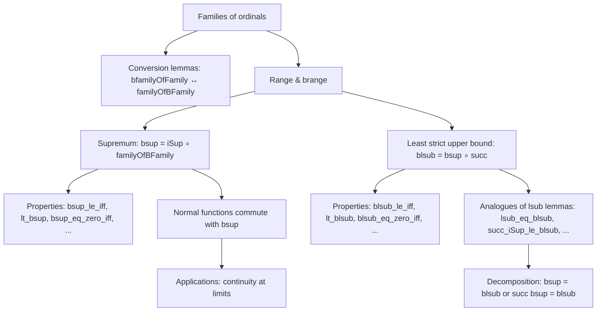

### Technical Brief: `Family.lean` — Arithmetic on Families of Ordinals

---

#### **1. Key Definitions & Theorems**

| Name | Type / Signature | Purpose |
|------|------------------|---------|
| `bfamilyOfFamily'` | `(r : ι → ι → Prop) [IsWellOrder ι r] → (f : ι → α) → ∀ a < type r, α` | Converts a family indexed by a type to one indexed by an ordinal via a well-ordering. |
| `bfamilyOfFamily` | `(f : ι → α) → ∀ a < type (@WellOrderingRel ι), α` | Same as above, using AC to get a well-ordering. |
| `familyOfBFamily'` | `(r : ι → ι → Prop) [IsWellOrder ι r] → type r = o → (∀ a < o, α) → ι → α` | Converts a family indexed by an ordinal to one indexed by a type. |
| `familyOfBFamily` | `o : Ordinal → (∀ a < o, α) → o.ToType → α` | Same as above, using `· < ·` on `o.ToType`. |
| `brange` | `o : Ordinal → (∀ a < o, α) → Set α` | Range of a family indexed by ordinals `< o`. |
| `bsup` | `o : Ordinal.{u} → (∀ a < o, Ordinal.{max u v}) → Ordinal.{max u v}` | Supremum of a family indexed by ordinals `< o`. Defined as `iSup (familyOfBFamily o f)`. |
| `lsub` | `(f : ι → Ordinal.{max u v}) → Ordinal` | Least strict upper bound: `iSup (succ ∘ f)`. |
| `blsub` | `o : Ordinal.{u} → (∀ a < o, Ordinal.{max u v}) → Ordinal.{max u v}` | Least strict upper bound for families indexed by `< o`. Defined as `bsup o (succ ∘ f)`. |
| `iSup_eq_bsup` | `iSup (familyOfBFamily o f) = bsup o f` | Equivalence between `iSup` and `bsup`. |
| `lsub_le_iff` | `lsub f ≤ a ↔ ∀ i, f i < a` | Characterization of `lsub`. |
| `lt_lsub` | `f i < lsub f` | Every element is strictly below `lsub f`. |
| `lsub_typein` | `lsub (typein (· < ·)) = o` | `lsub` of `typein` on `o.ToType` recovers `o`. |
| `IsNormal.bsup` | `IsNormal f → o ≠ 0 → f (bsup o g) = bsup o (f ∘ g)` | Normal functions commute with `bsup`. |
| `bsup_le_iff`, `lt_bsup`, `bsup_eq_zero_iff`, etc. | Various characterizations of `bsup` | Analogues of `iSup` lemmas for `bsup`. |
| `blsub_le_iff`, `lt_blsub`, `blsub_eq_zero_iff`, etc. | Analogous lemmas for `blsub` | Least strict upper bound for bounded-index families. |

**Notable Theorems:**
- `iSup_eq_lsub_iff`: `iSup f = lsub f ↔ ∀ a < lsub f, succ a < lsub f` — characterizes when `iSup` is a limit ordinal.
- `lsub_notMem_range`: `lsub f ∉ range f` — `lsub f` is strictly above all `f i`.
- `iSup_typein_limit`: If `o` is closed under successor, then `iSup (typein (· < ·)) = o`.
- `bsup_succ_of_mono`: For monotone `f` on `succ o`, `bsup f = f o`.

---

#### **2. Naming Conventions**

- **Prefixes:**
  - `b*`: “bounded” — families indexed by ordinals `< o`, e.g., `bsup`, `blsub`, `brange`, `bfamilyOfFamily`.
  - `*OfFamily*`: Conversion functions between type-indexed and ordinal-indexed families.
- **Suffixes:**
  - `'`: Variant using a *specified* well-ordering (e.g., `bfamilyOfFamily'`).
  - No `'`: Uses AC to pick a well-ordering (e.g., `bfamilyOfFamily`).
- **`iSup` vs `bsup` vs `lsub` vs `blsub`:**
  - `iSup`: General supremum over type-indexed families.
  - `bsup`: Supremum over families indexed by `< o`.
  - `lsub`: Least *strict* upper bound (uses `succ ∘ f`).
  - `blsub`: Bounded version of `lsub`.

---

#### **3. Tactic Stack**

Frequent tactics used:
- `simp` / `simp_rw`: Especially for unfolding `bsup`, `lsub`, `brange`, `familyOfBFamily`, etc.
- `rw`: Rewriting using lemmas like `iSup_eq_bsup`, `lsub_le_iff`, `bsup_le_iff`.
- `apply`, `exact`: For direct proof steps.
- `convert`: To align goals with known lemmas (e.g., `convert ... using 2`).
- `rcases`, `cases`: For case analysis on `eq_or_lt_of_le`, `or`, `exists`.
- `aesop`: Likely used in background automation (though not explicit here).
- `congr'`: For congruence proofs (e.g., `bsup_congr`, `blsub_congr`).
- `apply ... using ...`: For applying lemmas with manual unification.
- `by_contra!`: For contradiction proofs (e.g., `succ_lt_iSup_of_ne_iSup`).
- `ext`: Set extensionality (e.g., `Set.ext` in `range_familyOfBFamily'`).

---

#### **4. Proof Logic**

- **Induction on ordinals** is used for `IsNormal.bsup`, via `inductionOn`.
- **Case analysis** on `eq_or_lt_of_le`, `or`, `exists`, and `IsEmpty/Nonempty`.
- **Equational reasoning** with `antisymm`, `trans`, `lt_of_lt_of_le`, etc.
- **Universe management** is explicit: many lemmas have universe parameters `u, v, w`.
- **Reduction to `iSup`/`lsub`**: Many `bsup`/`blsub` lemmas are proved by reducing to `iSup`/`lsub` via `iSup_eq_bsup`, `lsub_eq_blsub`.
- **Set-theoretic reasoning**: `brange`, `range`, `mem_brange`, `bddAbove`, `Small`, `mk_le_mk_of_subset`, etc.

---

#### **5. Imports**

- `Mathlib.SetTheory.Ordinal.Arithmetic`: Core ordinal arithmetic.
- `Function`, `Cardinal`, `Set`, `Equiv`, `Order`: Standard libraries for sets, functions, cardinals, order theory.
- `Ordinal` namespace scoped: `open scoped Ordinal`.

---

#### **6. Dependency & Theory Overview**

##### **Mermaid Diagram: File Dependencies**

```mermaid
graph TD
  A[Family.lean] --> B[Mathlib.SetTheory.Ordinal.Arithmetic]
  B --> C[Mathlib.SetTheory.Ordinal.Basic]
  B --> D[Mathlib.SetTheory.Ordinal.Cofinality]
  B --> E[Mathlib.SetTheory.Ordinal.Principal]
  E --> A  %% sup/lsub defined in Principal.lean, referenced here
```

##### **Mermaid Diagram: Theory Flow in `Family.lean`**



##### **Relationship to Other Files**

- `Principal.lean`: Contains `sup`, `lsub` for *sets* of ordinals (not families), and principal ordinal operations.
- `Family.lean`: Extends this to *indexed families*, especially those indexed by ordinals `< o`.
- `Cofinality.lean`: Uses `bsup`, `blsub` to define cofinality and prove properties like `cf_le`, `cf_pos`, etc.
- `Normal.lean`: Defines `IsNormal`, used in `IsNormal.bsup`.

---

#### **7. Summary**

`Family.lean` formalizes the calculus of **indexed families of ordinals**, distinguishing between:
- Families indexed by arbitrary types (via `iSup`, `lsub`), and
- Families indexed by ordinals `< o` (via `bsup`, `blsub`).

It provides:
- **Equivalences** between the two indexing styles,
- **Universal properties** (e.g., `bsup_le_iff`, `lt_blsub_iff`),
- **Continuity properties** for normal functions,
- **Decomposition lemmas** (e.g., `bsup = blsub` or `succ bsup = blsub`).

The file is foundational for higher ordinal arithmetic, especially in cofinality and normal function theory.

--- 

Let me know if you'd like a formalized dependency graph (e.g., in `.dot` format) or a summary of deprecated aliases.
