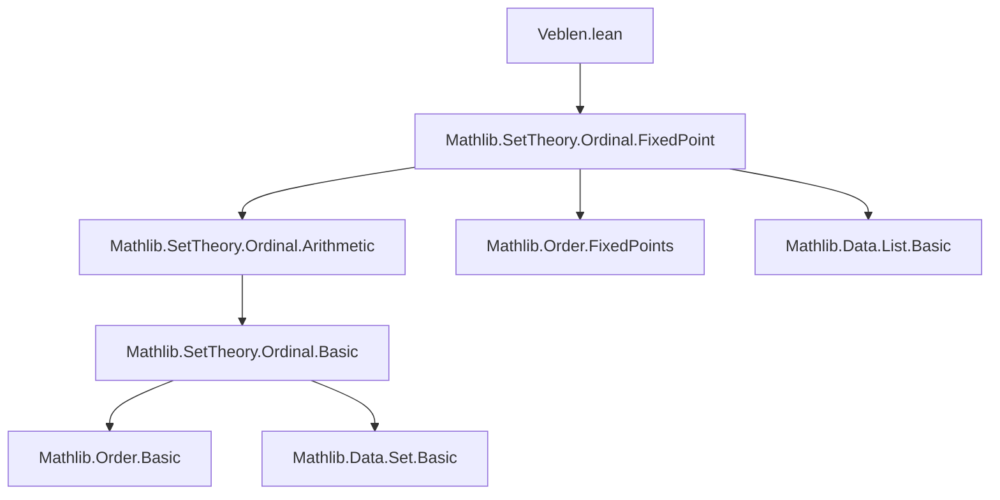

### Technical Brief: Veblen Hierarchy in Lean 4 (`Veblen.lean`)

---

#### **1. Key Definitions & Theorems**

| Name | Type / Signature | Purpose |
|------|------------------|---------|
| `veblenWith f o` | `Ordinal → Ordinal` | The $o$-th function in the Veblen hierarchy starting from $f$. For $o = 0$, it's $f$; for $o \ne 0$, it enumerates common fixed points of all earlier `veblenWith f o'`. |
| `veblen` | `Ordinal → Ordinal → Ordinal` | Special case of `veblenWith` with $f(a) = \omega^a$. Satisfies `veblen 0 a = ω ^ a`, and for $o \ne 0$, `veblen o` enumerates fixed points of `veblen o'` for $o' < o$. |
| `epsilon` / `ε_ o` | `Ordinal → Ordinal` | Abbreviation for `veblen 1`. Enumerates fixed points of $\omega^{(\cdot)}$. |
| `ε₀` | `Ordinal` | Notation for `ε_ 0`, the first fixed point of $\omega^{(\cdot)}$. |
| `gamma` / `Γ_ o` | `Ordinal → Ordinal` | Derivative of `veblen · 0`. Enumerates fixed points of the map $a \mapsto \texttt{veblen} \, a \, 0$. |
| `Γ₀` | `Ordinal` | Notation for `Γ_ 0`, the Feferman–Schütte ordinal. |
| `invVeblen₁ x`, `invVeblen₂ x` | `Ordinal → Ordinal` | Components of the inverse of `veblen`: for any $x$, $\omega^x = \texttt{veblen} \, (\texttt{invVeblen₁} \, x) \, (\texttt{invVeblen₂} \, x)$ with $\texttt{invVeblen₂} \, x < \omega^x$. |
| `isNormal_veblenWith`, `isNormal_veblen` | `IsNormal (veblenWith f o)` / `IsNormal (veblen o)` | Proves that all `veblenWith f o` and `veblen o` are *normal functions* (strictly increasing and continuous). |
| `veblen_lt_veblen_iff`, `veblen_le_veblen_iff`, `veblen_eq_veblen_iff` | `↔` characterizations | Provide full ordering/equality criteria for `veblen o₁ a` vs `veblen o₂ b`, based on lexicographic comparison of $(o, a)$. |
| `lt_veblen` | `a < veblen a a` | Fundamental inequality showing that every ordinal is strictly below its image under the diagonal Veblen function. |
| `epsilon0_eq_nfp`, `gamma0_eq_nfp` | `ε₀ = nfp (fun a ↦ ω ^ a) 0`, `Γ₀ = nfp (veblen · 0) 0` | Characterize $\varepsilon_0$ and $\Gamma_0$ as *least fixed points* of their respective normal functions. |
| `veblen_eq_opow_iff` | `veblen o a = ω ^ x ↔ invVeblen₁ x = o ∧ invVeblen₂ x = a` | Connects `veblen` and `invVeblen` via bijection between ordinals and pairs $(o, a)$. |

---

#### **2. Naming Conventions**

- **Prefixes**:
  - `veblenWith_`, `veblen_`, `epsilon_`, `gamma_`, `invVeblen₁`, `invVeblen₂`: module-specific.
  - `isNormal_`: indicates normality of a function.
  - `mem_range_`: membership in the range of a function.
  - `right_`, `left_`: refer to monotonicity in the second or first argument, respectively.
  - `zero_`: properties involving `o = 0` or `a = 0`.
  - `succ_`: properties involving successor ordinals.

- **Suffixes**:
  - `_iff`: equivalence statements (`↔`).
  - `_le`, `_lt`, `_inj`, `_mono`: indicate inequality, injectivity, monotonicity.
  - `_zero`, `_succ`: special cases for 0 or successor.
  - `_of_lt`, `_of_ne_zero`: conditional simplifications under assumptions.

- **Notation**:
  - `ε_ o`, `ε₀`, `Γ_ o`, `Γ₀`: scoped notations in `Ordinal` namespace.
  - `deriv`, `nfp`, `Iio`, `derivFamily`: from `Mathlib.SetTheory.Ordinal.FixedPoint`.

---

#### **3. Tactic Stack**

| Tactic | Usage Frequency | Purpose |
|--------|-----------------|---------|
| `simp` / `simp_rw` | Very High | Simplify using `@[simp]` lemmas (e.g., `veblen_zero`, `veblen_inj`). |
| `aesop` | High | Solve propositional combinations of inequalities/equalities (e.g., in `veblen_lt_veblen_iff`). |
| `grind` | Medium | Advanced simplification with rewrite hints (e.g., `veblenWith_veblenWith_eq_veblenWith_iff`). |
| `rw` | Very High | Rewrite using definitions or lemmas (e.g., `veblenWith_of_ne_zero`, `mem_range_derivFamily`). |
| `obtain` / `cases` | High | Case analysis on `eq_or_ne`, `lt_trichotomy`, `eq_zero_or_pos`. |
| `apply`, `exact`, `assumption` | Medium | Direct proof steps, especially in monotonicity/normality proofs. |
| `convert`, `congr_arg`, `ext` | Medium | Prove equality of functions or terms via extensionality or congruence. |
| `induction` | Medium | Structural induction on `l : List Ordinal` in `isNormal_veblenWith_zero`. |
| `ring` | Low | Not used here (no arithmetic in `ℕ` or `ℝ`). |

---

#### **4. Proof Logic**

- **Inductive/Recursive Structure**:
  - `veblenWith` is defined by *transfinite recursion* on `o`, using `derivFamily` for limit stages.
  - Proofs about `veblenWith` and `veblen` follow the same recursion: case split on `o = 0` vs `o ≠ 0`, then use properties of `derivFamily`.

- **Common Proof Patterns**:
  - **Normality**: Show `veblenWith f o` is strictly increasing and continuous via `isNormal_derivFamily`.
  - **Fixed-point characterizations**: Use `mem_range_derivFamily ↔ ∀ b < o, ... = ...`.
  - **Lexicographic comparison**: Prove ordering lemmas (`lt`, `le`, `eq`) by reducing to `cmp` and using `cmp_veblenWith`.
  - **Diagonal inequalities**: Use `lt_veblen` and `left_le_veblen` to bound ordinals below their Veblen images.
  - **Inverse construction**: Define `invVeblen₁` as `sInf {y | veblen y x ≠ x}`, then prove uniqueness and correctness via `mem_range_veblen_iff_le_invVeblen₁`.

- **Key Lemmas Used**:
  - `derivFamily_zero`, `deriv_eq_enumOrd`, `Subtype.forall`, `Function.mem_fixedPoints_iff`.
  - `lt_nfp_iff`, `nfp_le_fp`, `iterate_lt_nfp`: for characterizing $\varepsilon_0$, $\Gamma_0$.
  - `opow_right_inj`, `opow_le_opow_iff_right`: for reasoning about exponentiation.

---

#### **5. Imports**

- **Primary Dependency**:
  ```lean
  import Mathlib.SetTheory.Ordinal.FixedPoint
  ```
  Provides:
  - `deriv`, `derivFamily`, `nfp`, `isNormal`, `fixedPoints`, `enumOrd`, `Iio`, etc.

- **Implicit Imports** (via `Mathlib.SetTheory.Ordinal`):
  - `Mathlib.SetTheory.Ordinal.Arithmetic` (`ω`, `^`, `opow`, etc.)
  - `Mathlib.Order.Basic`, `Mathlib.Data.List.Basic`, `Mathlib.Data.Set.Basic`

---

#### **6. Mermaid Diagrams**

##### **Dependency Graph (Module-Level)**



##### **Overview of Theory Structure**

```mermaid
flowchart LR
  subgraph Definitions
    V1[veblenWith f o] --> V2[veblen o a]
    V2 --> E[ε_ o = veblen 1 o]
    V2 --> G[Γ_ o = deriv (veblen · 0)]
    V2 --> I[invVeblen₁ x, invVeblen₂ x]
  end

  subgraph Properties
    P1[IsNormal veblen o] --> P2[StrictMono veblen o]
    P2 --> P3[veblen o a < veblen o b ↔ a < b]
    P3 --> P4[veblen_lt_veblen_iff]
    P4 --> P5[Ordinal notation up to Γ₀]
  end

  subgraph Applications
    A1[ε₀ = nfp (ω^·)] --> A2[Countability? (TODO)]
    A1 --> A3[Exponential principal ordinals]
    A4[Γ₀ = nfp (veblen · 0)] --> A5[Feferman–Schütte ordinal]
    A4 --> A6[veblen-principal ordinals]
  end

  V1 --> P1
  V2 --> P1
  E --> A1
  G --> A4
```

---

#### **7. TODO & Open Questions (from file)**

- Prove `ε₀` and `Γ₀` are **countable**.
- Prove exponential principal ordinals = epsilon ordinals ∪ {0, 1, 2, ω}.
- Prove ordinals principal under `veblen` = gamma ordinals ∪ {0}.

These suggest future work on **proof-theoretic applications**, especially ordinal analysis and ** predicative foundations**.

---

#### **8. References**

- Larry W. Miller, *Normal functions and constructive ordinal notations*, 1976.

This file formalizes the **two-argument Veblen hierarchy**, building on fixed-point theory for normal functions on ordinals. It serves as a foundation for **ordinal notation systems up to Γ₀**, crucial in proof theory (e.g., for PA, ID₁).
