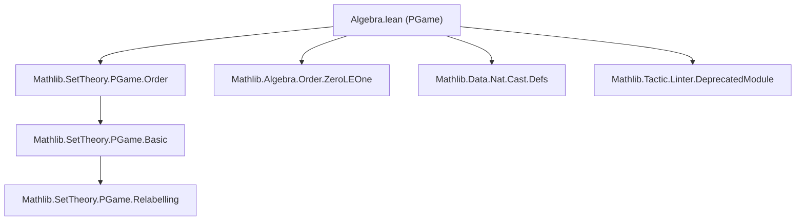

### Technical Brief: `Algebra.lean` (PGame Algebraic Structure)

---

#### **1. Key Definitions & Theorems**

| Name | Type / Signature | Purpose |
|------|------------------|---------|
| `neg : PGame → PGame` | `def neg : PGame → PGame` | Defines negation of a pregame: $- \{x_L \mid x_R\} = \{-x_R \mid -x_L\}$. |
| `instance : Neg PGame` | `instance` | Makes `neg` available as unary `-`. |
| `instance : InvolutiveNeg PGame` | `instance` | Proves $--x = x$. |
| `instance : NegZeroClass PGame` | `instance` | Ensures $-0 = 0$. |
| `add : PGame → PGame → PGame` | `instance : Add PGame` | Defines addition: $x + y = \{x_L + y, x + y_L \mid x_R + y, x + y_R\}$. |
| `instance : NatCast PGame` | `instance` | Embeds natural numbers via unary representation: $n = 0 + \cdots + 1$. |
| `sub : PGame → PGame → PGame` | `instance : Sub PGame := ⟨λ x y, x + -y⟩` | Defines subtraction as $x - y := x + (-y)$. |
| `add_zero_equiv`, `zero_add_equiv` | `x + 0 ≈ x`, `0 + x ≈ x` | Identity laws up to equivalence. |
| `add_comm`, `add_assoc` | `x + y ≡ y + x`, `x + y + z ≡ x + (y + z)` | Commutativity & associativity up to *identical* relabelling. |
| `neg_add`, `neg_add_rev` | `-(x + y) = -x + -y`, `-(x + y) ≡ -y + -x` | Distributivity of negation over addition. |
| `neg_add_cancel_equiv` | `-x + x ≈ 0` | Inverse law: sum of a game and its negation is equivalent to zero. |
| `le_iff_sub_nonneg` | `x ≤ y ↔ 0 ≤ y - x` | Order-theoretic characterization of ≤ via subtraction. |
| `lt_iff_sub_pos` | `x < y ↔ 0 < y - x` | Strict order via subtraction. |
| `add_le_add_right'` | `x ≤ y → x + z ≤ y + z` | Monotonicity of addition in right argument. |
| `add_lf_add_right` | `y ⧏ z → y + x ⧏ z + x` | Strict monotonicity of addition. |
| `Identical.neg`, `Identical.add`, `Identical.sub` | `x₁ ≡ x₂ → -x₁ ≡ -x₂`, etc. | Compatibility of algebraic ops with identity/equivalence. |
| `Relabelling.negCongr`, `Relabelling.addCongr`, `Relabelling.subCongr` | `x ≡ᵣ y → -x ≡ᵣ -y`, etc. | Compatibility with *relabellings* (stronger than equivalence). |

---

#### **2. Naming Conventions**

- **Prefixes**:
  - `neg_`: properties of negation (`neg_def`, `neg_le_neg_iff`, `neg_add`, `neg_insertLeft_neg`, etc.)
  - `add_`: properties of addition (`add_zero`, `add_comm`, `add_assoc`, `add_le_add_right'`, etc.)
  - `sub_`: properties of subtraction (`sub_zero`, `sub_congr`, etc.)
  - `memₗ_`, `memᵣ_`: membership in left/right options (`memₗ_add_iff`, `memᵣ_neg_iff`, etc.)
  - `isOption_`: option-related (`isOption_neg`, `isOption_neg_neg`)
  - `leftMoves_`, `rightMoves_`: move-set bijections (`leftMoves_add`, `rightMoves_neg`, etc.)
  - `toLeftMoves_`, `toRightMoves_`: equivalence/cast functions (`toLeftMovesAdd`, `toRightMovesNeg`)
  - `Relabelling._Congr`: congruence lemmas for relabellings (`addCongr`, `negCongr`, `subCongr`)
  - `equiv`: for equivalence (`equiv_rfl`, `equiv_symm`, `equiv_trans`)
  - `identical_`, `Identical._`: for *identical* games (stronger than equivalence)

- **Suffixes**:
  - `_equiv`: equivalence (`add_zero_equiv`, `neg_add_cancel_equiv`)
  - `_le`: ≤-version (`neg_le_neg_iff`, `add_le_add_right'`)
  - `_lf`: ⧏-version (`neg_lf_neg_iff`, `add_lf_add_right`)
  - `_lt`: < version (`neg_lt_neg_iff`, `lt_iff_sub_pos`)
  - `_cases`: case analysis principles (`leftMoves_add_cases`, `rightMoves_add_cases`)
  - `_inl`, `_inr`: for sum-type moves (`add_moveLeft_inl`, `add_moveRight_inr`)

---

#### **3. Tactic Stack**

- **Induction**: `induction x with | mk xl xr xL xR ihL ihR =>` — core pattern for structural induction on `PGame`.
- **Simplification**:
  - `simp only [...]`, `simp_rw [...]`, `dsimp`
  - `congr`, `funext`, `ext`, `rfl`
- **Rewriting & Congruence**:
  - `grw [...]` — global rewriting (used for order reasoning)
  - `gcongr` — congruence for order relations
- **Case analysis**:
  - `rcases h with (⟨i | i⟩ | i)` — for sum types
  - `intro (i | i)` — for `Sum`
- **Equivalence reasoning**:
  - `change`, `rw [Equiv, Equiv, ...]`, `apply Equiv.trans`, `apply Equiv.symm`
- **Relabelling proofs**:
  - `refine ⟨Equiv.sumComm _, _, ?_, ?_⟩`, `intro (_ | _)`, `apply ...`
- **Termination**: `termination_by (x, y, z) => ...` — used in recursive definitions to ensure well-foundedness.

---

#### **4. Proof Logic**

- **Structural Induction**: Most proofs proceed by induction on `x`, `y`, `z : PGame`, using the `mk` constructor pattern.
- **Case Splitting on Moves**: Proofs about left/right moves often split on `Sum.inl`/`Sum.inr` (for addition) or use `toLeftMovesAdd`, `toRightMovesNeg` to translate between move types.
- **Equivalence vs Identity**: Many lemmas distinguish between:
  - `≡` (identical games, definitional equality of constructors),
  - `≈` (equivalent games, mutual ≤),
  - `≡ᵣ` (relabellings, stronger than `≡`).
- **Order Reasoning**: Uses `le_def`, `lf_def`, `lt_iff_le_and_lf`, and monotonicity lemmas (`add_le_add_right'`, `add_lf_add_right`) to lift order through operations.
- **Relabelling Congruences**: Prove `w ≡ᵣ x → y ≡ᵣ z → w + y ≡ᵣ x + z` by constructing explicit relabellings using `Equiv.sumCongr`, `Equiv.refl`, etc.

---

#### **5. Imports & Dependencies**

| Import | Purpose |
|--------|---------|
| `Mathlib.Algebra.Order.ZeroLEOne` | Provides `0 ≤ 1` and related order facts. |
| `Mathlib.SetTheory.PGame.Order` | Defines order relations `≤`, `⧏`, `<`, `≈`, `‖`, and basic properties. |
| `Mathlib.Data.Nat.Cast.Defs` | Defines natural number casting and unary representation. |
| `Mathlib.Tactic.Linter.DeprecatedModule` | Linter for deprecated modules. |

> **Note**: This module is **deprecated** as of `2025-08-06`. Its contents have moved to `CombinatorialGames.Game.IGame` in the [CGT repo](https://github.com/vihdzp/combinatorial-games).

---

#### **6. Mermaid Diagrams**

##### **Dependency Graph (Top-Level)**



##### **Overview of File Structure**

```mermaid
flowchart LR
  A["Negation"] --> B["Addition & Subtraction"]
  B --> C["Order Interactions"]
  C --> D["Equivalence & Relabelling"]
  D --> E["Special Games (e.g., star)"]

  A --> A1["def neg"]
  A --> A2["InvolutiveNeg"]
  A --> A3["neg_le_neg_iff"]
  A --> A4["memₗ_neg_iff"]

  B --> B1["def add"]
  B --> B2["add_zero_equiv"]
  B --> B3["add_comm", "add_assoc"]
  B --> B4["neg_add", "neg_add_cancel_equiv"]
  B --> B5["sub"]

  C --> C1["le_iff_sub_nonneg"]
  C --> C2["lt_iff_sub_pos"]
  C --> C3["add_le_add_right'"]
  C --> C4["add_lf_add_right"]

  D --> D1["Identical.neg", "Identical.add"]
  D --> D2["Relabelling.negCongr", "Relabelling.addCongr"]
  D --> D3["equiv", "identical_zero_iff"]

  E --> E1["star"]
```

---

#### **7. Theory Context**

This file formalizes the **algebraic foundation** of *combinatorial pre-games* (PGame), enabling:
- Construction of an **additive commutative group** structure on the quotient (games modulo equivalence).
- Interpretation of **order** (`≤`, `<`, `⧏`) in terms of subtraction.
- Use of **relabellings** to handle definitional issues (e.g., associativity is not definitional, but relabellings witness equivalence).

The group laws are proven *up to equivalence* (`≈`), with relabellings (`≡ᵣ`) used to bridge definitional gaps (e.g., `add_assoc` is not definitional, but `add_assoc_equiv` holds).

The deprecated status reflects migration to a dedicated **Combinatorial Game Theory (CGT)** library, where `IGame` provides a more refined and scalable implementation.

--- 

Let me know if you'd like a formalization of the group axioms on the quotient or a comparison with the new `IGame` structure.
