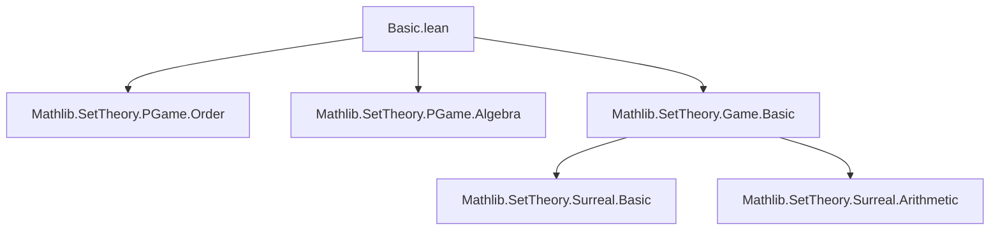
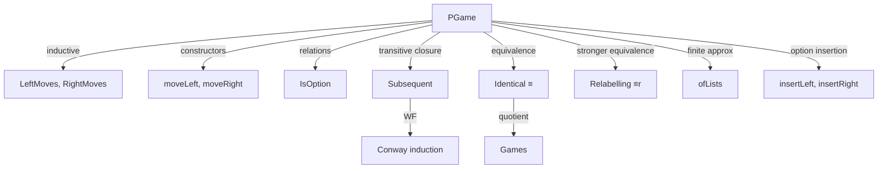

### Technical Brief: `Basic.lean` — Combinatorial Pregames in Lean 4

---

#### **1. Key Definitions & Theorems**

| Name | Type / Signature | Purpose |
|------|------------------|---------|
| `PGame` | `Type (u + 1)` (inductive) | Inductive type of *pregames*, built from two indexing types and move functions. |
| `LeftMoves`, `RightMoves` | `PGame → Type u` | Indexing types for Left and Right moves. |
| `moveLeft`, `moveRight` | `∀ g, LeftMoves g → PGame`, `∀ g, RightMoves g → PGame` | Resulting game after a move. |
| `ofLists` | `List PGame → List PGame → PGame` | Construct a pregame from finite lists of options (via `ULift (Fin n)`). |
| `IsOption` | `PGame → PGame → Prop` (inductive) | `x` is an immediate option (left or right) of `y`. |
| `Subsequent` | `PGame → PGame → Prop` | Transitive closure of `IsOption`; `x` reachable from `y` via nonempty move sequence. |
| `Identical` (`≡`) | `PGame → PGame → Prop` | Structural equality up to renaming of move indices (bi-total correspondence of options). |
| `memₗ`, `memᵣ` | `PGame → PGame → Prop` | Membership in left/right options up to `≡`. |
| `Relabelling` (`≡r`) | `PGame → PGame → Type (u + 1)` (inductive) | Stronger than `Identical`: explicit equivalence of move types + inductive relabellings of options. |
| `relabel` | `(xl' ≃ x.LeftMoves) → (xr' ≃ x.RightMoves) → PGame` | Reindex moves via equivalences. |
| `insertLeft`, `insertRight` | `PGame → PGame → PGame` | Add a new left/right option to a pregame. |
| `wf_isOption`, `wf_subsequent` | `WellFounded IsOption`, `WellFounded Subsequent` | Enables well-founded induction (Conway induction). |
| `pgame_wf_tac` | tactic macro | Discharges `Subsequent`-related WF goals automatically. |
| `Identical.ext`, `Identical.ext_iff` | Characterizations of `≡` via `∈ₗ`, `∈ᵣ` | Useful for proving `x ≡ y` by comparing option sets. |
| `Identical.of_equiv` | `x ≡ y` via equivalences of move types + congruent moves | Practical constructor for `Identical`. |
| `Relabelling.mk'`, `relabelRelabelling` | Constructors & proofs that `relabel` yields a relabelling | Enables reindexing without changing game semantics. |

---

#### **2. Naming Conventions**

- **Prefixes**:
  - `move*`: accessor functions for moves (`moveLeft`, `moveRight`).
  - `of*`: constructors from standard data (`ofLists`, `relabel`).
  - `insert*`: option insertion (`insertLeft`, `insertRight`).
  - `mem*`: option membership (`memₗ`, `memᵣ`).
  - `Identical.*`, `Relabelling.*`: methods for `Identical` and `Relabelling`.

- **Suffixes**:
  - `Equiv`: for equivalences (`leftMovesEquiv`, `rightMovesEquiv`).
  - `'` (prime): variants for simplifier use (`moveLeft_mk'`, `Subsequent.mk_right'`).
  - `Symm`: inverse direction (`moveLeftSymm`, `moveRightSymm`).

- **Infixes**:
  - `≡` for `Identical`
  - `∈ₗ`, `∈ᵣ` for left/right option membership
  - `≡r` for `Relabelling`

---

#### **3. Tactic Stack**

Frequently used tactics in proofs:

| Tactic | Role |
|--------|------|
| `pgame_wf_tac` | Custom tactic for discharging `Subsequent` goals (uses `solve_by_elim` with move/subsequent lemmas). |
| `rfl`, `simp`, `congr!` | Basic simplification and congruence. |
| `induction h with | moveLeft i => ... | moveRight j => ...` | Induction on `IsOption` or `Subsequent`. |
| `subst`, `cases` | Structural case analysis on `PGame.mk`. |
| `funext`, `exists_congr`, `congr` | Proving function/relational extensionality. |
| `simpa using ...` | Simplify goal using a hypothesis. |
| `solve_by_elim` | Used internally in `pgame_wf_tac`. |

---

#### **4. Proof Logic**

- **Inductive structure**: All definitions and proofs rely on **Conway induction**, i.e., induction on `Subsequent` (or `IsOption`), enabled by `wf_subsequent`.
- **Typical proof pattern**:
  1. Use `moveRecOn` or `PGame.recOn` to induct on `g : PGame`.
  2. Assume IH for all `g.moveLeft i` and `g.moveRight j`.
  3. Prove property for `g` using IH.
- **Relabelling & Identical proofs**:
  - Often use `Identical.ext` or `Identical.of_equiv` to reduce to constructing equivalences of move types and proving option correspondences.
  - `Relabelling` proofs are inductive and use `mk`/`mk'` with `trans`, `symm`, `refl`.
- **Termination**: Proofs involving recursion on `PGame` use `termination_by x` and discharge WF goals via `pgame_wf_tac`.

---

#### **5. Imports & Dependencies**

| Import | Purpose |
|--------|---------|
| `Mathlib.Logic.Equiv.Defs` | Equivalences, `Equiv`, `ulift`, etc. |
| `Mathlib.Tactic.Convert` | For `convert` tactic. |
| `Mathlib.Tactic.Linter.DeprecatedModule` | Deprecation infrastructure. |
| `Function`, `Relation` | Standard utilities for relations, functions. |

---

#### **6. Theory Overview & Dependencies**

##### **Module Scope**
- Defines *pregames* (`PGame`) as the foundational inductive structure for combinatorial game theory (Conway’s ONAG).
- Provides:
  - Move accessors (`LeftMoves`, `RightMoves`, `moveLeft`, `moveRight`)
  - Finite constructions (`ofLists`)
  - Structural equivalence (`Identical`, `Relabelling`)
  - Well-founded relations for induction (`IsOption`, `Subsequent`)
  - Option insertion (`insertLeft`, `insertRight`)

##### **Downstream Files**
- `Mathlib.SetTheory.PGame.Order`: defines ordering `≤` on pregames.
- `Mathlib.SetTheory.PGame.Algebra`: equips pregames with `AddCommGroup` structure.
- `Mathlib.SetTheory.Game.Basic`: defines *games* as quotient of pregames by `≈` (equivalence: `p ≤ q ∧ q ≤ p`).
- Future work includes surreal numbers, dominated/reversible positions, domineering, hex, temperature.

##### **Mermaid Diagrams**

--- 

This file serves as the *core foundational layer* for the combinatorial games library in Mathlib, establishing syntax, basic operations, and the induction principle needed for all further development.
