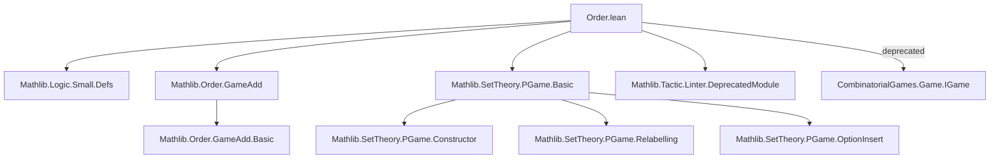

### Technical Brief: Order Properties of Pregames (`Order.lean`)

---

#### **1. Key Definitions & Theorems**

| Name | Type / Signature | Purpose |
|------|------------------|---------|
| `le : LE PGame` | `LE PGame` | Defines the ≤ relation on pregames via recursive fixpoint on options. |
| `LF (x y : PGame)` | `Prop` | `x ⧏ y` iff `¬ y ≤ x`. Models “Left wins as first player” when `0 ⧏ x`. |
| `Equiv (x y : PGame)` | `Prop` | `x ≈ y` iff `x ≤ y ∧ y ≤ x`. Equivalence relation identifying games of equal value. |
| `Fuzzy (x y : PGame)` | `Prop` | `x ‖ y` iff `x ⧏ y ∧ y ⧏ x`. Models “first-player win” when `x ‖ 0`. |
| `le_iff_forall_lf` | `x ≤ y ↔ (∀ i, x.moveLeft i ⧏ y) ∧ ∀ j, x ⧏ y.moveRight j` | Recursive characterization of ≤ in terms of ⧏ (one move out). |
| `lf_iff_exists_le` | `x ⧏ y ↔ (∃ i, x ≤ y.moveLeft i) ∨ ∃ j, x.moveRight j ≤ y` | Recursive characterization of ⧏ in terms of ≤ (one move out). |
| `le_def`, `lf_def` | Recursive two-move characterizations | Unfold ≤ / ⧏ two levels deep (used for induction). |
| `zero_le_lf`, `zero_lf_le`, etc. | Equivalences involving `0` | Special cases for `0 ≤ x`, `0 ⧏ x`, etc., using that `0` has no moves. |
| `zero_le`, `le_zero`, `zero_lf`, `lf_zero` | Two-move recursions for `0` | Useful for surreal arithmetic and inductive proofs. |
| `le_trans_aux` | Auxiliary lemma for transitivity | Enables mutual induction on three games to prove transitivity of ≤. |
| `instance : Preorder PGame` | `Preorder PGame` | Proves `≤` is reflexive and transitive. |
| `lt_iff_le_and_lf` | `x < y ↔ x ≤ y ∧ x ⧏ y` | Defines strict order `<` in terms of ≤ and ⧏. |
| `equiv_def`, `equiv_rfl`, `equiv_symm`, `equiv_trans` | Properties of `≈` | Shows `≈` is an equivalence relation (used to define games as quotient). |
| `Relabelling.le`, `Relabelling.equiv` | `x ≡r y → x ≤ y`, `x ≡r y → x ≈ y` | Relabellings preserve order and equivalence. |
| `insertLeft_equiv_of_lf`, `insertRight_equiv_of_lf` | Gift-horse lemmas | Adding a dominated option doesn’t change game value. |
| `bddAbove_range_of_small`, `bddBelow_range_of_small` | Small families bounded | Ensures completeness properties needed for surreal arithmetic. |

---

#### **2. Naming Conventions**

- **Prefixes**:
  - `le_`, `lf_`, `equiv_`, `fuzzy_`: Relation-specific.
  - `zero_`, `le_zero`, `lf_zero`: Special cases for `0`.
  - `moveLeft_`, `moveRight_`: Move-related lemmas.
  - `insertLeft_`, `insertRight_`: Option insertion lemmas.
- **Suffixes**:
  - `_of_le`, `_of_lf`, `_of_equiv`: From a hypothesis.
  - `_spec`: Specification of noncomputable choice (e.g., `rightResponse_spec`).
  - `_congr`, `_congr_left`, `_congr_right`: Congruence lemmas w.r.t. `≈`.
- **Infixes**:
  - `⧏` (`LF`), `≈` (`Equiv`), `‖` (`Fuzzy`), `≤` (`LE.le`), `<` (`LT.lt`).

---

#### **3. Tactic Stack**

- **Core tactics**:
  - `induction ... with | mk ... IH...`: Structural induction on `PGame`.
  - `rw [...]`, `simp only [...]`, `conv => lhs ...`: Rewriting and simplification using definitions.
  - `exact`, `intro`, `apply`, `cases`, `rcases`: Basic proof construction.
  - ` Classical.not_not`, `not_le.1`, `not_lf.1`: Classical logic manipulations.
  - `tauto`: Used in `lf_iff_lt_or_fuzzy`.
- **Domain-specific automation**:
  - `rw [le_iff_forall_lf]`, `rw [lf_iff_exists_le]`: Unfold order definitions.
  - `simp only [moveLeft_mk, moveRight_mk, insertLeft, ...]`: Simplify move operations.
  - `equivShrink`, `isEmptyElim`: For smallness/boundedness arguments.

---

#### **4. Proof Logic**

- **Inductive structure**:
  - Proofs over `PGame` use **well-founded induction** on the `IsOption` relation (via `fix` in `le` definition).
  - Transitivity of `≤` is proven via a **mutual induction** on three games using `le_trans_aux`, which simultaneously proves three cyclic reorderings.
- **Logical flow**:
  1. **Unfold definitions** (`le`, `LF`, `Equiv`, `Fuzzy`) using `rw`/`simp`.
  2. **Apply recursive characterizations** (`le_iff_forall_lf`, `lf_iff_exists_le`) to reduce to options.
  3. **Use induction hypotheses** (`IHxl`, `IHyl`, `IHzl`, etc.) for subgoals.
  4. **Apply classical logic** (`em`, ` Classical.not_not`) to handle disjunctions like `x ≤ y ∨ y ⧏ x`.
  5. **Use congruence lemmas** (`le_congr`, `lf_congr`) to substitute equivalent games.

---

#### **5. Imports & Dependencies**

| Import | Role |
|--------|------|
| `Mathlib.Logic.Small.Defs` | Smallness assumptions for boundedness lemmas. |
| `Mathlib.Order.GameAdd` | Game addition (used in `le` definition via `Sym2.GameAdd.fix`). |
| `Mathlib.SetTheory.PGame.Basic` | Core `PGame` type, moves, constructor, relabellings. |
| `Mathlib.Tactic.Linter.DeprecatedModule` | Deprecation marker. |

> **Note**: This module is deprecated as of `2025-08-06`; functionality moved to `CombinatorialGames.Game.IGame`.

---

#### **6. Mermaid Diagrams**

##### **Dependency Graph (Top-Level)**



##### **Overview of Theory Flow**

```mermaid
flowchart LR
  PGame[PGame type] --> LE[≤ relation]
  PGame --> LF[⧏ relation]
  PGame --> Equiv[≈ relation]
  PGame --> Fuzzy[‖ relation]

  LE --> Preorder[Preorder instance]
  LE --> Trans[Transitivity proof]
  LE --> Reflexivity[Reflexivity proof]

  LF --> NotLe[¬(x ≤ y) ↔ y ⧏ x]
  LF --> NotGe[¬(y ≤ x) → x ⧏ y]

  Equiv --> Setoid[Setoid instance]
  Equiv --> Quotient[Games = PGame / ≈]

  Fuzzy --> LFAndGF[x ⧏ y ∧ y ⧏ x]

  LE --> GameAdd[Game addition compatibility]
  Equiv --> Congruence[Congruence of operations]

  subgraph Surreal[For surreals]
    ZeroLef[0 ≤ x ↔ ∀j, 0 ⧏ x.moveRight j]
    ZeroLf[0 ⧏ x ↔ ∃i, 0 ≤ x.moveLeft i]
  end
```

---

#### **7. Summary**

This file formalizes the **order-theoretic foundation** of combinatorial game theory for *pregames*, defining and proving key properties of the ≤, ⧏, ≈, and ‖ relations. It establishes that `≤` is a preorder, `≈` an equivalence relation, and `⧏`, `‖` their associated irreflexive/fuzzy companions. The recursive definitions (`le_def`, `lf_def`) and move-based characterizations (`le_iff_forall_lf`, `lf_iff_exists_le`) enable inductive reasoning about game outcomes. The deprecated status signals migration to the dedicated `combinatorial-games` repository, where these constructions are refined for surreal numbers and further algebraic structure.
