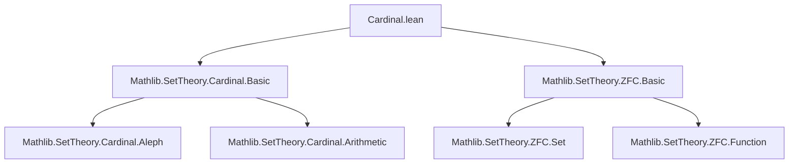

### Technical Brief: `Cardinal.lean` — Cardinalities of ZFC Sets

---

#### **1. Key Definitions & Theorems**

| Name | Type / Signature | Purpose |
|------|------------------|---------|
| `card` | `ZFSet.{u} → Cardinal.{u}` | Defines the cardinality of a ZFC set `x` as `#(Shrink x)`, i.e., the cardinal associated to the well-founded extensional relation on `x`. |
| `cardinalMk_coe_sort` | `#x = lift.{u + 1, u} (card x)` | Relates the set-theoretic cardinal `#x` (as a `ZFSet` seen as a `Set ZFSet`) to `card x`, via lifting. |
| `card_mono` | `x ⊆ y → card x ≤ card y` | Monotonicity of cardinality under inclusion. |
| `card_empty` | `card ∅ = 0` | Cardinality of the empty ZFSet is zero. |
| `card_insert_le` | `card (insert x y) ≤ card y + 1` | Upper bound on cardinality after inserting an element. |
| `card_insert` | `x ∉ y → card (insert x y) = card y + 1` | Exact cardinality after inserting a *new* element. |
| `card_singleton` | `card {x} = 1` | Singleton sets have cardinality 1. |
| `card_pair_of_ne` | `x ≠ y → card {x, y} = 2` | Pair of distinct elements has cardinality 2. |
| `card_union_le` | `card (x ∪ y) ≤ card x + card y` | Subadditivity of cardinality under union. |
| `card_powerset` | `card (powerset x) = 2 ^ card x` | Powerset cardinality matches exponential cardinal arithmetic. |
| `card_image_le` | `card (image f x) ≤ card x` | Image under a definable function does not increase cardinality. |
| `lift_card_range_le` | `lift (card (range f)) ≤ lift (#α)` | Range of a definable function from a small type has cardinality ≤ that of the domain (up to lift). |
| `iSup_card_le_card_iUnion` | `⨆ i, card (f i) ≤ card (⋃ i, f i)` | Supremum of cardinals ≤ cardinal of union (disjointness not required). |
| `lift_card_iUnion_le_sum_card` | `lift (card (⋃ i, f i)) ≤ sum fun i => card (f i)` | Union cardinality ≤ sum of cardinals (generalized countable choice / choice over small index). |

---

#### **2. Naming Conventions**

- **Prefixes**:
  - `card_`: All theorems about `ZFSet.card`.
  - `lift_`: Relating lifted cardinals (e.g., `lift_card_range_le`, `lift_card_iUnion_le_sum_card`).
- **Suffixes**:
  - `_le`: Inequality proofs (e.g., `card_mono`, `card_insert_le`, `card_union_le`).
  - `_eq` or no suffix for equalities (e.g., `card_insert`, `card_pair_of_ne`, `card_powerset`).
- **`coe_` / `coe_`-related**: Used for coercion from `ZFSet` to `Set ZFSet`, e.g., `coe_subset_coe`, `coe_image`, `coe_range`, `coe_iUnion`.

---

#### **3. Tactic Stack**

- **Core tactics**:
  - `rw`: Rewriting using definitions and lemmas (especially `card`, `cardinalMk_coe_sort`, `lift_inj`, `lift_le`).
  - `simp`: Simplification using `simp` lemmas (e.g., `card_empty`, `card_singleton`).
  - `convert`: To reduce to known equalities (e.g., `card_pair_of_ne`).
  - `simpa [ ... ] using ...`: To discharge goals by simplifying with a target lemma and applying a supporting lemma.
- **Cardinal-specific**:
  - `mk_*` lemmas (e.g., `mk_insert_le`, `mk_union_le`, `mk_range_le_lift`, `mk_iUnion_le_sum_mk_lift`) are heavily used via `simpa`.
  - `lift_inj`, `lift_le`, `lift_lift`, `lift_umax`: For manipulating lifts between universes.

---

#### **4. Proof Logic**

- **General pattern**:
  1. Lift both sides to a common universe (often `u + 1`) using `lift_le` or `lift_inj`.
  2. Apply known `mk_*` lemmas from `Mathlib.SetTheory.Cardinal.Basic`, which operate on `Set ZFSet` (i.e., `coe x : Set ZFSet`).
  3. Use `cardinalMk_coe_sort` to relate `#x` (set-theoretic cardinal) to `card x`.
  4. Simplify or discharge side conditions (e.g., `x ∉ y`, `x ≠ y`) using `notMem_*` lemmas.

- **Induction / recursion**: Not used here — all proofs are direct cardinal arithmetic arguments.

- **Key logical tools**:
  - `Shrink` and `mk` (cardinal of a set with extensional relation) bridge ZF sets and cardinals.
  - `Definable₁` and `Small` typeclass constraints ensure definability and smallness for image/range/union lemmas.

---

#### **5. Imports**

- `Mathlib.SetTheory.Cardinal.Basic`: Provides `Cardinal`, `mk`, `Shrink`, `lift`, `#`, arithmetic operations (`+`, `*`, `^`), and `mk_*` lemmas.
- `Mathlib.SetTheory.ZFC.Basic`: Provides `ZFSet`, `SetLike`, `insert`, `union`, `powerset`, `image`, `range`, `iUnion`, etc., and their coercion to `Set ZFSet`.

---

#### **6. Mermaid Diagrams**

##### **Dependency Graph (Module-Level)**



##### **Overview of File Structure**

```mermaid
flowchart LR
  subgraph Definitions
    D1[card : ZFSet → Cardinal]
  end

  subgraph Core Equivalence
    E1[cardinalMk_coe_sort] -->|relates| D1
    E1 -->|via| C1[#x : Cardinal]
    C1 -->|coercion| C2[coe x : Set ZFSet]
  end

  subgraph Properties
    P1[card_mono] -->|monotonicity|
    P2[card_empty] -->|base case|
    P3[card_insert] -->|atomic addition|
    P4[card_union_le] -->|subadditivity|
    P5[card_powerset] -->|Cantor’s thm|
    P6[card_image_le] -->|definable maps|
    P7[iSup_card_le_card_iUnion] -->|countable unions|
    P8[lift_card_iUnion_le_sum_card] -->|sum bound|
  end

  D1 --> P1 & P2 & P3 & P4 & P5 & P6 & P7 & P8
```

---

#### **7. Theory Context**

- This module formalizes **cardinal arithmetic for ZF sets**, treating `ZFSet` as a class of sets in a Grothendieck universe `u`.
- It connects the internal `mk` (cardinal of a set with extensional relation) to the external `#x` (cardinal of the underlying `Set ZFSet`), via `Shrink`.
- The results are foundational for later development of:
  - Cardinal arithmetic in ZF,
  - Regular/accessible cardinals,
  - Well-ordering and choice-dependent constructions.

---

Let me know if you'd like a formalized dependency graph of theorems or a proof automation sketch.
