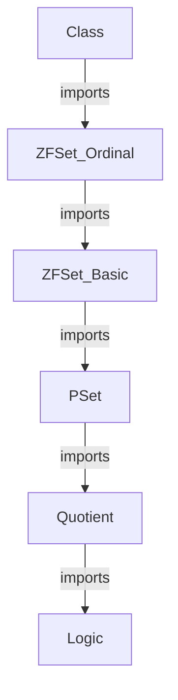
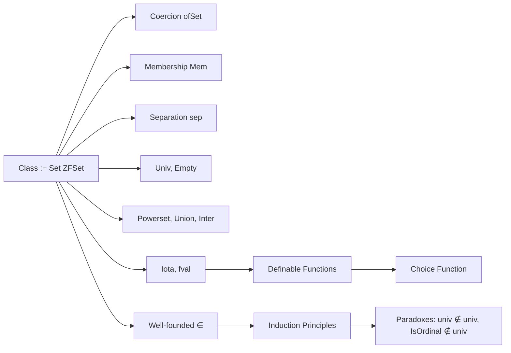

### Technical Brief: `Class.lean` — ZFC Classes in Lean 4

---

#### **1. Key Definitions & Theorems**

| Name | Type / Signature | Purpose |
|------|------------------|---------|
| `Class` | `def Class := Set ZFSet` | Represents classes as sets of ZF sets; enables automatic instance derivation. |
| `Class.ofSet` | `ZFSet → Class` | Coerce a ZF set into a class via membership predicate. |
| `Class.univ` | `Class` | The universal class: `λ x => True`. |
| `Class.Mem` / `∈` | `Class → Class → Prop` | Membership between classes: `A ∈ B ↔ ∃ x, ↑x = A ∧ B x`. |
| `Class.sep` | `(ZFSet → Prop) → Class → Class` | Separation: `{y ∈ A | p y}`. |
| `Class.powerset` | `Class → Class` | Power class: `{x | ↑x ⊆ A}`. |
| `Class.sUnion` / `⋃₀` | `Class → Class` | Union over a class: `⋃₀ A = ⋃ {x ∈ A} x`. |
| `Class.sInter` / `⋂₀` | `Class → Class` | Intersection over a class: `⋂₀ A = ⋂ {x ∈ A} x`. |
| `Class.iota` | `Class → Class` | Definite description: returns `{x}` if `A = {x}`, else `∅`. |
| `Class.fval` / `′` | `Class → Class → Class` | Function application: `F ′ A = iota (λ y, ToSet (λ x, F (pair x y)) A)`. |
| `Class.mem_wf` | `WellFounded (· ∈ ·)` | Well-foundedness of class membership (induction principle). |
| `Class.univ_notMem_univ` | `univ ∉ univ` | No universal set; formalizes Russell/Burali-Forti style paradox. |
| `ZFSet.isOrdinal_notMem_univ` | `IsOrdinal ∉ Class.univ` | **Burali-Forti paradox**: ordinals form a proper class. |
| `Class.coeEquiv` | `ZFSet ≃ {s // Small s}` | Equivalence between ZF sets and small subsets of ZF sets. |

---

#### **2. Naming Conventions**

- **Prefixes**:
  - `ofSet`, `ofClass`: coercion-related.
  - `iota_`, `fval_`, `choice_`: definite description / choice-related.
  - `mem_`, `notMem_`, `eq_univ_`, `sUnion_`, `sInter_`: operational predicates.
  - `toSet_`, `classToCong_`, `congToClass_`: conversions between classes and conglomerates.

- **Suffixes**:
  - `_hom`: homogeneity (e.g., `not_empty_hom`).
  - `_def`: definition equivalence (e.g., `mem_def`).
  - `_ex`: existence (e.g., `iota_ex`, `fval_ex`).
  - `_apply`: application semantics (e.g., `sUnion_apply`, `sInter_apply`).

- **Infixes**:
  - `′` for `fval`.
  - `⋃₀`, `⋂₀` scoped under `Class`.

---

#### **3. Tactic Stack**

Frequent tactics used in proofs:

| Tactic | Usage |
|--------|-------|
| `ext` | Extensionality for classes (via `Set.ext`). |
| `simp` / `simp_rw` | Simplification using `@[simp]` lemmas (e.g., `coe_mem`, `mem_def`). |
| `rfl` / ` rfl` | Reflexivity for definitional equalities. |
| `rw` | Rewriting using lemmas like `mem_def`, `coe_apply`. |
| `exact` / `refine` | Direct proof construction, especially with induction. |
| `by_contra!` | Proof by contradiction (e.g., in `eq_univ_of_powerset_subset`). |
| `obtain` / `cases` | Destructing existential quantifiers. |
| `subst` | Substitution after equality hypotheses. |
| `rwa` | Rewrite + assumption. |
| `convert` / `congr` | Congruence closure (implicit in many `@[simp]` proofs). |
| `classical` / `Classical.em` | Classical reasoning (e.g., in `iota_ex`). |
| `induction` | ZF induction (e.g., `ZFSet.inductionOn`). |

---

#### **4. Proof Logic**

- **Inductive structure**: Most proofs rely on:
  - **ZF induction** (`ZFSet.inductionOn`) for well-foundedness of ∈.
  - **Extensionality** (`Class.ext`) to prove class equality.
  - **Definitional coercion** (`↑x`) to reduce class membership to ZF membership.
  - **Case analysis** on classical EM (`Classical.em`) for `iota`-related existence.

- **Typical flow**:
  1. Unfold definitions (`mem_def`, `sUnion_apply`, etc.).
  2. Apply `ext` to reduce to element-wise equivalence.
  3. Use `simp` with `@[simp]` lemmas (e.g., `coe_mem`, `coe_apply`).
  4. For existence: construct witness explicitly or use classical choice (`Classical.epsilon`).
  5. For paradoxes: assume membership, derive contradiction via well-foundedness or extensionality.

---

#### **5. Imports & Dependencies**

- **Primary dependency**:
  ```lean
  import Mathlib.SetTheory.ZFC.Ordinal
  ```
  - Provides `ZFSet`, `IsOrdinal`, `ordinal` machinery.
  - Enables use of `ZFSet.inductionOn`, `WellFounded`, `Small`, `Shrink`, `equivShrink`.

- **Implicit dependencies** (via `Mathlib.SetTheory.ZFC`):
  - `PSet`, `ZFSet`, `ordinal`, `cardinal`, `small`, `shrink`, `choice`.

---

#### **6. Mermaid Diagrams**

##### **Dependency Graph (Module Level)**



##### **Overview of `Class.lean` Theory**



##### **Class ↔ ZFSet ↔ Conglomerate (Set Class)**

```mermaid
flowchart LR
  ZFSet -->|ofSet| Class
  Class -->|classToCong| Set Class
  Set Class -->|congToClass| Class
  Class -.->|coeEquiv| {s // Small s}
```

---

#### **7. Summary**

This module formalizes **classes** in ZFC as `Set ZFSet`, enabling a uniform treatment of sets and classes. It provides:

- **Foundational machinery**: membership, separation, union, intersection, powerset.
- **Paradox handling**: formalization of Russell and Burali-Forti paradoxes.
- **Definite description & choice**: `iota`, `fval`, and `choice` functions.
- **Equivalence with small sets**: `coeEquiv` bridges ZF sets and small subsets.

The design prioritizes **automatic instance derivation** and **coherence with set operations**, while preserving classical logic for non-constructive definitions (e.g., `iota`, `choice`).
