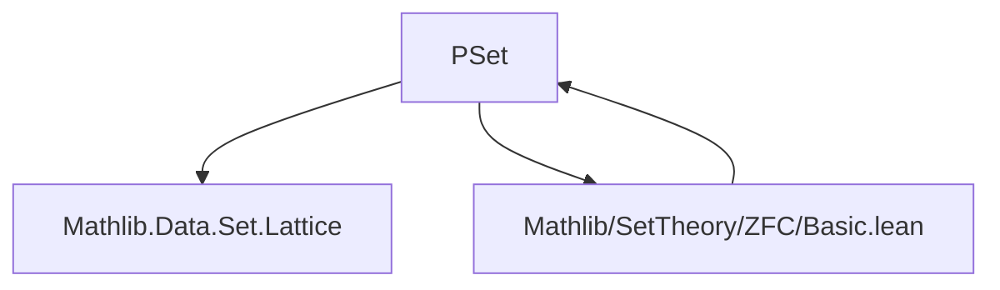
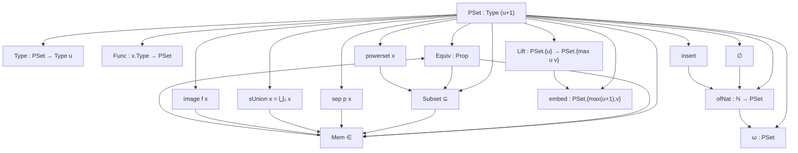
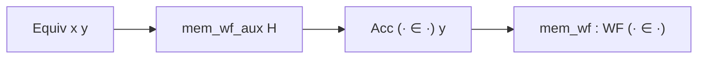

### Technical Brief: `PSet.lean` — Pre-sets in Lean 4 (ZFC Foundation)

---

#### **1. Key Definitions & Theorems**

| Name | Type / Signature | Purpose |
|------|------------------|---------|
| `PSet` | `Type (u + 1)` (inductive) | Universe-indexed inductive type of *pre-sets*, representing families of pre-sets over a type in `Type u`. |
| `PSet.Type` | `PSet → Type u` | Extracts the indexing type of a pre-set. |
| `PSet.Func` | `∀ x : PSet, x.Type → PSet` | Extracts the family of members of a pre-set. |
| `PSet.Equiv` | `PSet → PSet → Prop` | *Extensional equivalence*: two pre-sets are equivalent iff each element of one is equivalent to some element of the other (mutual ∃∀ condition). |
| `PSet.Subset` | `PSet → PSet → Prop` | `x ⊆ y` iff every element of `x` is equivalent to some element of `y`. |
| `PSet.Mem` | `PSet → PSet → Prop` | Membership: `x ∈ y` iff `x` is equivalent to some `y.Func b`. |
| `PSet.empty` | `PSet` | The empty pre-set: indexed by `PEmpty`. |
| `PSet.insert` | `PSet → PSet → PSet` | Insertion: `insert x y` has indexing type `Option y.Type`, with `x` at `none` and `y.Func` at `some`. |
| `PSet.ofNat` | `ℕ → PSet` | Von Neumann finite ordinals: `0 ↦ ∅`, `n+1 ↦ insert (ofNat n) (ofNat n)`. |
| `PSet.omega` | `PSet` | Von Neumann `ω`: indexed by `ULift ℕ`, with `n ↦ ofNat n`. |
| `PSet.sep` | `(PSet → Prop) → PSet → PSet` | Separation: `{a ∈ x | p a}`; indexing type is `{a // p (x.Func a)}`. |
| `PSet.powerset` | `PSet → PSet` | Powerset: indexed by `Set x.Type`, each subset `p` gives pre-set `{a // p a}`. |
| `PSet.sUnion` | `PSet → PSet` | Union: indexed by `Σ x, (x.Func x).Type`, i.e., dependent sum of members’ members. |
| `PSet.image` | `(PSet → PSet) → PSet → PSet` | Image under `f`: indexing type unchanged, family composed with `f`. |
| `PSet.Lift` | `PSet.{u} → PSet.{max u v}` | Universe lift: lifts indexing type and family to higher universe. |
| `PSet.embed` | `PSet.{max (u+1) v}` | Canonical embedding of `PSet.{u}` into higher universe via `ULift`. |

**Key Theorems:**
- `equiv_iff_mem`: `Equiv x y ↔ ∀ w, w ∈ x ↔ w ∈ y`  
- `Equiv.ext`: `Equiv x y ↔ x ⊆ y ∧ y ⊆ x`  
- `mem_wf`: `WellFounded (· ∈ ·)` — foundational well-foundedness of membership.  
- `equiv_of_isEmpty`: Any two empty-indexed pre-sets are equivalent.  
- `mem_asymm`, `mem_irrefl`, `not_subset_of_mem`: Regularity consequences.  
- `toSet_sUnion`: `⋃₀ x` corresponds to union of sets `toSet '' x.toSet`.  
- `lift_mem_embed`: Every lifted pre-set is a member of `embed`.

---

#### **2. Naming Conventions**

- **Prefixes**:
  - `mk_`: constructor-related simplifications (`mk_type`, `mk_func`).
  - `equiv_`: properties of extensional equivalence (`equiv_of_isEmpty`, `equiv_iff_mem`).
  - `mem_`: membership-related (`mem_def`, `mem_wf`, `mem_irrefl`, `mem_asymm`, `mem_of_subset`, `mem_image`, `mem_sep`, `mem_powerset`, `mem_sUnion`).
  - `subset_`: subset properties (`subset_iff`, `Subset.congr_left/right`).
  - `nonempty_`: non-emptiness (`nonempty_def`, `nonempty_of_mem`, `nonempty_type_iff_nonempty`).
  - `toSet_`: conversion to `Set PSet` (`toSet_empty`, `toSet_sUnion`).
- **Suffixes**:
  - `_iff`: characterizations as biconditionals (`le_def`, `lt_def`, `mem_def`, `nonempty_def`, `subset_iff`, `equiv_iff_mem`, `mem_powerset`, `mem_sUnion`, `mem_image`, `mem_sep`, `mem_insert_iff`).
  - `_def`: definitions of instances or derived ops (`empty_def`, `nonempty_def`, `subset_iff`).
  - `_left`/`_right`: congruence lemmas (`Subset.congr_left`, `Subset.congr_right`, `Mem.congr_left`, `Mem.congr_right`).
- **Operators**:
  - `· ⊆ ·`, `· ∈ ·`, `· < ·`, `⋃₀`, `insert`, `sep`, `powerset`, `image`, `Lift`, `embed`.

---

#### **3. Tactic Stack**

- **Core simplifiers**: `simp`, `rfl`, `rw`, `ext`, `cases`, `obtain`, `exact`.
- **Inductive reasoning**: `induction` (implicit in `mem_wf_aux`), `intro`, `intro h`, `intro ⟨α, A⟩`.
- **Logical reasoning**: `apply`, `exact`, `assumption`, `contradiction`, `intro`, `intro h`, `intro ⟨a, ha⟩`.
- **Equivalence reasoning**: `trans`, `symm`, `euc`, `refl`, `equiv_of_isEmpty`.
- **Set-theoretic reasoning**: `subset_iff`, `mem_def`, `mem_insert_iff`, `mem_powerset`, `mem_sUnion`, `mem_image`, `mem_sep`.
- **Universe management**: `lift`, `ULift`, `inferInstanceAs`, `cases'`, `rwa`, `convert`, `congr`.
- **Automation**: `aesop`, `ring`, `linarith` not used — proof is mostly *manual* and *constructive*.

---

#### **4. Proof Logic**

- **Inductive structure**: All definitions are *inductive* on the structure of pre-sets (`⟨α, A⟩`).
- **Proof style**:
  - **Structural induction** on pre-sets is implicit via `inductive` and `cases`.
  - **Equivalence reasoning** is central: proofs of `Equiv x y` construct mutual witnesses `(αβ, βα)`.
  - **Well-foundedness** (`mem_wf`) is proven via auxiliary lemma `mem_wf_aux`, using `Equiv` to transfer accessibility.
  - **Congruence lemmas** (`congr_left`, `congr_right`) rely on symmetry and transitivity of `Equiv`.
  - **Extensionality** is derived from membership equivalence (`Equiv.ext`, `equiv_iff_mem`).
  - **Separation & powerset** proofs require *proof-irrelevance* or *stability* of predicates under `Equiv` (e.g., `H : ∀ x y, Equiv x y → p x → p y`).
- **No classical logic**: All proofs are constructive; choice is only used implicitly in `Setoid`/`quotient` setup (not in this file).

---

#### **5. Imports**

- `Mathlib.Data.Set.Lattice`: Provides lattice structure on sets, used for `HasSubset`, `HasSSubset`, `Preorder`, etc.

---

#### **6. Mermaid Diagrams**

##### **Dependency Graph (Module-Level)**

> *Note*: `PSet` is foundational for ZFC sets (defined as `quotient PSet ~ Equiv` in `Basic.lean`).

##### **Overview of `PSet` Theory**

##### **Membership Well-Foundedness Flow**

---

#### **7. Summary**

`PSet.lean` formalizes the *pre-set* foundation for ZFC in Lean 4. It defines:
- A universe-polymorphic inductive type of pre-sets,
- Extensional equality (`Equiv`) and subset/membership relations,
- Standard set-theoretic operations (`empty`, `insert`, `sep`, `powerset`, `sUnion`, `image`),
- Ordinals (`ofNat`, `omega`),
- Universe lifting/embedding,
- Proves foundational properties: well-foundedness of `∈`, extensionality, regularity, congruence.

It serves as the *raw material* for constructing the ZFC universe in `Mathlib/SetTheory/ZFC/Basic.lean`, where sets are defined as `quotient PSet ~ Equiv`.

--- 

Let me know if you'd like a formalized dependency graph for the entire ZFC pipeline or a comparison with other set-theoretic encodings (e.g., Aczel’s APSC).
