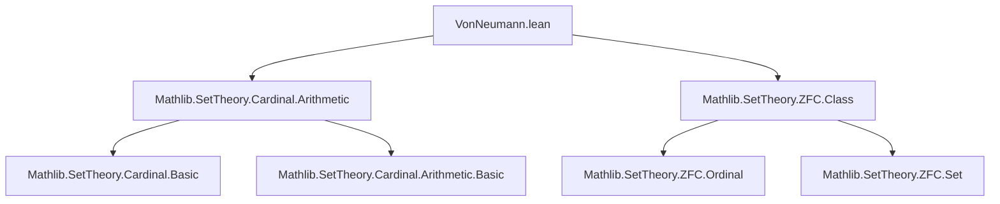
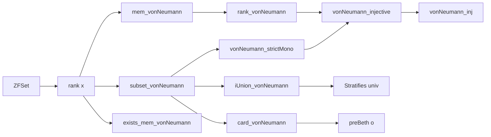

### Technical Brief: `VonNeumann.lean`

---

#### **1. Key Definitions & Theorems**

| Name | Type / Signature | Purpose |
|------|------------------|---------|
| `vonNeumann` | `Ordinal.{u} → ZFSet.{u}` | Defines the von Neumann hierarchy $V_o = \bigcup_{a < o} \mathcal{P}(V_a)$ |
| `mem_vonNeumann'` | `x ∈ V_ o ↔ ∃ a < o, x ⊆ V_ a` | Characterizes membership in $V_o$ via subset of some earlier stage |
| `isTransitive_vonNeumann` | `IsTransitive (V_ o)` | Proves each $V_o$ is transitive |
| `subset_vonNeumann` | `x ⊆ V_ o ↔ rank x ≤ o` | Connects subset relation to rank |
| `mem_vonNeumann` | `x ∈ V_ o ↔ rank x < o` | Membership in $V_o$ iff rank is strictly less than $o$ |
| `rank_vonNeumann` | `rank (V_ o) = o` | Rank of $V_o$ is exactly $o$ |
| `vonNeumann_mem_vonNeumann_iff` | `V_ a ∈ V_ b ↔ a < b` | Strict membership between hierarchy levels mirrors ordinal order |
| `vonNeumann_subset_vonNeumann_iff` | `V_ a ⊆ V_ b ↔ a ≤ b` | Inclusion between hierarchy levels mirrors ordinal order |
| `iUnion_vonNeumann` | `⋃ o, V_ o = univ` | The hierarchy stratifies the universe |
| `card_vonNeumann` | `card (V_ o) = preBeth o` | Cardinality of $V_o$ equals the $o$-th Beth number |

---

#### **2. Naming Conventions**

- **Prefixes**:
  - `vonNeumann_`: for lemmas about the hierarchy function itself (`vonNeumann_zero`, `vonNeumann_succ`, etc.)
  - `mem_vonNeumann`: for membership characterizations
  - `subset_vonNeumann`: for subset characterizations
  - `isTransitive_vonNeumann`: for transitivity properties

- **Suffixes**:
  - `_iff`: for biconditional equivalences (`vonNeumann_mem_vonNeumann_iff`)
  - `_self`: for reflexive or identity-like statements (`subset_vonNeumann_self`)
  - `_of_isSuccPrelimit`: for limit-case lemmas using `IsSuccPrelimit`

- **Notation**:
  - `V_ o` is notation for `vonNeumann o`, scoped in `ZFSet`

---

#### **3. Tactic Stack**

Frequently used tactics in proofs:

| Tactic | Usage |
|--------|-------|
| `rw` / `simp_rw` | Rewriting definitions like `vonNeumann`, `mem_vonNeumann`, `rank_le_iff` |
| `simp` | Simplifying using lemmas like `mem_vonNeumann`, `subset_vonNeumann`, `rank_vonNeumann` |
| `aesop` | Automated reasoning for simple implications and quantifier manipulations |
| `exact` / `intro` / `apply` | Standard natural-deduction style proof steps |
| `ext` | Extensionality for class/set equality |
| `induction ... using Ordinal.limitRecOn` | Transfinite induction over ordinals |
| `apply ... .antisymm'` | Proving equality via double inequality |
| `convert` / `refine` | Constructing proofs with holes to be filled later |
| `by_contra!` | Proof by contradiction (used in `card_vonNeumann`) |

---

#### **4. Proof Logic**

The proofs follow a **transfinite induction** strategy over ordinals, with three cases:

1. **Zero case**: Direct simplification using `vonNeumann_zero`.
2. **Successor case**: Use `vonNeumann_succ` and properties of powerset/cardinal arithmetic.
3. **Limit case**: Use `vonNeumann_of_isSuccPrelimit` to reduce to union over predecessors, then apply cardinal arithmetic lemmas like `iSup_card_le_card_iUnion`, `sum_eq_lift_iSup_of_lift_mk_le_lift_iSup`, and Cantor’s theorem.

Key logical flow:
- Prove structural properties (`mem_vonNeumann`, `rank_vonNeumann`) first.
- Use these to derive monotonicity/injectivity (`vonNeumann_strictMono`, `vonNeumann_injective`).
- Finally, compute cardinalities using Beth numbers and transfinite recursion.

---

#### **5. Imports & Dependencies**

| Module | Purpose |
|--------|---------|
| `Mathlib.SetTheory.Cardinal.Arithmetic` | Provides cardinal arithmetic, Beth numbers (`preBeth`), Cantor’s theorem, etc. |
| `Mathlib.SetTheory.ZFC.Class` | Defines `ZFSet`, `Class`, `rank`, `toZFSet`, and foundational ZFSet machinery |

Other key dependencies (implicit via `Mathlib`):
- Ordinal arithmetic (`Order`, `Ordinal`)
- Transfinite induction principles (`Ordinal.RecOn`, `limitRecOn`)
- Set-theoretic operations (`powerset`, `iUnion`, `subset`)

---

#### **6. Mermaid Diagrams**

##### **Dependency Graph (Module-Level)**



##### **Overview of Theory Flow**



##### **Proof Strategy Flow (for `card_vonNeumann`)**

```mermaid
flowchart TD
  Start[card (V_ o) = preBeth o] --> Ind[Transfinite Induction]
  Ind --> Zero[Zero case]
  Ind --> Succ[Successor case]
  Ind --> Limit[Limit case]
  Zero --> simp_zero[simp [vonNeumann_zero, card_empty, preBeth_zero]]
  Succ --> simp_succ[simp [vonNeumann_succ, card_powerset, ih, preBeth_succ]]
  Limit --> union_limit[rewrite using vonNeumann_of_isSuccPrelimit]
  union_limit --> iSup_card[iSup_card_le_card_iUnion]
  iSup_card --> sum_card[sum_eq_lift_iSup...]
  sum_card --> Cantor[Cantor + ord_strictMono]
```

---

#### **7. Summary**

This file formalizes the **von Neumann hierarchy** in ZF set theory, establishing its foundational properties:
- Recursive definition via powersets and unions,
- Connection to the rank function,
- Strict monotonicity and injectivity,
- Stratification of the universe,
- Exact cardinality via Beth numbers.

It serves as a cornerstone for further development in set-theoretic foundations, especially in contexts involving cumulative hierarchies, constructibility, or large cardinal axioms.

--- 

Let me know if you'd like a formalized dependency graph (e.g., `.dot` format) or a summary of how this module integrates into Mathlib’s ZFC library.
