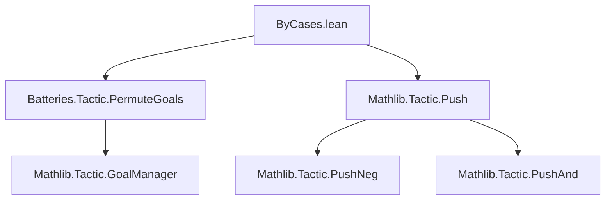
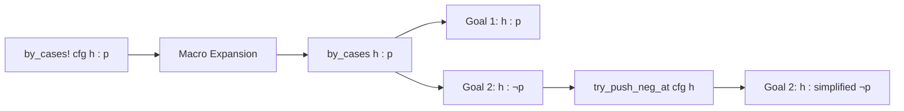

**Technical Brief: `ByCases.lean` Module**

---

### 1. **Key Definitions & Theorems**

| Name | Type / Syntax | Purpose |
|------|---------------|---------|
| `by_cases!` | `tactic` syntax: `"by_cases! " optConfig (atomic(ident " : "))? term` | A variant of `by_cases` that automatically applies `push_neg` on the negated hypothesis in the second branch. |
| `try_push_neg_at` | Local macro: tactic | Helper macro that invokes `Push.push` with configuration to apply `push_neg` at a given hypothesis `h`. |

---

### 2. **Naming Conventions**

- **Prefixes / Suffixes**:
  - `by_cases!` — suffix `!` indicates an enhanced/extended version of `by_cases`.
  - `try_push_neg_at` — `try_` prefix indicates non-failing behavior (does not fail if no change); `push_neg_at` follows Mathlib’s `push_*` naming for simplification tactics targeting specific hypotheses.

- **No `is_`, `mul_`, `dist_` patterns** — this file is tactic-implementation focused, not algebraic.

---

### 3. **Tactic Stack**

Frequently used tactics/macros in this file:

| Tactic / Macro | Role |
|----------------|------|
| `by_cases` | Base tactic for case analysis on a proposition. |
| `Push.push` | Internal tactic for `push_neg`, `push_and`, etc., with fine-grained control. |
| `failIfUnchanged := false` | Ensures `Push.push` does not fail if the hypothesis is unchanged (e.g., if `h` is not a negation). |
| `on_goal 2 => ...` | Applies the second tactic only to the second generated subgoal. |
| `macro_rules` | Used to expand syntax sugar (e.g., `by_cases! h : p` vs `by_cases! p`). |

---

### 4. **Proof Logic / Implementation Flow**

The tactic operates as follows:

1. **Syntax parsing**:
   - Accepts optional config, optional hypothesis name `h`, and proposition `p`.
   - If no `h` is given, auto-generates `h`.

2. **Expansion**:
   - `by_cases! cfg h : p` expands to:
     ```lean
     by_cases h : p; on_goal 2 => try_push_neg_at cfg h
     ```

3. **Behavior**:
   - First subgoal: hypothesis `h : p`.
   - Second subgoal: hypothesis `h : ¬p`, **plus** `push_neg at h` is applied to simplify `¬p` (e.g., `¬(a < b) ↦ b ≤ a`, `¬(a ≠ b) ↦ a = b`).

4. **Safety**:
   - `failIfUnchanged := false` ensures `push_neg` does not error if `h` is not syntactically a `Not` term (e.g., if `p` is already positive).

---

### 5. **Imports**

| Import | Purpose |
|--------|---------|
| `Batteries.Tactic.PermuteGoals` | Provides utilities for goal manipulation (used indirectly via `on_goal`). |
| `Mathlib.Tactic.Push` | Provides `Push.push`, the low-level engine for `push_neg`, `push_and`, etc. |

---

### 6. **Mermaid Diagrams**

#### **Dependency Graph**


#### **Overview of `by_cases!` Execution Flow**


---

### 7. **Example Behavior**

| Input | Resulting Goals |
|-------|-----------------|
| `by_cases! h : a < b` | Goal 1: `h : a < b`<br>Goal 2: `h : b ≤ a` |
| `by_cases! h : a ≠ b` | Goal 1: `h : a ≠ b`<br>Goal 2: `h : a = b` |
| `by_cases! h : ¬(a = b ∧ b = c)` | Goal 2: `h : a = b ∨ b ≠ c` (after `push_neg`) |

---

### 8. **Theoretical Scope**

- **Domain**: Proof automation for classical reasoning, especially simplifying negated hypotheses.
- **Integration**: Part of `Mathlib.Tactic`, aligning with Lean’s `push_*` family of simplification tactics.
- **Philosophy**: Follows Lean’s principle of *progressive elaboration* — `by_cases!` is a thin syntactic wrapper over existing tactics (`by_cases`, `Push.push`), preserving modularity and reusability.

--- 

*End of Technical Brief.*
