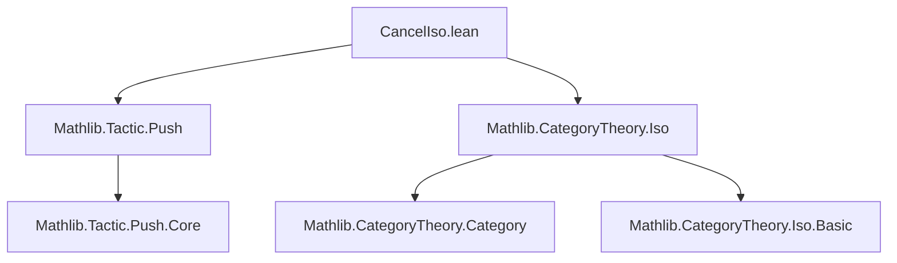
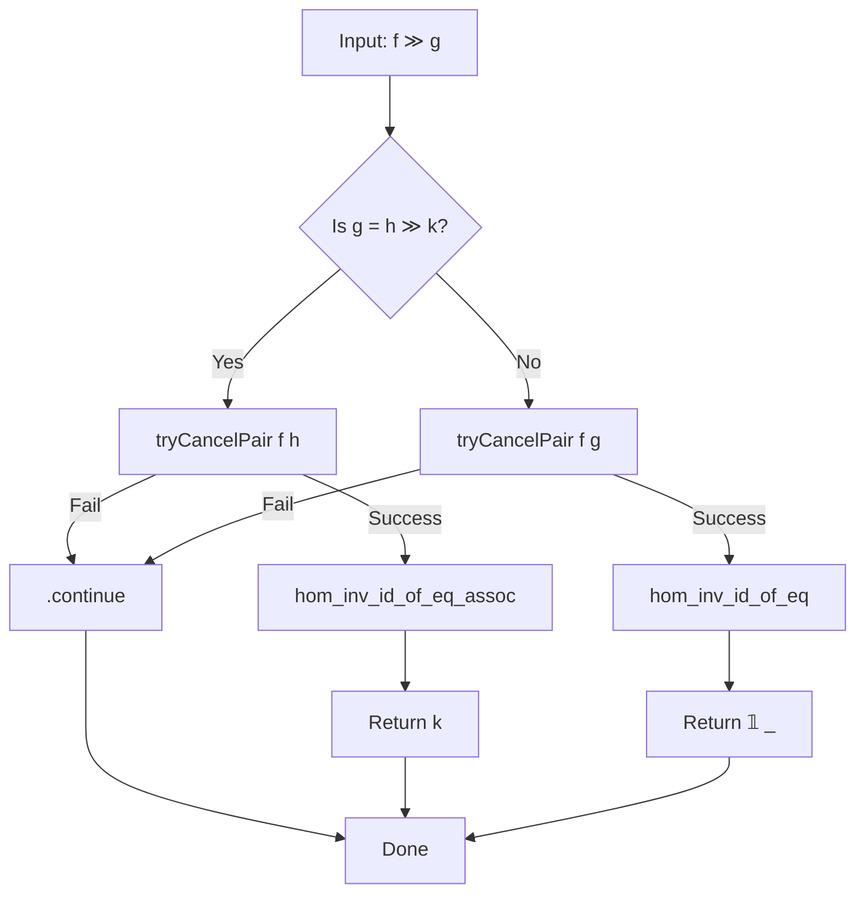
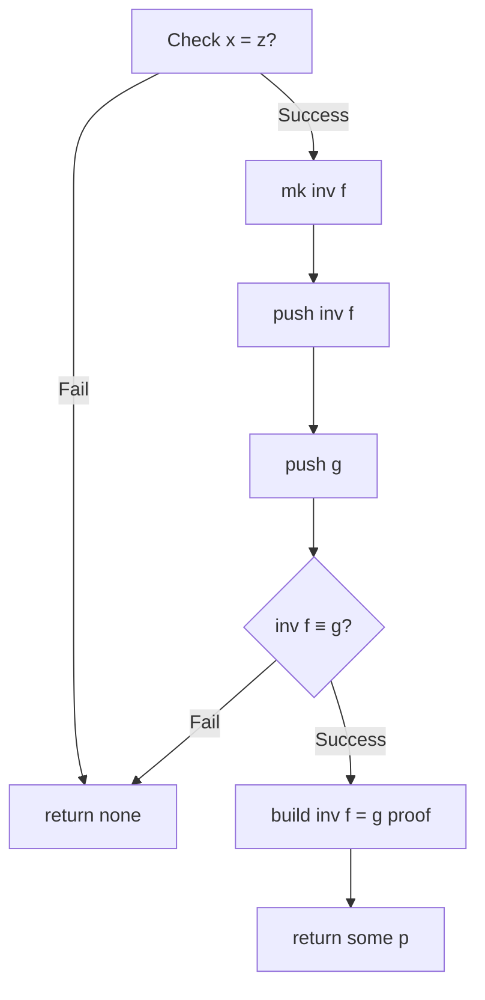

### Technical Metadata Brief: `CancelIso.lean`

---

#### **1. Key Definitions & Theorems**

| Name | Type / Signature | Purpose |
|------|------------------|---------|
| `hom_inv_id_of_eq` | `{f : x ⟶ y} [IsIso f] {g : y ⟶ x} → inv f = g → f ≫ g = 𝟙 _` | Internal lemma for proving composition of iso and its inverse is identity. Used by `cancelIsoSimproc`. |
| `hom_inv_id_of_eq_assoc` | `{f : x ⟶ y} [IsIso f] {g : y ⟶ x} → inv f = g → {z} (k : x ⟶ z) → f ≫ g ≫ k = k` | Associative version of above, used when `g` is part of a longer composition. |
| `tryCancelPair` | `Expr → Expr → Expr → Expr → Expr → Expr → MetaM (Option Expr)` | Core decision procedure: checks if `f` and `g` are inverses via object matching, `IsIso` instance, and `push`-normalization of `inv f` and `g`. Returns proof of `inv f = g` if successful. |
| `cancelIsoSimproc` | `Simp.Simproc` | Main simproc: simplifies `f ≫ g` to `𝟙 _` or `k` (if `g = h ≫ k` and `f ≫ h = 𝟙`) using `tryCancelPair`. |
| `cancelIso` | Simproc attribute | Public-facing alias for `cancelIsoSimproc`, registered as a `simp`-like simproc. |

---

#### **2. Naming Conventions**

- **Prefixes**:
  - `hom_inv_id_of_eq*`: Indicates lemmas about `f ≫ inv f = id`, with variants for associativity.
  - `try*`: Indicates internal decision procedures (e.g., `tryCancelPair`).
- **Suffixes**:
  - `_assoc`: For lemmas involving associativity (i.e., post-composition with extra morphism).
- **Module/namespace**:
  - `Mathlib.Tactic.CategoryTheory.CancelIso`: Reflects tactic-level category theory utility.

---

#### **3. Tactic Stack**

Frequent tactics used in this file:

| Tactic | Usage |
|--------|-------|
| `withNewMCtxDepth` | To avoid metavariable capture during definitional equality checks. |
| `isDefEq` | To compare expressions (objects, normal forms) definitionally. |
| `mkAppOptM` | To construct applications of constants (e.g., `inv`, `id`, lemmas). |
| `Push.pushCore` | To normalize expressions using `push`-lemmas (e.g., `map_inv`, `inv_hom`). |
| `mkEqTrans`, `mkEqSymm`, `mkEqRefl` | To build equality proofs (e.g., `inv f = g`). |
| `match_expr`, `let_expr` | Pattern matching on expression structure (e.g., `f ≫ g`, `f ≫ (h ≫ k)`). |
| `return .done / .continue` | Control flow in simproc: `.done` for success, `.continue` for no match. |

---

#### **4. Proof Logic**

The core logic follows this flow:

1. **Pattern match** on input expression `e` to detect `f ≫ g`.
2. **Case split** on `g`:
   - If `g = h ≫ k`, attempt to cancel `f` with `h`, returning `k`.
   - Otherwise, attempt to cancel `f` with `g`, returning `𝟙 _`.
3. In both cases:
   - Use `tryCancelPair` to verify:
     - Objects match (`x = z`).
     - `f` is an isomorphism (via `IsIso` instance).
     - `inv f` and `g` normalize to the same term under `push`.
   - If successful, construct a proof using `hom_inv_id_of_eq` or `hom_inv_id_of_eq_assoc`.
4. Return simplified term + proof.

This is a **semantic simplifier**: it does not rely on syntactic `simp`-rules, but on runtime equality checking after normalization.

---

#### **5. Imports**

| Import | Role |
|--------|------|
| `Mathlib.Tactic.Push` | Provides `Push.pushCore`, used to normalize expressions using `push`-lemmas (e.g., `map_inv`, `inv_hom`). |
| `Mathlib.CategoryTheory.Iso` | Provides `IsIso`, `inv`, `hom_inv_id`, `hom_inv_id_assoc`, and category-theoretic infrastructure. |

---

#### **6. Mermaid Diagrams**

##### **Dependency Graph (Module-Level)**

##### **Overview of `cancelIso` Logic Flow**

##### **`tryCancelPair` Decision Procedure**

---

#### **7. Notes on Design & Usage**

- **Intended as post-procedure**: Works best when `f` and `g` have already been normalized (e.g., via `push` or `simp`).
- **Leverages `push`-lemmas**: Critical for handling functorial maps like `F.map (inv (H.map e.hom))`.
- **Avoids `Category.assoc`**: Assumes `f` is not a composition, since `assoc` is `@[simp]` and would interfere.
- **Dualizable**: `@[to_dual none]` on lemmas indicates they dualize trivially (no special dual version needed).

--- 

Let me know if you'd like a formalized dependency graph for the entire `Mathlib.CategoryTheory` module or a comparison with similar simprocs (e.g., `cancelMonoid`, `cancelAdd`).
