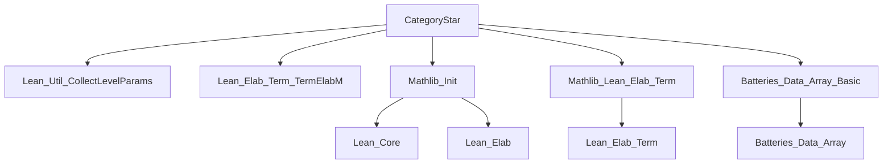
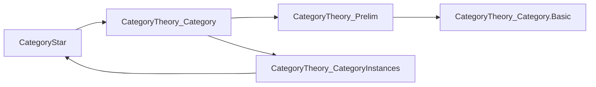

**Technical Brief: `CategoryStar.lean`**

---

### 1. **Key Definitions & Theorems**

| Name | Type / Signature | Purpose |
|------|------------------|---------|
| `insertAfterLevels` | `Array Name → List Name → Name → List Name` | Inserts a new universe level (`newLevel`) into a list of level names (`levelNames`) immediately after the last level from `us` (a subset of `levelNames`) that appears in `levelNames`. If none are found, prepends `newLevel`. |
| Elaborator `"Category*"` | Syntax → `TermElabM Term` | Parses the syntax `Category* C`, introduces a fresh universe level `v`, positions it appropriately relative to existing universe parameters in `C` and its type, and returns the term `Category.{v} C`. |

No named theorems are present—this is a *metaprogramming* module focused on syntax elaboration.

---

### 2. **Naming Conventions**

- **Prefixes / Suffixes**:
  - `insertAfterLevels`: descriptive verb + prepositional phrase; follows standard Lean naming for utility functions.
  - `us`, `levelNames`, `newLevel`: descriptive local variable names.
  - `u`, `v`: standard Lean universe level metavariable names.
  - `cExpr`, `tpCExpr`: expression naming convention (`Expr`) with type hints (`tp` = type).
  - `commitIfNoEx`: compound verb phrase indicating conditional commitment of metavariables.

- **No `is_`, `mul_`, `dist_`-style prefixes**—this is not domain-theory code but metaprogramming infrastructure.

---

### 3. **Tactic Stack**

The elaborator uses **metaprogramming tactics**, not user-level tactics:

| Tactic / Function | Role |
|-------------------|------|
| `mkFreshLevelMVar`, `mkFreshLevelParam` | Introduce fresh universe levels. |
| `elabTermEnsuringType` | Elaborate term `C` and ensure it has expected type (a `Type*`). |
| `Meta.inferType` | Infer the type of the elaborated term. |
| `collectLevelParams` | Collect all universe parameters appearing in expressions (used twice: on `cExpr` and `tpCExpr`). |
| `commitIfNoEx` | Commit metavariables only if no errors occurred (prevents partial elaboration). |
| `withoutErrToSorry` | Suppress errors temporarily (allows elaboration to proceed even if intermediate steps fail). |
| `return .app ...` | Construct final term via application. |

No user-facing tactics (`aesop`, `ring`, `simp`, etc.) appear.

---

### 4. **Proof Logic**

Not applicable—this is **not proof code**, but **term elaboration logic**.

The logic flow is:

1. Introduce a fresh level `u` (for the object universe of `C`).
2. Elaborate `C` as a term of type `Type u`.
3. Infer the type of `C` to collect universe parameters (`us`).
4. Compute where to insert a new level `v` (for morphism universe) using `insertAfterLevels`.
5. Create a fresh level parameter `v` at that position.
6. Return the term `Category.{v} C`.

This is deterministic and side-effect-free (within `TermElabM`).

---

### 5. **Imports**

| Import | Purpose |
|--------|---------|
| `Lean.Util.CollectLevelParams` | Provides `collectLevelParams`, used to extract universe parameters from expressions. |
| `Lean.Elab.Term.TermElabM` | The monad for term elaboration. |
| `Mathlib.Init` | Core Lean + Mathlib initialization (includes basic utilities). |
| `Mathlib.Lean.Elab.Term` | Mathlib extensions to Lean’s elaboration infrastructure. |
| `Batteries.Data.Array.Basic` | Provides `Array` operations (e.g., `filterMap`, `idxOf?`, `max?`, `insertIdx`). |

These imports indicate this module lives in the **metaprogramming layer** of Mathlib, specifically extending Lean’s syntax for category theory.

---

### 6. **Mermaid Diagrams**

#### **Dependency Graph (Module-Level)**



#### **Overview of File Structure**

```mermaid
flowchart LR
  A[Syntax: Category* C] --> B[Elaborator Entry]
  B --> C[Create u (object level)]
  C --> D[Elaborate C : Type u]
  D --> E[Infer type of C]
  E --> F[Collect level params us]
  F --> G[Compute insertion position via insertAfterLevels]
  G --> H[Create v (morphism level)]
  H --> I[Return Category.{v} C]
```

#### **Theoretical Context (Category Theory Library)**



> **Note**: `CategoryStar` is a *syntactic sugar* layer enabling concise universe-polymorphic category declarations, analogous to `Type*`. It sits *above* `CategoryTheory.Category`, not within it.

--- 

Let me know if you'd like a formal specification of `insertAfterLevels` or a comparison with `Type*`.
