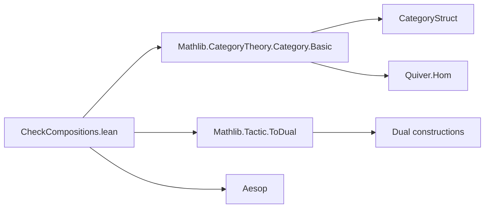

**Technical Brief: `CheckCompositions` Tactic (Lean 4)**  
*Source: `CheckCompositions.lean` (Mathlib Category Theory Tactic)*

---

### 1. KEY DEFINITIONS & THEOREMS

| Name | Type / Signature | Purpose |
|------|------------------|---------|
| `forEachComposition` | `Expr → (Expr → MetaM Unit) → MetaM Unit` | Traverses an expression, finding all subterms of the form `CategoryStruct.comp C inst X Y Z f g`, and applies a given function to each. |
| `checkComposition` | `Expr → MetaM Unit` | For a given composition term, infers types of `f` and `g`, checks source/target compatibility with `X`, `Y`, `Z` at *instances and reducible* transparency, and logs mismatches. |
| `checkCompositions` | `Expr → MetaM Unit` | Applies `checkComposition` to all compositions in an expression. |
| `checkCompositionsTac` | `TacticM Unit` | Top-level tactic entry point: runs `checkCompositions` on the current goal. |
| `elab "check_compositions" : tactic` | Syntax rule | Registers the `check_compositions` tactic in the Lean 4 tactic language. |

No theorems are proven in this file — it is a *metaprogramming utility* for diagnostics.

---

### 2. NAMING CONVENTIONS

- **Prefixes**:
  - `check_`: Indicates diagnostic/checking functions (`checkComposition`, `checkCompositions`, `checkCompositionsTac`).
  - `forEach_`: Indicates traversal functions (`forEachComposition`).
- **Suffixes**:
  - `_Tac`: Indicates tactic-level wrappers (`checkCompositionsTac`).
- **Internal representation**:
  - Uses `CategoryStruct.comp` (7-ary application), not `≫` syntax — reflects internal term representation.

---

### 3. TACTIC STACK

- **Core tactics used**:
  - `withReducibleAndInstances`: For type inference at appropriate transparency.
  - `isDefEq`: Definitional equality checks.
  - `inferType`: To extract morphism types.
  - `logInfo`: To emit user-facing diagnostic messages.
  - `throwError`: For malformed inputs (e.g., non-morphism types).
- **No high-level automation** (e.g., `simp`, `ring`, `aesop`) — purely structural inspection.

---

### 4. PROOF LOGIC (Metaprogramming Flow)

1. **Goal extraction**: `getMainTarget` retrieves the current goal expression.
2. **Composition traversal**: `forEachComposition` walks the expression tree, identifying all `CategoryStruct.comp _ _ X Y Z f g` subterms.
3. **Per-composition check**:
   - Extract `f`, `g`, `X`, `Y`, `Z`.
   - Infer `f : X' ⟶ Y'`, `g : Y'' ⟶ Z'`.
   - Compare:
     - `X'` vs `X` (source of `f`)
     - `Y'` vs `Y` (target of `f`, source of `g`)
     - `Y''` vs `Y` (source of `g`)
     - `Z'` vs `Z` (target of `g`)
   - All comparisons done at `instances & reducible` transparency.
4. **Reporting**: Mismatches are logged as `info` messages; type errors throw.

> **Design rationale**: Diagnose *definitional* misalignments in composition (e.g., due to implicit associativity of functor composition `((F ⋙ G) ⋙ H)` vs `F ⋙ G ⋙ H`), which `rw`/`simp` may obscure.

---

### 5. IMPORTS & DEPENDENCIES

| Import | Role |
|--------|------|
| `Aesop` | General-purpose automation (used indirectly via tactic infrastructure). |
| `Mathlib.CategoryTheory.Category.Basic` | Provides `CategoryStruct`, `Quiver.Hom`, `≫`, and basic categorical infrastructure. |
| `Mathlib.Tactic.ToDual` | Possibly for dualization utilities (though not directly used here). |

> **Scope**: Purely metaprogramming + category theory foundations — no heavy library dependencies.

---

### 6. MERMAID DIAGRAMS

#### Dependency Graph (Module-Level)



#### Overview of `check_compositions` Workflow

```mermaid
flowchart TD
  Start[Goal: expr e] --> Extract[getMainTarget]
  Extract --> Traverse[forEachComposition e]
  Traverse --> Check{Is CategoryStruct.comp?}
  Check -->|Yes| InferF[inferType f]
  InferF --> CheckF[Is Quiver.Hom X' Y'?]
  CheckF -->|No| ThrowF[throwError]
  CheckF -->|Yes| CompX[isDefEq X' X?]
  CompX -->|No| LogX[logInfo source mismatch]
  CompX -->|Yes| CompY1[isDefEq Y' Y?]
  CompY1 -->|No| LogY1[logInfo target(f) mismatch]
  CompY1 -->|Yes| InferG[inferType g]
  InferG --> CheckG[Is Quiver.Hom Y'' Z'?]
  CheckG -->|No| ThrowG[throwError]
  CheckG -->|Yes| CompY2[isDefEq Y'' Y?]
  CompY2 -->|No| LogY2[logInfo source(g) mismatch]
  CompY2 -->|Yes| CompZ[isDefEq Z' Z?]
  CompZ -->|No| LogZ[logInfo target(g) mismatch]
  LogX --> End[Done]
  LogY1 --> End
  LogY2 --> End
  LogZ --> End
  ThrowF --> End
  ThrowG --> End
```

---

### 7. USE CASE SUMMARY

- **Primary use**: Diagnose *definitional* composition errors in category theory proofs, especially when `rw`, `simp`, or `erw` behave unexpectedly.
- **Typical scenario**: When functor composition associativity is implicitly assumed, but definitional equality fails (e.g., `((F ⋙ G) ⋙ H)` vs `F ⋙ G ⋙ H`).
- **Output**: Informative `info` messages (not errors), guiding user to reassociate or fix definitions.

---

### 8. EXAMPLE DIAGNOSTIC OUTPUT (from docstring)

```
In composition
  colimit.ι ((F ⋙ G) ⋙ H) j ≫ (preservesColimitIso (G ⋙ H) F).inv
the source of
  (preservesColimitIso (G ⋙ H) F).inv
is
  colimit (F ⋙ G ⋙ H)
but should be
  colimit ((F ⋙ G) ⋙ H)
```

This reveals a *definitional* mismatch in the codomain of the first morphism, caused by implicit associativity of `Functor.comp`.

--- 

*End of Technical Brief.*
