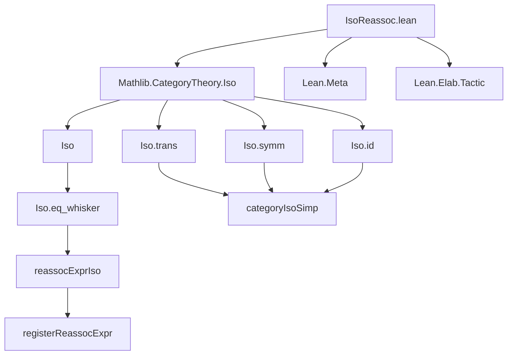

**Technical Brief: `IsoReassoc.lean`**

---

### 1. **Key Definitions & Theorems**

| Name | Type / Signature | Purpose |
|------|------------------|---------|
| `Iso.eq_whisker` | `{C : Type*} [Category* C] {X Y : C} {f g : X ≅ Y} (w : f = g) {Z : C} (h : Y ≅ Z) : f ≪≫ h = g ≪≫ h` | Whiskering equality of isomorphisms along a post-composed isomorphism; foundational lemma for extension of `reassoc`. |
| `categoryIsoSimp` | `Expr → MetaM Simp.Result` | Simplifier for isomorphism expressions using only groupoid axioms (e.g., associativity, unit, inverse laws). |
| `reassocExprIso` | `Expr → MetaM (Expr × Array MVarId)` | Core tactic logic: given an equation `f = g` between isomorphisms, produces the associated “right-associated whiskered” version `∀ {Z} (h : Y ≅ Z), f ≪≫ h = g ≪≫ h`, simplified via `categoryIsoSimp`. |
| `registerReassocExpr` | `initialize` block | Registers `reassocExprIso` as a handler for the `@[reassoc]` attribute, enabling automatic generation of `*_assoc` lemmas. |

---

### 2. **Naming Conventions**

- **Prefixes**:
  - `Iso.`: for lemmas about isomorphism calculus (e.g., `Iso.trans_assoc`, `Iso.symm_self_id`).
  - `reassoc`: for tactic-level machinery extending `reassoc` to isomorphisms.
- **Suffixes**:
  - `_assoc`: generated lemma names (e.g., `F_assoc`) for whiskered versions.
  - `_Iso`: internal helper names (e.g., `reassocExprIso`, `categoryIsoSimp`).
- **Pattern**: `F` (original lemma) → `F_assoc` (derived whiskered lemma).

---

### 3. **Tactic Stack**

- `simpOnlyNames [...]`: uses a curated list of isomorphism identities.
- `forallMetaBoundedTelescope`: to unpack quantifiers and metavariables.
- `mkConstWithFreshMVarLevels`: instantiate `Iso.eq_whisker` with fresh metavariables.
- `assignIfDefEq`: unify metavariables with given expressions.
- `withEnsuringLocalInstance`: ensure category instance is in scope.
- `simpType`: apply `categoryIsoSimp` to simplify result type.

No high-level tactics like `intro`, `apply`, or `rw` are used directly—simplification is delegated to `categoryIsoSimp`.

---

### 4. **Proof Logic**

- **Input**: an equation `f = g` between isomorphisms `X ≅ Y`.
- **Steps**:
  1. Instantiate `Iso.eq_whisker` with `f = g` as `w`.
  2. Introduce fresh metavariables for `C`, `X`, `Y`, `Z`, `h`, and ensure `w` is assigned.
  3. Simplify the resulting goal using `categoryIsoSimp`, which reduces compositions using groupoid laws.
- **Output**: a simplified universally quantified equation `∀ {Z} (h : Y ≅ Z), f ≪≫ h = g ≪≫ h`.

The logic is *purely equational* and *simplifier-driven*, avoiding case analysis or induction.

---

### 5. **Imports**

- `Mathlib.CategoryTheory.Iso`: provides core isomorphism definitions and lemmas (`Iso`, `trans`, `symm`, `id`, and their properties).
- `Lean.Meta`, `Lean.Elab.Tactic`: for tactic metaprogramming (`MetaM`, `Expr`, `Simp.Result`, etc.).

---

### 8. **Mermaid Diagrams**

#### **Dependency Graph (Module Level)**



#### **Overview of File Logic Flow**

```mermaid
flowchart LR
  Input[Input: f = g : X ≅ Y] --> Instantiate[Iso.eq_whisker instantiation]
  Instantiate --> Assign[Assign w := f = g]
  Assign --> Simplify[categoryIsoSimp]
  Simplify --> Output[Output: ∀ {Z} (h : Y ≅ Z), f ≪≫ h = g ≪≫ h]
  Output --> Register[registerReassocExpr]
  Register --> Generated[Generated lemma: F_assoc]
```

#### **Theoretical Scope**

- **Domain**: Category theory with isomorphisms (a groupoid structure on each hom-space).
- **Goal**: Automate derivation of *right-associated* whiskering lemmas for isomorphisms, leveraging simplifier rules for:
  - Associativity (`trans_assoc`)
  - Unit laws (`trans_refl`, `refl_trans`)
  - Inverse laws (`trans_symm`, `symm_self_id`, `self_symm_id`)
  - Functoriality (`mapIso_*`)

This enables `simp` to normalize expressions like `f ≪≫ (g ≪≫ h)` or `id ≪≫ f` automatically—even when already right-associated—by reducing via groupoid axioms.

--- 

Let me know if you'd like a formalization of the `@[reassoc]` attribute usage or examples of generated lemmas.
