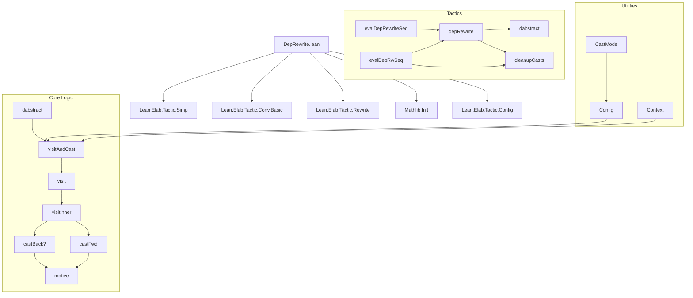
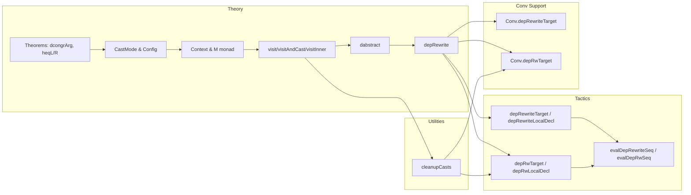

### Technical Brief: `DepRewrite.lean`

---

#### **1. Key Definitions & Theorems**

| Name | Type | Purpose |
|------|------|---------|
| `dcongrArg` | `∀ {α : Sort u} {a a' : α} {β : (a' : α) → a = a' → Sort v}, a = a' → (f : (a' : α) → (h : a = a') → β a' h) → f a rfl = Eq.rec (motive := fun x h' ↦ β x (h.trans h')) (f a' h) h.symm` | Dependent congruence for function application under equality; handles type families indexed by paths. |
| `nddcongrArg` | `∀ {α : Sort u} {a a' : α} {β : Sort v}, a = a' → (f : (a' : α) → (h : a = a') → β) → f a rfl = f a' h` | Non-dependent version of `dcongrArg`; simpler cast-free congruence. |
| `heqL`, `heqR` | `HEq a b → a = cast (type_eq_of_heq h).symm b`, `cast (type_eq_of_heq h) a = b` | Relates heterogeneous equality (`HEq`) to homogeneous equality via type transport. |
| `CastMode` | `inductive` | Configures when casts are inserted: `.proofs` (only proofs), `.all` (any subterm). |
| `Config` | `structure` | Holds tactic configuration: `transparency`, `occs`, `castMode`, `castTransparency`. |
| `Context` | `structure` | Encapsulates state for the monad `M`: pattern `p`, variable `x`, equality `h : p = x`, context `Δ`, and dependent binders `δ`. |
| `visitAndCast`, `visit`, `visitInner` | `partial def` | Core traversal functions that rewrite occurrences of `p` to `x`, inserting casts as needed to preserve type correctness. |
| `dabstract` | `def` | Abstracts over pattern `p` and equality `h : p = x`, returning a lambda term that performs dependent rewriting. |
| `depRewrite` | `def` | Main tactic entry point: rewrites a term `e` using an equality `heq : lhs = rhs`, handling dependent types and casting. |
| `cleanupCasts` | `def` | Post-processes terms to eliminate refl-casts introduced during rewriting. |
| `castBack?`, `castFwd` | `def` | Helper functions to cast terms backward (`x ↦ p`) or forward (`p ↦ x`) along equality `h`. |
| `canUseCache` | `def` | Determines whether cached traversal results can be reused based on occurrence positions. |

---

#### **2. Naming Conventions**

- **Prefixes**:
  - `dcongrArg`, `nddcongrArg`: *dependent* and *non-dependent* congruence.
  - `castBack?`, `castFwd`: direction of cast.
  - `visit`, `visitInner`, `visitAndCast`: traversal phases.
  - `depRewrite`, `depRw`: *dependent rewrite* variants.
  - `heqL`, `heqR`: left/right projection of heterogeneous equality.
- **Suffixes**:
  - `?`: returns `Option`.
  - `M`: monadic type (e.g., `M := ReaderT ...`).
  - `Config`, `Context`: data structures.
- **Trace Classes**:
  - `Tactic.depRewrite`, `Tactic.depRewrite.visit`, `Tactic.depRewrite.cast`, `Tactic.depRewrite.cleanupCasts`.

---

#### **3. Tactic Stack**

Frequently used tactics and utilities:
- `cases`, `rfl`: basic equality reasoning.
- `withLocalDeclD`, `withLetDecl`, `withLambdaFVars`, `mkLambdaFVars`: binder introduction.
- `mkEqRec`, `mkEqSymm`, `mkEqTrans`: construction of equality eliminators and operations.
- `isDefEq`, `whnf`, `inferType`: type checking and normalization.
- `transform`, `replaceFVars`, `instantiate1`, `abstract`: term manipulation.
- `MonadCacheT`, `ReaderT`, `StateRefT`: monad stack for caching and context.
- `trace[Tactic.depRewrite.*]`: debug tracing.

---

#### **4. Proof Logic**

The core logic follows a **structural traversal with dynamic casting**:

1. **Pattern Matching & Unification**  
   - `visitInner` checks if a subterm matches the pattern `p` (via `isDefEq`), and if so, replaces it with `x`.

2. **Contextual Type Correction**  
   - After rewriting, `visitAndCast` checks if the resulting term’s type matches the expected type.
   - If not, it attempts to insert casts:
     - `castBack?`: cast from inferred type to expected type (i.e., `x ↦ p`).
     - `castFwd`: cast from expected type to inferred type (i.e., `p ↦ x`).
   - Casts are only inserted if allowed by `castMode`.

3. **Binder Handling**  
   - For `lam`, `letE`, `forallE`, the tactic introduces new binders and maintains a context `Δ` of *abstracted binders* with their types cast along `h`.
   - Dependent binders (`δ`) are tracked separately to ensure correct motive computation.

4. **Caching & Optimization**  
   - `visit` caches traversal results keyed by `ExprStructEq`.
   - `canUseCache` ensures cached results are only reused when occurrence sets match.

5. **Cleanup**  
   - `cleanupCasts` post-processes to eliminate refl-casts (`Eq.rec ... rfl`) via definitional equality checks.

---

#### **5. Imports**

| Import | Purpose |
|--------|---------|
| `Lean.Elab.Tactic.Simp` | Simplifier infrastructure (used for tactic elaboration). |
| `Lean.Elab.Tactic.Conv.Basic` | Conv tactic infrastructure (for `rewrite!` in `conv` mode). |
| `Lean.Elab.Tactic.Rewrite` | Rewrite tactic utilities (e.g., `rwRuleSeq`, `location`). |
| `Mathlib.Init` | Core Lean + Mathlib utilities (e.g., `HEq`, `cast`, `type_eq_of_heq`). |
| `Lean.Elab.Tactic.Config` | Configuration elaboration (`declare_config_elab`). |

---

#### **6. Mermaid Diagrams**

##### **Dependency Graph (High-Level)**

##### **Overview of File Structure**

---

#### **7. Summary**

`DepRewrite.lean` implements a **dependent rewrite tactic** (`rewrite!` / `rw!`) that extends Lean’s `rewrite` to handle type-dependent subterms by inserting *transport casts* along equality proofs. It introduces:

- A **monadic traversal** (`M`) with caching and context tracking.
- **Configurable cast insertion** (`castMode`).
- **Motive computation** for dependent casts via `castBack?.motive`.
- **Post-processing cleanup** to eliminate trivial casts.

This enables robust rewriting in dependent type theory, especially for dependent functions, vectors, and other type-indexed structures.

--- 

*End of Technical Brief.*
