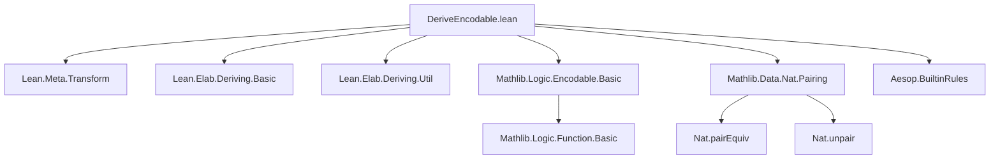
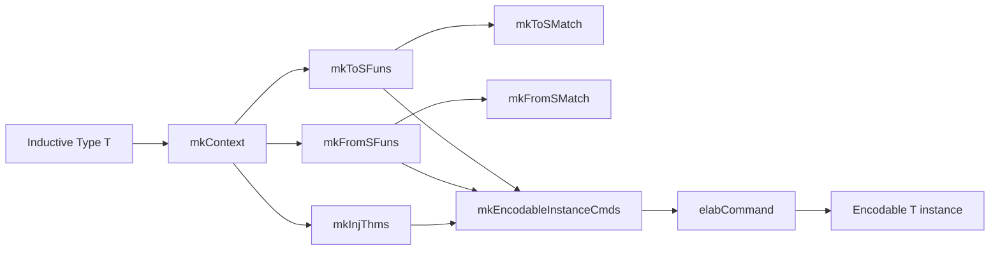
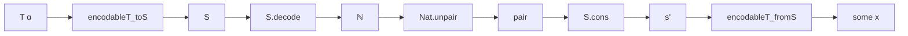

### Technical Brief: `DeriveEncodable.lean`

---

#### **1. Key Definitions & Theorems**

| Name | Type / Purpose |
|------|----------------|
| `S` | Inductive type: `nat n : S` or `cons a b : S`. Represents encoded trees as linked lists of naturals. |
| `S.encode : S → ℕ` | Encodes `S` into `ℕ` using `Nat.pair`. |
| `S.decode : ℕ → S` | Decodes `ℕ` back into `S`, using `Nat.unpair` and conditional logic. |
| `S_equiv : S ≃ ℕ` | Equivalence proof: `S` is bijective with `ℕ`. |
| `encodableT_toS` (example) | Encodes a term of an inductive type `T` into `S`. |
| `encodableT_fromS` (example) | Partial inverse: decodes `S` to `Option T`. |
| `encodableT` (example) | Proof that `fromS ∘ toS = some id`. |
| `mkToSMatch`, `mkToSFuns` | Meta functions to generate `toS` encoding functions for inductive types. |
| `mkFromSMatch`, `mkFromSFuns` | Meta functions to generate `fromS` decoding functions. |
| `mkInjThms` | Generates proofs that `fromS ∘ toS = some id`. |
| `mkEncodableInstanceCmds`, `mkEncodableCmds` | Assembles all generated declarations and `instance` commands. |
| `mkEncodableInstance` | Main entry point: deriving handler for `Encodable`. |
| `registerDerivingHandler ``Encodable mkEncodableInstance`` | Registers the handler with Lean’s deriving system. |

---

#### **2. Naming Conventions**

- **Prefixes**:
  - `mk*`: Meta functions that *generate* code (e.g., `mkToSFuns`, `mkInjThms`).
  - `encodable*`: Generated auxiliary functions/proofs (e.g., `encodableT_toS`, `encodableT_fromS`, `encodableT`).
  - `toS`, `fromS`: Standard suffixes for encoding/decoding functions to/from `S`.
- **Suffixes**:
  - `_toS`, `_fromS`: Encoding/decoding functions for a specific type.
  - `_toS`, `_fromS` names derived from original type name + suffix.
- **Internal naming**:
  - `S` is the internal canonical encoding type.
  - `nat`, `cons` constructors for `S`.

---

#### **3. Tactic Stack**

Frequent tactics used in generated proofs and meta code:

| Tactic | Role |
|--------|------|
| `cases` | Induction on inductive type or `S`. |
| `simp only [...]` | Simplify using `Encodable.encodek`, generated lemmas, and `S` definitions. |
| `rfl` | Final step for definitional equality. |
| `unfold` | Expand definitions of `toS`, `fromS`, `S.encode`, `S.decode`. |
| `try rfl` | Fallback for trivial equalities. |
| `have`, `obtain`, `split`, `lia` | In `S_equiv` proof (meta-level reasoning about `Nat.pair`, `Nat.unpair`). |
| `induction ... using Nat.strongRecOn` | For proving `right_inv` in `S_equiv`. |

---

#### **4. Proof Logic**

- **Encoding logic**:
  - Each constructor is tagged with its index (`cidx`) as `S.nat cidx`.
  - Constructor arguments are encoded recursively:
    - Non-inductive args: `S.nat (Encodable.encode a)`.
    - Inductive args: recursive call to `toS`.
  - Result is a linked list: `S.cons (S.nat cidx) (S.cons arg1 (S.cons arg2 ... (S.nat 0)))`.

- **Decoding logic**:
  - `S.decode n` uses `Nat.unpair n` to destructure:
    - If first component is `0`, decode as `S.nat`.
    - Else, decode as `S.cons (S.decode (a-1)) (S.decode b)`.
  - `fromS` pattern matches on `S.cons (S.nat cidx) ...` to reconstruct constructor.
  - Recursive fields decoded via `fromS` calls; non-recursive via `Encodable.decode`.

- **Proofs**:
  - `mkInjThms` proves `fromS (toS x) = some x` by:
    - `cases x` to reduce to each constructor.
    - `unfold` + `simp only [Encodable.encodek, ...]` to simplify.
    - `rfl` for definitional equality.

- **Equivalence `S ≃ ℕ`**:
  - `left_inv`: induction on `s : S`.
  - `right_inv`: strong induction on `n : ℕ`, using `nat_unpair_lt_2` to ensure termination.

---

#### **5. Imports**

| Import | Purpose |
|--------|---------|
| `Lean.Meta.Transform` | Meta-programming utilities (e.g., term construction). |
| `Lean.Elab.Deriving.Basic`, `Util` | Deriving infrastructure (context, helpers). |
| `Mathlib.Logic.Encodable.Basic` | Core `Encodable` typeclass. |
| `Mathlib.Data.Nat.Pairing` | `Nat.pair`, `Nat.unpair`, `Nat.pairEquiv`. |
| `Aesop.BuiltinRules` | For `aesop`-based simplification (used in `mkInjThms`). |

---

#### **6. Mermaid Diagrams**

##### **Dependency Graph (Top-Level)**



##### **Overview of Deriving Flow**



##### **Encoding/Decoding Cycle**



---

#### **7. Theory Summary**

- **Core idea**: Encode any well-founded, non-nested, non-reflexive inductive type as a tree of naturals via `S`.
- **`S` as s-expression encoding**: Each constructor → list tagged with index; leaves are naturals (encoded via `Encodable.encode`).
- **`S ≃ ℕ`** provides a uniform encoding into `ℕ`, enabling `Encodable` instances.
- **Optimization for mutual inductives**: Reuse generated functions/proofs across mutually defined types.

---

#### **8. Limitations & Scope**

- **Supported**: Non-nested, non-reflexive, zero-indexed inductive types (including mutual).
- **Not yet supported**:
  - Indexed inductive types (e.g., `Vector` with index `n`).
  - Nested or reflexive types (e.g., `Tree` with `Tree → Tree`).
  - Types with parameters or indices requiring decidability checks.

---

#### **9. Example Output (for `T` in docstring)**

Generated declarations (simplified):

```lean
private def T_toS {α} [Encodable α] : T α → S := ...
private def T_fromS {α} [Encodable α] : S → Option (T α) := ...
private theorem T_enc {α} [Encodable α] (x : T α) : T_fromS (T_toS x) = some x := ...

instance {α} [Encodable α] : Encodable (T α) :=
  Encodable.ofLeftInjection T_toS T_fromS T_enc
```

--- 

Let me know if you'd like a formalized dependency graph or a proof-term extraction.
