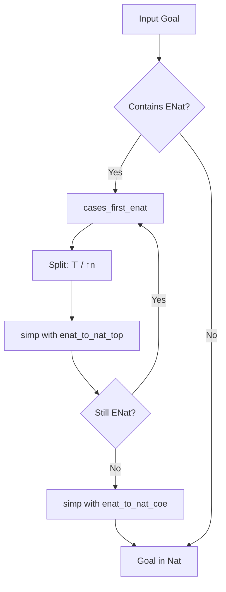

### Technical Brief: `ENatToNat.lean`

---

#### **1. Key Definitions & Theorems**

| Name | Type / Signature | Purpose |
|------|------------------|---------|
| `enat_to_nat_top` | `@[simp]` attribute | Marks lemmas for simplification when eliminating `⊤` (infinity) in `ENat` expressions. |
| `enat_to_nat_coe` | `@[simp]` attribute | Marks lemmas for translating finite `ENat` values (via coercion `↑`) to `Nat`. |
| `not_lt_top` | `∀ x : ENat, ¬(⊤ < x)` | Proves no `ENat` is strictly greater than `⊤`. |
| `coe_add` | `∀ m n : ℕ, (m : ENat) + (n : ENat) = ((m + n) : ENat)` | Coercion preserves addition. |
| `coe_sub` | `∀ m n : ℕ, (m : ENat) - (n : ENat) = ((m - n) : ENat)` | Coercion preserves subtraction (truncated at 0). |
| `coe_mul` | `∀ m n : ℕ, (m : ENat) * (n : ENat) = ((m * n) : ENat)` | Coercion preserves multiplication. |
| `coe_ofNat` | `∀ n : ℕ, [n.AtLeastTwo] ⇒ (OfNat.ofNat n : ENat) = (n : ENat)` | Coercion of numerals (≥2) matches natural numeral. |
| `coe_zero`, `coe_one` | `(0 : ENat) = (0 : ℕ)`, `(1 : ENat) = (1 : ℕ)` | Base cases for coercion. |
| `ENat.coe_inj`, `ENat.coe_le_coe`, `ENat.coe_lt_coe` | Injectivity & monotonicity of coercion | Enable equivalence between `ENat` and `Nat` comparisons on finite values. |
| `cases_first_enat` | `tactic` | Finds first `ENat` in context, performs `cases` using `ENat.recTopCoe`, simplifies with `enat_to_nat_top`. |
| `enat_to_nat` | `macro tactic` | Repeatedly applies `cases_first_enat`, then simplifies with both `enat_to_nat_top` and `enat_to_nat_coe`. |

---

#### **2. Naming Conventions**

- **Attribute names**:  
  - `enat_to_nat_top`: for lemmas about `⊤` (infinity) simplification.  
  - `enat_to_nat_coe`: for lemmas about coercion from `ℕ` to `ENat`.  
- **Lemma names**:  
  - `coe_*`: denote coercion compatibility (e.g., `coe_add`, `coe_mul`).  
  - `not_lt_top`: descriptive predicate about `⊤`.  
- **Tactic names**:  
  - `cases_first_enat`, `enat_to_nat`: action-oriented, descriptive of behavior.

---

#### **3. Tactic Stack**

| Tactic | Frequency / Role |
|--------|------------------|
| `cases` (with `ENat.recTopCoe`) | Core: splits `ENat` into `⊤` or `↑n`. |
| `simp only [...] at *` | Heavy use: simplifies goals using `enat_to_nat_top` and `enat_to_nat_coe`. |
| `repeat'` | Used in macro to apply `cases_first_enat` until no `ENat` remains. |
| `focus`, `getMainGoal`, `getLCtx`, `inferType`, `isExprDefEq`, `evalTactic`, `mkIdent`, `throwError` | Internal implementation of `cases_first_enat`. |
| `try`, `<;>` | Control flow in macro: `repeat'` + `try simp`. |

---

#### **4. Proof Logic / Strategy**

The tactic operates in two phases:

1. **Case Splitting**  
   - For each `ENat` variable `x`, apply `cases x using ENat.recTopCoe`, yielding two subgoals:  
     - `x = ⊤`  
     - `x = ↑n` for some `n : ℕ`  
   - This eliminates all `ENat` variables from the context.

2. **Simplification & Translation**  
   - First, simplify using `enat_to_nat_top`:  
     - Rewrites expressions involving `⊤` (e.g., `⊤ + n = ⊤`, `n - ⊤ = 0`, `⊤ < x` → `false`).  
     - Makes many goals trivial or finite-only.  
   - Then, simplify using `enat_to_nat_coe`:  
     - Rewrites finite `ENat` operations as `Nat` operations (e.g., `(↑m + ↑n) = ↑(m + n)`).  
     - Converts inequalities like `↑m ≤ ↑n` to `m ≤ n`.  
   - Result: goal expressed entirely in `Nat`, ready for `lia`, `omega`, etc.

---

#### **5. Imports**

| Module | Role |
|--------|------|
| `Mathlib.Data.ENat.Basic` | Provides `ENat`, `⊤`, coercion `↑`, arithmetic ops, `ENat.recTopCoe`. |
| `Mathlib.Tactic.ToAdditive` | Enables attribute system (`@[enat_to_nat_top]`, etc.). |
| `Qq`, `Lean`, `Elab`, `Tactic`, `Term`, `Meta` | For tactic implementation (quote/splice, goal manipulation, elaboration). |

---

#### **6. Mermaid Diagrams**

##### **Dependency Graph (Module-Level)**

```mermaid
graph TD
  A[ENatToNat.lean] --> B[Mathlib.Data.ENat.Basic]
  A --> C[Mathlib.Tactic.ToAdditive]
  A --> D[Mathlib.Tactic.Lia]  %% implied via typical usage: enat_to_nat; lia
  B --> E[Mathlib.Data.Nat.Basic]
  B --> F[Mathlib.Data.ENat.Lemmas]
  C --> G[Mathlib.Tactic.Attr]
```

##### **Tactic Workflow Overview**

```mermaid
flowchart LR
  Start[Goal with ENat vars] --> Repeat[repeat' cases_first_enat]
  Repeat --> Split[Split ENat vars: ⊤ or ↑n]
  Split --> SimpTop[simp only [enat_to_nat_top]]
  SimpTop --> SimpCoe[simp only [enat_to_nat_coe]]
  SimpCoe --> Final[Goal in Nat]
  Final --> Use[lia / omega / etc.]
```

##### **Data Flow of `enat_to_nat`**



---

#### **7. Usage Example**

```lean
example (x y : ENat) (h : x + 1 ≤ y) : x ≤ y := by
  enat_to_nat  -- splits x, y; rewrites +, ≤ to Nat
  -- Now goal is in Nat: e.g., (m + 1 ≤ n) ⊢ m ≤ n
  linarith  -- or `lia`
```

---

#### **8. Design Notes**

- **Modularity**: Attributes `enat_to_nat_top`/`enat_to_nat_coe` allow extensibility — new lemmas can be added without modifying tactic code.
- **Safety**: Uses `ENat.recTopCoe` to ensure case split is exhaustive and structurally sound.
- **Efficiency**: `cases_first_enat` targets only the *first* `ENat`, avoiding unnecessary duplication; `repeat'` handles remaining ones.
- **Integration**: Designed to pair with `lia`/`omega` — the final goal is pure `Nat` arithmetic.

--- 

✅ *End of Technical Brief*
