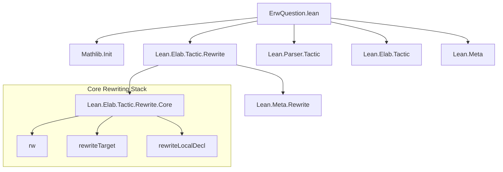
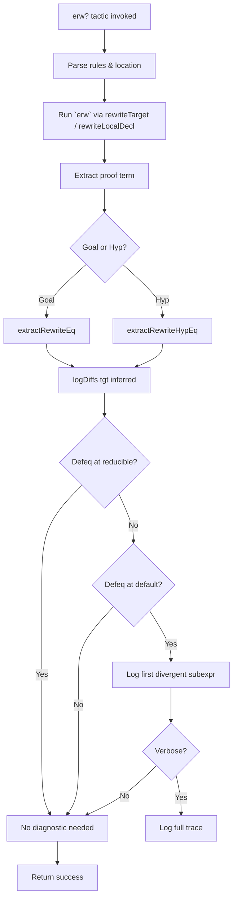

### Technical Brief: `erw?` Tactic in Lean 4 (from `ErwQuestion.lean`)

---

#### **1. Key Definitions & Theorems**

| Name | Type / Signature | Purpose |
|------|------------------|---------|
| `tactic.erw?.verbose` | `Option Bool` (register_option) | Controls verbosity of `erw?`: logs internal diagnostics when `true`. Default: `false`. |
| `logDiffs` | `Syntax → Expr → Expr → StateT (Array (Unit → MessageData)) MetaM Bool` | Compares two expressions at *reducible* vs *default* transparency; logs differences and returns `true` if they are definitionally equal at default but *not* at reducible transparency. |
| `extractRewriteEq` | `Expr → MetaM (Expr × Expr)` | Extracts the pair `(target_type, inferred_type)` from a proof term produced by `erw` on the *goal*. These are defeq but not necessarily reducibly so. |
| `extractRewriteHypEq` | `Expr → MetaM Expr` | Extracts the *inferred* LHS type from a proof term produced by `erw at h`, i.e., the type of the hypothesis after rewriting. |
| `erw?` syntax macro | `tactic` | Entry point: expands to `erw` + diagnostic analysis of *why* `rw` would fail (i.e., due to non-reducible definitional equality). |

---

#### **2. Naming Conventions**

- **Prefixes**:
  - `logDiffs`: diagnostic function naming (`log` + `Diff`s).
  - `extractRewrite*`: extraction of semantic content from `erw`-generated proof terms.
- **Suffixes**:
  - `?`: indicates *extended* or *diagnostic* variant (cf. `rw?`, `erw?`).
  - `Eq.mpr`, `Eq.mp`: standard equality elimination constructors.
- **Internal naming**:
  - `cfg := { transparency := .default }`: uses `.default` transparency to simulate `erw` behavior.
  - `tk`: token (syntax node) for error/logging location.

---

#### **3. Tactic Stack**

Frequently used tactics & utilities:

| Tactic / Utility | Role |
|------------------|------|
| `withRWRulesSeq` | Parses rewrite rules and applies them (core of `rw`/`erw` logic). |
| `rewriteLocalDecl` / `rewriteTarget` | Applies rewriting to hypothesis or goal. |
| `withReducible`, `isDefEq` | Checks definitional equality at specific transparency levels. |
| `withOptions (fun opts => opts.setBool ``pp.analyze true)` | Enables pretty-printer analysis for structural comparison. |
| `instantiateMVars`, `headBeta` | Normalizes expressions before comparison. |
| `logInfoAt`, `verbose` | Conditional logging based on `tactic.erw?.verbose`. |
| `throwTacticEx`, `throwError` | Error reporting for malformed proof terms. |

---

#### **4. Proof Logic / Execution Flow**

1. **Parse input**: `erw? [r₁, …] at h?` → parse rules + location.
2. **Run `erw`** (via `rewriteLocalDecl` / `rewriteTarget` with `.default` transparency).
3. **Extract proof term**:
   - For goal: `extractRewriteEq` → `(tgt, inferred)`.
   - For hypothesis `h`: `extractRewriteHypEq` → `inferred`.
4. **Compare types**:
   - Use `logDiffs` to check if `tgt` and `inferred` are defeq at reducible vs default transparency.
   - Recursively descend into subterms (via `Expr.app` case analysis) to find *first* differing subexpression.
5. **Log diagnostics** (if `verbose`):
   - Show original expression in context vs. inferred expression.
   - Show where they diverge (at reducible vs default transparency).
6. **Return success/failure** (based on `rw` success, not on diagnostics).

> **Core insight**: `erw?` does *not* change behavior of `erw`, but *diagnoses* why `rw` would have failed — namely, due to definitional equality only holding at default transparency, not reducible.

---

#### **5. Imports & Dependencies**

| Import | Purpose |
|--------|---------|
| `Mathlib.Init` | Core Lean infrastructure (basic types, monads, etc.). |
| `Lean.Elab.Tactic.Rewrite` | Provides `rw`, `rewriteTarget`, `rewriteLocalDecl`, and rule-parsing infrastructure. |
| `Lean.Parser.Tactic`, `Lean.Elab.Tactic`, `Lean.Meta` | Syntax parsing, tactic monad, and meta-programming utilities. |

---

#### **6. Mermaid Diagrams**

##### **Dependency Graph (Module-Level)**

##### **Overview of `erw?` Execution Flow**

---

#### **7. Theory Context**

- **Purpose**: Diagnose *why* `rw` fails where `erw` succeeds — i.e., when definitional equality holds only at default transparency (e.g., due to `@[reducible]`, `@[inline]`, or `simp`-like lemmas).
- **Theoretical basis**:
  - Uses Lean’s transparency settings (`reducible`, `default`, `irreducible`, etc.).
  - Leverages `isDefEq` with scoped transparency options.
  - Based on the *proof term structure* of `erw` (which uses `Eq.mpr`/`Eq.mp` with `id` wrappers).
- **Relation to other tactics**:
  - `rw`: only rewrites when LHS and target are *reducibly* defeq.
  - `erw`: relaxes this to *default* transparency.
  - `erw?`: *diagnoses* the gap between `rw` and `erw`.

---

#### **8. Summary**

The `erw?` tactic is a *diagnostic extension* of `erw`, designed to help users understand *why* a rewrite succeeded with `erw` but would have failed with `rw`. It does so by:
- Inspecting the proof term generated by `erw`,
- Comparing source and target types at different transparency levels,
- Logging precise locations of non-reducible definitional equality.

It is a *meta-level* tool, not changing the logic of the goal, but improving usability in complex rewriting scenarios (e.g., with definitional unfoldings, type class inference, or custom transparency settings).
