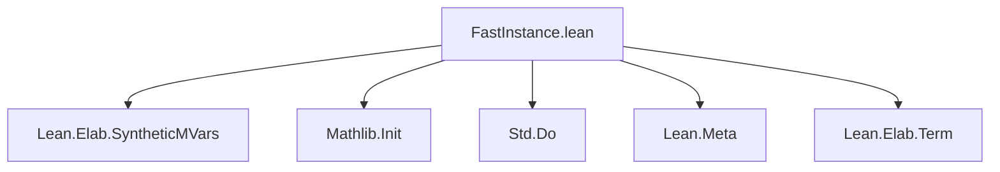
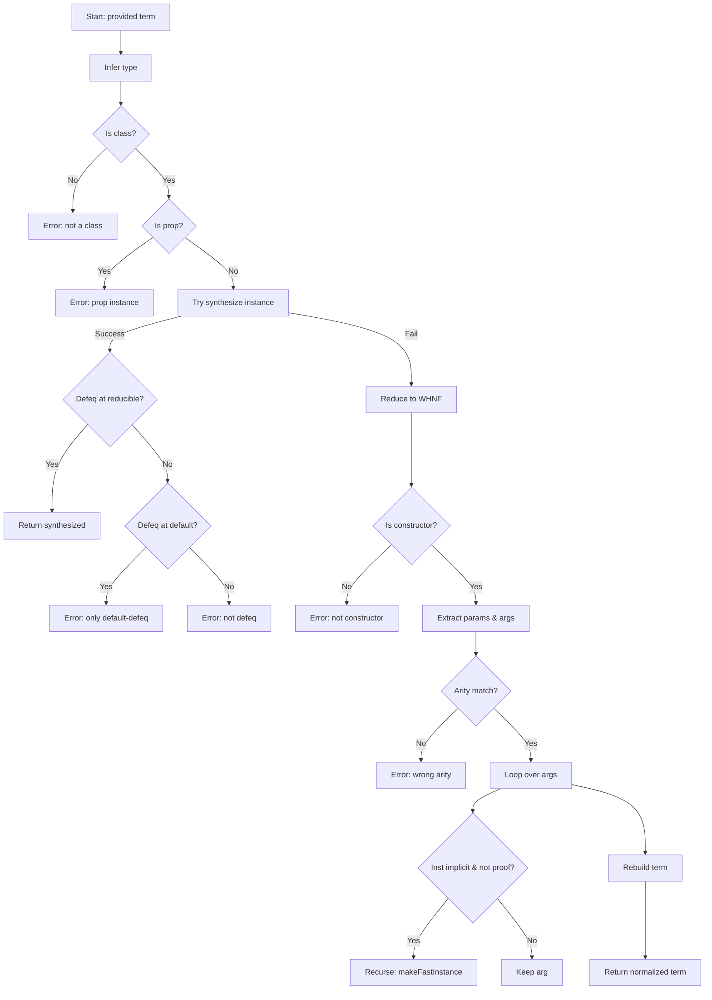

**Technical Brief: `FastInstance.lean` Module**

---

### **1. Key Definitions & Theorems**

| Name | Type / Signature | Purpose |
|------|------------------|---------|
| `error` | `Array Name → MessageData → MetaM α` | Helper to throw structured errors with trace context; used when `makeFastInstance` fails. |
| `makeFastInstance` | `Expr → Array Name → MetaM Expr` | Core normalization algorithm: attempts to replace a given instance term with a synthesized canonical one, or reduce it to a constructor with recursively normalized implicit fields. |
| `elabFastInstance` | `TermElab` | Elaborator for the `fast_instance%` syntax extension; wraps `makeFastInstance` and falls back to the original term on error. |

---

### **2. Naming Conventions**

- **Prefixes**:
  - `makeFastInstance`: action-oriented (`make*`) for core algorithm.
  - `error`: generic error helper.
  - `elabFastInstance`: `elab*` for term elaborator.
- **Suffixes**:
  - None prominent; names are descriptive and action-first.
- **Trace-related**:
  - `trace` parameter is consistently passed as `Array Name`.
  - `className ++ binderName` used to build trace path.

---

### **3. Tactic Stack**

| Tactic / Function | Usage |
|-------------------|-------|
| `withReducible` | Used to normalize with reducible transparency (standard for typeclass search). |
| `withReducibleAndInstances` | Used when comparing or normalizing with instances in scope. |
| `withDefault` | To evaluate terms at default transparency (e.g., for `isProp`, `isDefEq`). |
| `forallTelescopeReducing` | To decompose dependent function types (telescopes) and process implicit arguments. |
| `whnf` | Weak head normal form normalization for constructor detection. |
| `trySynthInstance` | Attempt to synthesize a canonical instance. |
| `isDefEq`, `isProp`, `isStructure`, `isClass?` | Core meta-level predicates for type analysis. |
| `mkAppN`, `mkLambdaFVars` | Term construction utilities. |
| `getAppFn`, `getAppArgs` | Destructors for application terms. |

---

### **4. Proof Logic / Algorithm Flow**

The `makeFastInstance` algorithm follows this logic:

1. **Type inference**: Infer the type of the provided term.
2. **Class check**: Ensure the type is a typeclass (`isClass?`).
3. **Prop check**: Reject if the term is a proof (propositional).
4. **Synthesis attempt**:
   - Try to synthesize a new instance (`trySynthInstance`).
   - If successful:
     - Check definitional equality (`isDefEq`) at two transparency levels:
       - `withReducibleAndInstances` → success → return new instance.
       - `withDefault` → partial match → error.
       - else → error.
   - If synthesis fails:
     - Normalize term to constructor form (`whnf`, `getAppFn`, `getAppArgs`).
     - Validate constructor and extract parameter info (`forallTelescopeReducing`, `ctorInfo`).
     - Recursively normalize instance-implicit arguments (`recurse` flag).
     - Rebuild term with normalized args.

Error handling is uniform: `error trace m!"..."` with full trace of visited fields.

---

### **5. Imports**

| Import | Role |
|--------|------|
| `Lean.Elab.SyntheticMVars` | For `withSynthesize`, used in elaboration. |
| `Mathlib.Init` | Core Lean + Mathlib utilities. |
| `Std.Do` | Do-notation support (likely for monadic chaining). |

---

### **6. Dependency & Theory Overview**

#### **Mermaid Diagram: Module Dependencies**

#### **Mermaid Diagram: Algorithm Flow**

---

### **7. Summary**

The `fast_instance%` elaborator implements a *canonicalization* strategy for typeclass instances: it attempts to replace user-provided instances with synthesized ones (when possible), or otherwise normalize them into constructor applications that reuse existing instances. This improves unification behavior and avoids non-canonical constructors (e.g., `Function.Injective.ring`) in favor of canonical structure instances (e.g., `Ring X` via `Semiring X` + extra data). The algorithm is conservative: it errors on non-structure classes unless explicitly allowed, and provides rich trace diagnostics for debugging.

--- 

Let me know if you'd like a formalized specification of `makeFastInstance` in Lean or a proof of correctness under certain assumptions.
