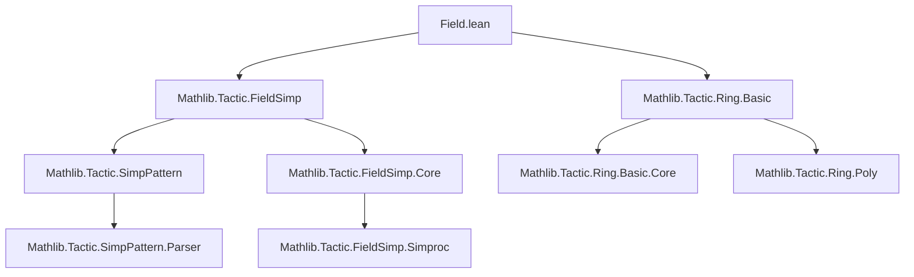
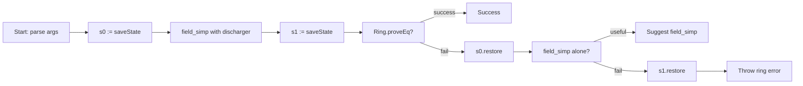

### Technical Brief: `Field.lean` — The `field` Tactic in Lean 4

---

#### **1. Key Definitions & Theorems**

| Name | Type / Purpose |
|------|----------------|
| `field` | A *finishing tactic* (elaborated via `elab`) that proves equality goals in (semi-)fields by combining `field_simp` and `ring`. It succeeds when the goal is a universal identity in the language of fields (i.e., derivable from field axioms alone, modulo nonvanishing denominators). |
| `reduceProp` | Internal function used in `field_simp`-style simplification; part of the `AtomM` monad stack for propositional simplification with discharger support. |
| `Ring.proveEq` | Core function from `Mathlib.Tactic.Ring.Basic` that proves equality of two ring expressions by normalizing them to a canonical form (via ring normalization). |
| `transformAtTarget` | Meta-level tactic combinator used to apply a transformation to the current goal’s target, with options to fail if unchanged or not. |
| `liftMetaTactic1`, `liftMetaFinishingTactic` | Meta-programming utilities to embed tactic logic into the Lean 4 elaborator monad. |

---

#### **2. Naming Conventions**

- **Prefixes**:
  - `is_` / `has_`: Not used here.
  - `reduce_`, `transform_`, `liftMeta_`: Standard Lean meta-tactic naming for internal transformations.
  - `field_`: Used for all components related to field simplification (`field_simp`, `field`).
- **Suffixes**:
  - `_tactic`: For tactic parsers (`field`, `field_simp`).
  - `_eq`, `_prop`: Not used here; instead, `proveEq`, `reduceProp` follow functional naming.

---

#### **3. Tactic Stack**

The `field` tactic uses the following tactics in sequence:

| Tactic | Role |
|--------|------|
| `field_simp` | Simplifies denominators (i.e., rewrites `a / b` as `a * b⁻¹`, cancels common factors, applies `ne_zero` lemmas). Runs *non-recursively*, only at top level. |
| `ring` / `Ring.proveEq` | Proves the resulting equality in the language of commutative (semi-)rings. Uses canonical normal forms (e.g., polynomial expansion). |
| `try`, `catch`, `restore`, `saveState` | Backtracking and error handling to suggest fallback strategies (`field_simp` alone, or error reporting). |
| `parseDischarger`, `simpArgs` | Parses optional discharger and simp-arguments (e.g., `[hK]`) to guide nonvanishing proofs. |
| `evalTactic`, `addSuggestion` | Used to suggest alternative tactic scripts (e.g., via `try?` or `hint`). |

---

#### **4. Proof Logic / Logical Flow**

The `field` tactic follows this logical flow:

1. **Parse arguments**: Extract optional discharger and simp-arguments.
2. **Save state** (`s0`) before simplification.
3. **Apply `field_simp`**:
   - Uses `reduceProp` with discharger to simplify the goal by clearing denominators.
   - Only applies at top level (non-recursive).
4. **Save state** (`s1`) after simplification.
5. **Attempt to finish with `ring`**:
   - Calls `Ring.proveEq` on the simplified goal.
   - If successful, tactic succeeds.
6. **On failure**:
   - Restore to `s0` (pre-`field_simp` state).
   - Try running `field_simp` alone and suggest it via `addSuggestion`.
   - If that also fails, restore to `s1` and rethrow the original `ring` error.

> **Key insight**: The tactic separates *universal algebraic reasoning* (`ring`) from *field-specific nonvanishing checks* (`field_simp`). The latter is non-universal and may depend on context (e.g., order, `CharZero`, user-provided lemmas).

---

#### **5. Imports**

| Module | Purpose |
|--------|---------|
| `Mathlib.Tactic.FieldSimp` | Provides `field_simp` and supporting infrastructure (not shown here, but imported). |
| `Mathlib.Tactic.Ring.Basic` | Provides `Ring.proveEq`, the core ring normalizer. |
| `Lean.Meta`, `Lean.Elab.Tactic`, `Lean.Parser.Tactic` | Meta-programming infrastructure for tactic elaboration. |
| `Qq`, `AtomM`, `saveState`, `restore`, etc. | Lean 4 meta-level utilities for tactic state management. |

---

#### **6. Mermaid Diagrams**

##### **Dependency Graph**



##### **Overview of `field` Tactic Execution**



---

#### **7. Example Use Cases (from docstring)**

- **Basic field identity**:
  ```lean
  example {x y : ℚ} (hx : x + y ≠ 0) : x / (x + y) + y / (x + y) = 1 := by field
  ```

- **With user-provided nonvanishing lemma**:
  ```lean
  example {K : Type*} [Field K] (hK : ∀ x : K, x ^ 2 + 1 ≠ 0) (x : K) :
      1 / (x ^ 2 + 1) + x ^ 2 / (x ^ 2 + 1) = 1 := by field [hK]
  ```

- **Requires manual preprocessing**:
  ```lean
  example {a b : ℚ} (H : b + a ≠ 0) : a / (a + b) + b / (b + a) = 1 :=
    by ring_nf at *; field
  ```

---

#### **8. Registration & Integration**

- Registered as a `hint` tactic with priority `850`.
- Registered as a `try?` tactic with same priority.
- Designed to integrate with Lean’s `try?`, `hint`, and `suggest` infrastructure.

---

#### **9. Theoretical Scope**

- **Universal fragment**: Proves identities valid in *all* fields (or semifields), modulo denominator nonvanishing.
- **Non-universal fragment**: Uses context-specific facts (`≠ 0` hypotheses, `CharZero`, order, etc.) to discharge side conditions.
- **Not for inequalities or existence**: Purely equality reasoning.

---

This file is a canonical example of *tactic composition* in Lean 4: combining a domain-specific simplifier (`field_simp`) with a general-purpose algebraic solver (`ring`) to automate reasoning in a mathematically rich structure (fields).
