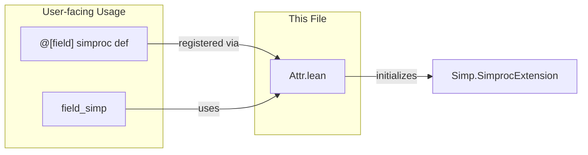

**Technical Brief: `Attr.lean` (Mathlib Field Simproc Attribute)**

---

### 1. KEY DEFINITIONS & THEOREMS

- **`fieldSimpExt`**  
  - **Type**: `Simp.SimprocExtension`  
  - **Purpose**: A global extension point in Lean’s simplifier registry that groups simprocs associated with the `field_simp` tactic.

- **`Simp.registerSimprocAttr`**  
  - **Type**: `Lean.Name → String → Option Simp.Simproc → MetaM Simp.SimprocExtension`  
  - **Purpose**: Registers a new attribute (`attrName = ``field``) that collects simprocs used by `field_simp`, enabling modular extension via `@[field]` annotations.

> *Note*: No theorems are stated in this file—this is a *meta-programming* module initializing infrastructure.

---

### 2. NAMING CONVENTIONS

- **Attribute name**: `` `field `` — short, lowercase, no prefix/suffix beyond the core concept.
- **Extension name**: `fieldSimpExt` — camelCase, suffix `Ext` for extension constants.
- **Simproc attribute pattern**: `@[field]` — follows Lean’s convention where attribute names match the simproc group name.

---

### 3. TACTIC STACK

- **Meta-level tactics used**:
  - `Simp.registerSimprocAttr` — core registration tactic.
  - `initialize` — Lean 4’s meta initialization block (runs at compile time).
  - `MetaM` — monad for metaprogramming operations.

- **No user-level tactics** appear in this file (it’s infrastructure, not a proof script).

---

### 4. PROOF LOGIC

- **Not applicable** — this file contains *no proofs*, only *meta-level initialization*.
- **Logical flow**:
  1. Import `Mathlib.Init`.
  2. Open `Lean Meta`.
  3. Define `fieldSimpExt` by registering a new simproc attribute `` `field ``.
  4. Attach documentation string: `"Attribute grouping the simprocs associated to the field_simp tactic"`.

---

### 5. IMPORTS

- **Primary dependency**: `Mathlib.Init`  
  - Provides core Lean infrastructure, including `Simp.SimprocExtension`, `Simp.registerSimprocAttr`, and `MetaM`.

> *No other Mathlib modules are imported here* — this is a low-level, foundational module.

---

### 6. DEPENDENCY & OVERVIEW DIAGRAM

```mermaid
graph TD
  A[Attr.lean] -->|imports| B[Mathlib.Init]
  A -->|defines| C[fieldSimpExt : Simp.SimprocExtension]
  A -->|registers| D[`` `field `` attribute]
  D -->|used by| E[field_simp tactic]
  E -->|applies| F[Simprocs annotated with @[field]]
  
  subgraph "Simplifier Infrastructure"
    C
    D
  end
```



---

### 7. ROLE IN THEORY ECOSYSTEM

- **Purpose**: Enables modular registration of field-theoretic simplification rules (e.g., for `+`, `*`, `-`, `/`, `0`, `1`, inverses) under a unified attribute.
- **Usage**: When users write `@[field]`, the simproc is added to `fieldSimpExt`, and `field_simp` (a wrapper around `simp`) will invoke them.
- **Design principle**: Separation of *simproc registration* (meta) from *tactic logic* (user-level), following Lean’s extensible simplifier architecture.

--- 

Let me know if you'd like the corresponding tactic definition (`field_simp`) or examples of `@[field]` simprocs.
