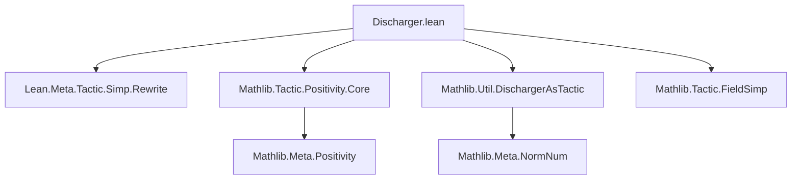
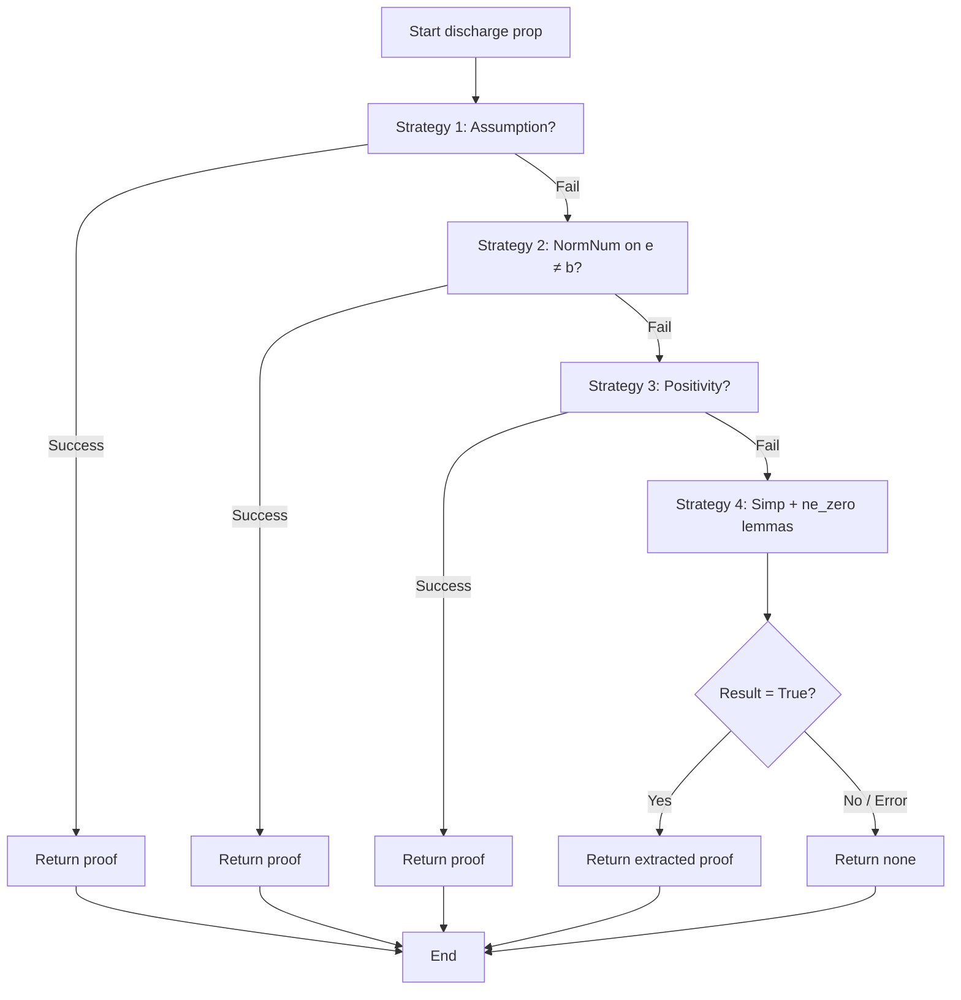

### Technical Brief: `Discharger.lean`

---

#### **1. Key Definitions & Theorems**

| Name | Type / Signature | Purpose |
|------|------------------|---------|
| `dischargerTraceMessage` | `Expr → Except ε (Option Expr) → SimpM MessageData` | Constructs trace messages for the discharger, indicating success/failure of discharging a proposition. |
| `discharge` | `Expr → SimpM (Option Expr)` | Main discharger function for `field_simp`. Attempts to prove a proposition (typically `≠ 0`) using four strategies in sequence. |
| `field_simp_discharge` | tactic syntax | Tactic wrapper for `discharge`, useful for testing/debugging. |
| `two_ne_zero`, `three_ne_zero`, `four_ne_zero`, `mul_ne_zero`, `pow_ne_zero`, `zpow_ne_zero`, `Nat.cast_add_one_ne_zero` | `ne_zero` lemmas | Preloaded simplification theorems used by `simp` as a fallback when `positivity` is unavailable (e.g., in non-ordered fields). |

---

#### **2. Naming Conventions**

- **Prefixes**:
  - `discharge_`: for discharger-related functions (`discharge`, `dischargerTraceMessage`).
  - `ne_zero`: for lemmas asserting non-zero-ness of expressions (e.g., `mul_ne_zero`, `zpow_ne_zero`).
- **Suffixes**:
  - `_ne_zero`: standard for theorems about non-vanishing of expressions.
  - `_traceMessage`: for helper functions generating trace output.

---

#### **3. Tactic Stack**

Frequently used tactics and meta-level operations:

| Tactic / Meta Operation | Role |
|-------------------------|------|
| `Simp.dischargeUsingAssumption?` | Strategy 1: try assumptions. |
| `Mathlib.Meta.NormNum.derive` | Strategy 2: normalize and prove inequalities (e.g., `2 ≠ 0`). |
| `Mathlib.Meta.Positivity.solve` | Strategy 3: use positivity solver (robust for `≠ 0`, not just `> 0`). |
| `simp` (with custom context) | Strategy 4: fallback `simp` with extra `ne_zero` lemmas. |
| `mkOfEqTrue`, `getProof`, `isConstOf ``True`` | Proof reconstruction after `simp`. |
| `withTraceNode`, `wrapSimpDischarger` | Tracing and tactic integration. |

---

#### **4. Proof Logic**

The `discharge` function follows a **sequential fallback strategy**:

1. **Assumption check**: Try to solve `prop` directly from local context.
2. **NormNum-based inequality solving**: For goals of the form `e ≠ b`, try to prove via `norm_num`.
3. **Positivity solver**: Use `Mathlib.Meta.Positivity.solve`, which handles `≠ 0` goals robustly (even without order).
4. **Simplifier with enriched context**:
   - Extend the simplifier context with a fixed set of `ne_zero` lemmas.
   - Run `simp` recursively (via `Simp.withIncDischargeDepth`) to discharge the goal.
   - If `simp` succeeds (i.e., reduces to `True`), extract and return the proof.

> **Rationale**: The fallback chain compensates for limitations of `positivity` in structures lacking a partial order (e.g., fields without `≤`). The `simp`-based fallback approximates `positivity` using known algebraic facts.

---

#### **5. Imports**

| Import | Role |
|--------|------|
| `Lean.Meta.Tactic.Simp.Rewrite` | Core simplifier infrastructure. |
| `Mathlib.Tactic.Positivity.Core` | Provides `positivity` solver. |
| `Mathlib.Util.DischargerAsTactic` | Utilities for embedding dischargers as tactics. |

---

#### **8. Mermaid Diagrams**

##### **Dependency Graph (Module-Level)**

##### **Overview of `discharge` Logic Flow**

##### **Theoretical Scope**

- **Domain**: Field arithmetic, especially denominator non-vanishing in `field_simp`.
- **Theory**: 
  - Algebraic properties of fields (`mul_ne_zero`, `pow_ne_zero`, etc.).
  - Interaction between simplifier, positivity, and norm-num.
  - Meta-programming for tactic composition and tracing.

---

This file is a **core infrastructure component** for `field_simp`, enabling robust and modular discharge of non-zero denominator obligations in symbolic simplification.
