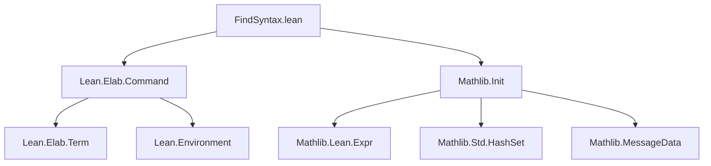
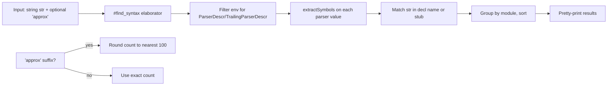

**Technical Brief: `FindSyntax.lean`**

---

### 1. KEY DEFINITIONS & THEOREMS

| Name | Type | Purpose |
|------|------|---------|
| `extractSymbols : Expr → Array Expr` | Function | Extracts all `Expr` subterms that are arguments to `Lean.ParserDescr.symbol` or `Lean.ParserDescr.nonReservedSymbol`, used to reconstruct syntax stubs. |
| `litToString : Expr → String` | Function | Converts `Expr.lit` values (string or nat literals) to their string representation; returns `""` otherwise. |
| `#find_syntax` | Elaborator command | A user-facing command that searches the environment for syntax declarations whose *name* or *reconstructed syntax stub* contains a given string. Supports optional `approx` suffix for stable test output. |

---

### 2. NAMING CONVENTIONS

- **Prefixes**:
  - `extractSymbols`, `litToString`: descriptive verb–noun pattern.
  - `isInternal`: used implicitly via `declName.isInternal`.
- **Suffixes**:
  - `Symbols`, `ToString`: indicate transformation or extraction behavior.
- **Command naming**:
  - `#find_syntax`: follows Lean’s convention for interactive commands (`#` prefix), with underscore-separated words.

---

### 3. TACTIC STACK

This file is **not tactic-based** — it is a *meta-level* elaborator command.  
The core logic uses:

- `for` loops over environment constants (`getEnv`, `constants`)
- `match` on `Expr` constructors (`.app`, `.lit`, `.letE`, etc.)
- Standard `Array`/`NameMap`/`Std.HashSet` operations
- `MessageData` construction for output formatting
- `qsort` for deterministic ordering

No Lean tactics (e.g., `simp`, `ring`, `aesop`) are used.

---

### 4. PROOF LOGIC

There are **no proofs** in this file — it is purely *computational/meta-programming*.

**Execution flow**:
1. Define parser types (`ParserDescr`, `TrailingParserDescr`) to filter relevant declarations.
2. Traverse environment constants:
   - Filter for declarations whose type is one of the parser types and which have a value.
   - Skip internal declarations.
   - Extract syntax symbols via `extractSymbols`.
3. For each candidate, reconstruct a syntax stub using `litToString`.
4. Match input string against either declaration name or stub.
5. Group results by module, sort, and pretty-print.

---

### 5. IMPORTS

| Import | Role |
|--------|------|
| `Lean.Elab.Command` | Required for defining custom `elab` commands. |
| `Mathlib.Init` | Provides foundational utilities (e.g., `Std.HashSet`, `MessageData`, basic `Expr` operations). |

---

### 6. DEPENDENCY DIAGRAM (Mermaid)

---

### 7. OVERVIEW DIAGRAM (Mermaid)

---

### 8. THEORY SCOPE

This module belongs to the **Lean 4 metaprogramming ecosystem**, specifically within **Mathlib’s tooling infrastructure**. It enables interactive exploration of syntax declarations — useful for:

- Understanding parser structure
- Debugging syntax extensions
- Maintaining consistency in large-scale syntax design

It does **not** contribute to the core theory of syntax or logic, but serves as a *development-time utility*.

--- 

Let me know if you'd like a formalized correctness spec (e.g., `extractSymbols` preserves semantics), or a test suite sketch.
