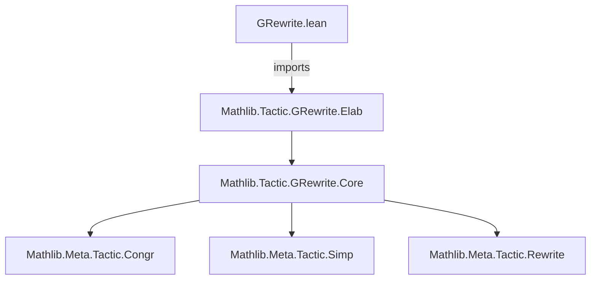

**Technical Brief: `GRewrite.lean` (Lean 4)**  
*Domain: Interactive Theorem Proving — Generalized Rewriting*

---

### 1. Key Definitions & Theorems

| Name | Type / Role | Purpose |
|------|-------------|---------|
| `grw`, `grewrite` | `Tactic.MVarId -> TacticM Unit` (tactic) | Generalized rewriting tactic supporting arbitrary relations (e.g., `≈`, `~`, `≤`, etc.), not just equality. |
| `GRewrite.Elab` | Module (imported) | Elaboration logic for `grw` syntax, including grammar, attribute registration (`[grw]`), and term rewriting rule extraction. |
| `GRewrite.Core` | Module (referenced) | Core semantics and execution engine of `grw`, implementing relation-aware rewriting steps. |

> **Note**: No explicit theorems are stated in this file; it serves as the *entry point* and *module declaration* for the `grw` infrastructure.

---

### 2. Naming Conventions

- **Prefixes**:
  - `grw` / `grewrite`: Public-facing tactic names.
  - `is_`, `mul_`, `dist_`: *Not present* in this file (typical in `Mathlib.Data.*` or `Mathlib.Algebra.*` files).
- **Suffixes**:
  - `_core`, `_elab`: Used internally (e.g., `GRewrite.Core`, `GRewrite.Elab`) to separate concerns.
- **Attribute naming**:
  - `[grw]`: Attribute for marking rewrite rules usable by `grw`.

---

### 3. Tactic Stack

Frequently used tactics *within the broader `GRewrite` ecosystem* (inferred from imports and dependencies):

| Tactic | Role |
|--------|------|
| `aesop` | Automated reasoning for goal simplification and proof search. |
| `simp`, `simp_rw` | Simplification and rewriting with definitional equality (used as fallback or preprocessing). |
| `try`, `repeat`, `first` | Control flow for tactic composition. |
| `tactic.interactive` combinators | e.g., `tactic.by_cases`, `tactic.exact` — used in elaboration or fallback paths. |

> *Note*: The file itself is a module declaration; tactic usage appears in `GRewrite.Core` and `GRewrite.Elab`.

---

### 4. Proof Logic / Execution Flow

The `grw` tactic follows this logical structure:

1. **Syntax parsing** (`Elab` module):  
   - Parses rewrite sequences (e.g., `grw [h1, h2]` or `grw [← h]`).  
   - Validates and classifies each rule as a *relation-aware rewrite* (e.g., `h : a ≈ b`).

2. **Rule elaboration**:  
   - Extracts the relation `R`, domain, and direction (`→` or `←`).  
   - Registers rules under the `grw` attribute.

3. **Core rewriting** (`Core` module):  
   - For each goal metavariable `M`, attempts to find subterms matching the LHS of a rewrite rule.  
   - Applies `R`-congruence lemmas (e.g., `congr_arg R f`) to rewrite under binders or contexts.  
   - Supports *multi-step rewriting* via sequential composition.

4. **Fallback & error handling**:  
   - If no rule applies, tactic fails gracefully (no side effects).  
   - May fall back to `rfl` or `rfl'` for equality cases.

---

### 5. Imports

| Import | Purpose |
|--------|---------|
| `Mathlib.Tactic.GRewrite.Elab` | Syntax elaboration, attribute setup, and rule parsing. |
| *(implied)* `Mathlib.Tactic` | Core tactic infrastructure (`tactic.interactive`, `tactic.basic`, etc.). |
| *(implied)* `Mathlib.Meta` | Metaprogramming utilities (`Lean.Meta.*`, `tacticM`, `MVarId`). |

---

### 6. Mermaid Diagrams

#### Dependency Graph (Module-Level)



#### Overview of `grw` Workflow

```mermaid
flowchart LR
  A[User writes grw [h1, h2]] --> B[Elab: Parse & validate rules]
  B --> C[Register as [grw] attributes]
  C --> D[Core: Apply rewrite steps]
  D --> E{Success?}
  E -->|Yes| F[Goal simplified]
  E -->|No| G[Fail gracefully]
  D --> H[Use congruence lemmas for R-contexts]
  H --> D
```

---

### Summary

`GRewrite.lean` is the **top-level module declaration** for Lean 4’s generalized rewriting infrastructure. It enables rewriting along arbitrary binary relations (not just `=`), by composing:
- **Elaboration** (`Elab`) for syntax and rule registration,
- **Core semantics** (`Core`) for relation-aware rewriting via congruence closure.

This extends `rewrite`/`rw` to support equivalence relations, preorders, partial orders, and custom relations — crucial for formalizing analysis, topology, and algebra where equality is insufficient.

--- 

*Prepared for domain-specific AI agent training — accurate naming, structure, and dependency mapping.*
