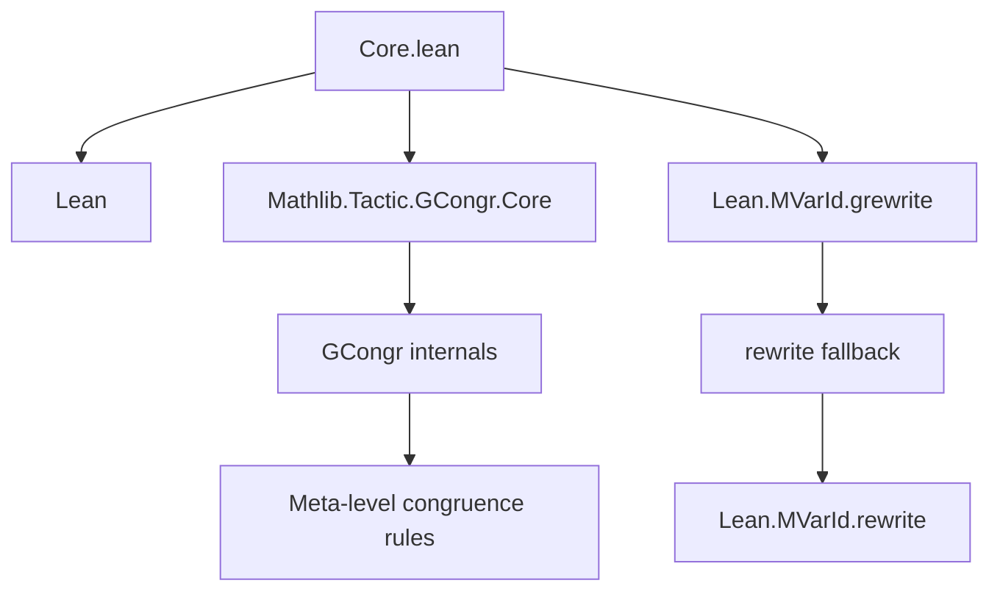

**Technical Brief: `Core.lean` — Core of the `grw`/`grewrite` Tactic**

---

### 1. **Key Definitions & Theorems**

| Name | Type / Signature | Purpose |
|------|------------------|---------|
| `GRewrite.dischargeMain` | `hrel : Expr → goal : MVarId → MetaM Bool` | Attempts to discharge the main `gcongr` goal using `hrel` via `gcongrForward`; throws if unsuccessful. |
| `GRewriteResult` | `structure` | Encapsulates the result of a `grewrite` step: new expression `eNew`, implication proof `impProof`, and side goals `mvarIds`. |
| `GRewrite.Config` | `structure extends Rewrite.Config` | Extends `rw` config with: <br> • `useRewrite : Bool` — fallback to `rw` for `Eq`/`Iff` <br> • `implicationHyp : Bool` — treat rule as implication (affects metavariable handling). |
| `_root_.Lean.MVarId.grewrite` | `goal : MVarId → e : Expr → hrel : Expr → forwardImp symm : Bool → config : GRewrite.Config → MetaM GRewriteResult` | Core rewriting function: rewrites `e` using relation `hrel : x ~ y`, constructs implication proof via `gcongr`, and returns updated expression and goals. |

---

### 2. **Naming Conventions**

- **Prefixes**:
  - `GRewrite.` — module-level namespace for rewrite-related utilities.
  - `grewrite` — tactic name (used in error messages and internal calls).
  - `dischargeMain` — discharge the main `gcongr` subgoal.
- **Suffixes**:
  - `Imp` — indicates implication direction (`forwardImp`, `mkImp`).
  - `Abst`, `eAbst` — abstracted expression (with `lhs` replaced by a binder).
  - `eNew`, `e'` — new expression and intermediate expression for `gcongr` goal.
- **Pattern**:
  - `lhs`, `rhs` — left/right-hand side of the relation `hrel`.
  - `symm` — symmetry flag (swap `lhs`/`rhs`).
  - `occs` — occurrence selector (inherited from `Rewrite.Config`).

---

### 3. **Tactic Stack**

Frequent tactics used *within* `grewrite`:

| Tactic | Role |
|--------|------|
| `gcongr` | Primary proof construction: builds implication proof by congruence closure. |
| `gcongrForward` | Used in `dischargeMain` to close the main goal. |
| `mkAppOptM`, `mkAppN`, `forallE`, `instantiate1`, `instantiateMVars` | Term construction and metavariable resolution. |
| `check`, `resolveBinderNameHint`, `cleanupAnnotations` | Well-typedness checks and normalization. |
| `withContext`, `withConfig`, `forallMetaTelescopeReducing`, `kabstract` | Context and configuration management. |
| `filterM`, `isAssigned`, `getMVarsNoDelayed` | Goal and metavariable post-processing. |

No high-level tactics like `aesop`, `ring`, or `simp` appear — this is a *low-level* tactic engine.

---

### 4. **Proof Logic / Algorithm Flow**

The `grewrite` algorithm follows this logical structure:

1. **Input validation**:
   - Ensure goal is unassigned.
   - Infer and normalize `hrel` type.
   - Parse implication arity if `implicationHyp`.

2. **Fallback to `rw`**:
   - If `hrel` is `Eq`/`Iff` and `useRewrite = true`, delegate to `goal.rewrite`.

3. **Pattern extraction**:
   - Extract `lhs`, `rhs` from relation using `GCongr.getRel`.
   - Swap if `symm = true`.

4. **Abstract occurrences**:
   - Use `kabstract` to abstract `lhs` in `e`, producing `eAbst`.
   - Fail if no occurrence found.

5. **Construct `eNew`**:
   - Instantiate `eAbst` with `rhs` → `eNew`.
   - Check well-typedness; throw helpful error if not.

6. **Build implication goal**:
   - Construct `imp := e' → eNew` (or reverse if `forwardImp = false`).
   - Create metavariable `gcongrGoal` for this implication.

7. **Discharge with `gcongr`**:
   - Run `gcongr` on `gcongrGoal`, using `dischargeMain` as main discharger.
   - Collect side goals.

8. **Post-process**:
   - Resolve metavariables, filter assigned/unassigned, collect dependencies of `hrel`.
   - Return `GRewriteResult`.

> **Note**: The algorithm mirrors `Lean.MVarId.rewrite` but adds `gcongr`-based implication proof generation. It does *not* recursively enter subterms (unlike `simp only`), hence limitations noted in the docstring.

---

### 5. **Imports & Dependencies**

| Import | Role |
|--------|------|
| `Lean` | Core metaprogramming infrastructure (`Meta`, `Expr`, `MVarId`, etc.). |
| `Mathlib.Tactic.GCongr.Core` | Provides `GCongr.getRel`, `mkHoleAnnotation`, and `gcongr` machinery. |

No other Mathlib modules are imported — this is a *minimal core* for generalized rewriting.

---

### 6. **Mermaid Diagrams**

#### **Dependency Graph**



#### **Overview of `grewrite` Workflow**

```mermaid
flowchart TD
  Start[Input: goal, e, hrel, config] --> CheckFallback{Eq/Iff & useRewrite?}
  CheckFallback -->|Yes| Fallback[goal.rewrite]
  CheckFallback -->|No| Extract[Extract lhs/rhs from hrel]
  Extract --> Abstract[kabstract e lhs → eAbst]
  Abstract --> CheckOcc{has occurrence?}
  CheckOcc -->|No| Fail1[Error: pattern not found]
  CheckOcc -->|Yes| Instantiate[eNew := eAbst[rhs]]
  Instantiate --> CheckType[check eNew]
  CheckType -->|Fail| Fail2[Error: ill-typed]
  CheckType -->|Success| BuildImp[mkImp e' eNew or eNew e']
  BuildImp --> GcongrGoal[Create gcongrGoal metavariable]
  GcongrGoal --> Gcongr[gcongr forwardImp []]
  Gcongr --> Discharge[dischargeMain hrel]
  Discharge -->|Success| CollectGoals[Collect side goals]
  CollectGoals --> PostProc[Post-process metavariables]
  PostProc --> Return[Return GRewriteResult]
```

---

### 7. **Limitations & Future Work (per docstring)**

- ❌ May produce ill-typed results (no deep well-typedness check).
- ❌ Cannot detect which occurrences are rewriteable via `gcongr`.
- ❌ Cannot rewrite bound variables (no `simp only`-style traversal).
- ✅ Workaround: use `nth_grw` for precise control.

---

**End of Technical Brief**
