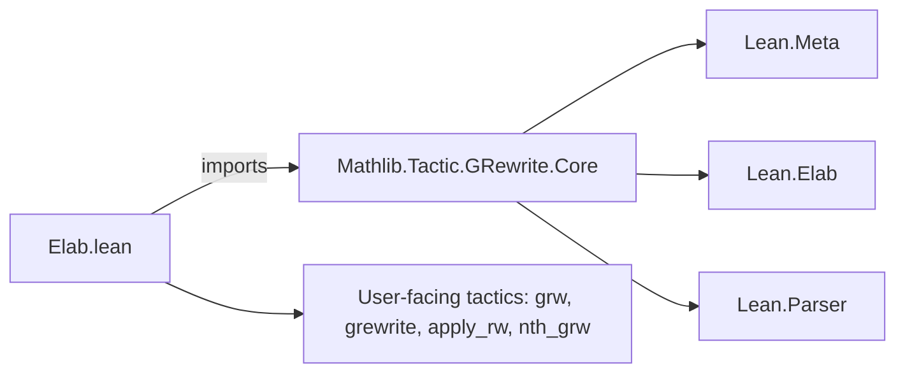

**Technical Brief: `Elab.lean` — Generalized Rewriting Tactics in Lean 4**

---

### 1. **Key Definitions & Theorems**

| Name | Type / Signature | Purpose |
|------|------------------|---------|
| `grewriteTarget` | `Syntax → Bool → GRewrite.Config → TacticM Unit` | Applies `grewrite` to the main goal (i.e., the conclusion). |
| `grewriteLocalDecl` | `Syntax → Bool → FVarId → GRewrite.Config → TacticM Unit` | Applies `grewrite` to a local hypothesis (identified by `FVarId`). |
| `elabGRewriteConfig` | `ConfigElab GRewrite.Config` | Elaborates configuration syntax for `grewrite`/`grw`. |
| `evalGRewriteSeq` | `Tactic` | Elaborator for the `grewrite` tactic syntax (`grewrite [e]`). |
| `grwSeq` macro | `tactic` | Syntactic sugar for `grw`, which is `grewrite` + `rfl`-closure. |
| `applyRwSeq` macro | `tactic` | Shorthand for `grewrite +implicationHyp`. |
| `nth_grewrite`, `nth_grw` macros | `tactic` | Positional variants of `grewrite`/`grw`, analogous to `nth_rewrite`. |

> **Note**: The core rewriting logic resides in `Mathlib.Tactic.GRewrite.Core`, which defines the low-level `grewrite` method on metavariables. This file (`Elab.lean`) provides the *user-facing tactic interface*.

---

### 2. **Naming Conventions**

- **Prefixes**:
  - `grewrite*`: Core rewriting logic (goal or local decl).
  - `grw*`: User-facing shorthand (with `rfl`-closure).
  - `nth_*`: Positional rewriting.
  - `apply_*`: Rewriting with implication hypotheses (via `+implicationHyp`).
- **Suffixes**:
  - `Target`: Applies to the main goal (conclusion).
  - `LocalDecl`: Applies to a local hypothesis.
  - `Seq`: Sequence-based tactic (e.g., `rwRuleSeq`).
- **Configuration**:
  - `elabGRewriteConfig`: Elaborates config (e.g., `transparency`, `occs`).
  - `optConfig`: Optional config argument in syntax.

---

### 3. **Tactic Stack**

Frequently used tactics & utilities in this file:

| Tactic / Utility | Role |
|------------------|------|
| `withSynthesize` | Ensures typeclass inference runs before elaboration. |
| `Term.withSynthesize` | Same, but scoped to term elaboration. |
| `elabTerm` | Elaborates syntax to `Expr`. |
| `getMainGoal`, `replaceMainGoal`, `assign` | Goal manipulation. |
| `withLocation` | Handles `at *`, `at h`, etc. |
| `with_annotate_state` | Annotates state after tactic (used in `grw` macro). |
| `try (with_reducible rfl)` | Attempts to close with `rfl` (used in `grw`). |
| `throwAbortTactic`, `throwTacticEx` | Error handling. |
| `expandOptLocation`, `withRWRulesSeq` | Helper utilities for rule application. |

---

### 4. **Proof Logic Flow**

The core logic of `grewrite`/`grw` follows this pattern:

1. **Elaborate input**:
   - Parse syntax (`stx`) into an expression `e`.
   - Check for synthetic `sorry` (abort if found).
2. **Determine target**:
   - For `grewriteTarget`: use `goal.getType`.
   - For `grewriteLocalDecl`: use `localDecl.type`.
3. **Call backend**:
   - `goal.grewrite target e (forwardImp := _) (symm := _) (config := _)`
   - Returns `r : {eNew : Expr, impProof : Expr, mvarIds : List MVarId}`
4. **Construct new goal(s)**:
   - For goal: assign `r.impProof` to the new metavariable and replace.
   - For local decl: build proof term `.app r.impProof (.fvar fvarId)` and `replace`.
5. **Return new metavariable IDs** as subgoals.

> **Symmetry**: `symm = true` means rewrite backwards (LHS ← RHS), like `← e`.

---

### 5. **Imports & Dependencies**

| Import | Purpose |
|--------|---------|
| `Mathlib.Tactic.GRewrite.Core` | Backend: defines `grewrite` method on metavariables, `GRewrite.Config`, and `gcongr` infrastructure. |
| `Lean.Meta`, `Lean.Elab`, `Lean.Tactic`, `Lean.Parser` | Core elaboration & tactic infrastructure. |
| `open Lean Meta Elab Parser Tactic` | Convenience imports. |

> **Key dependency**: `gcongr` lemmas (tagged with `@[gcongr]`) and `IsTrans` instances are required for `grw` to work on non-equality relations.

---

### 6. **Mermaid Diagrams**

#### **Dependency Graph (Module-Level)**



#### **Tactic Flow Overview**

```mermaid
flowchart TD
  S[Syntax: grw [e] at h] --> E[elabTerm]
  E -->|e| B{grewriteTarget?}
  B -->|yes| G[getMainGoal]
  B -->|no| D[get localDecl]
  G --> C[grewrite goal.type e]
  D --> C
  C --> R{symm?}
  R -->|true| L[rewrite LHS ← RHS]
  R -->|false| R2[rewrite LHS → RHS]
  C --> P[impProof, eNew, mvarIds]
  P --> A[assign / replace]
  A --> M[replaceMainGoal]
```

#### **Relation to Core Theory**

- `grewrite` extends `rw` to arbitrary relations (`<`, `≤`, `∣`, `≡ [ZMOD n]`, etc.).
- Requires:
  - `@[gcongr]` lemmas for congruence closure.
  - `IsTrans` instances for transitivity-based rewriting.
- `grw` = `grewrite` + `rfl`-closure (like `rewrite` vs `rw`).
- `apply_rw` = `grewrite` + `+implicationHyp` (rewrites using implication hypotheses).

---

### 7. **Summary**

This file (`Elab.lean`) provides the **tactic elaboration layer** for Lean’s generalized rewriting system (`grw`). It wraps the backend in `Mathlib.Tactic.GRewrite.Core` with user-friendly syntax and semantics, enabling rewriting over non-equality relations while preserving Lean’s proof-term discipline. The design mirrors `rw`/`rewrite` but generalizes to arbitrary relations via `gcongr` and `IsTrans`.
