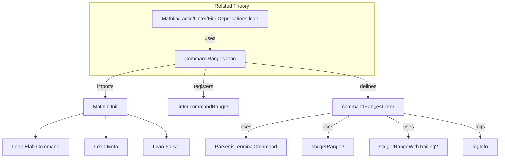

**Technical Brief: `CommandRanges.lean`**

---

### 1. KEY DEFINITIONS & THEOREMS

| Name | Type | Purpose |
|------|------|---------|
| `linter.commandRanges` | `Option Bool` | Configuration flag to enable/disable the `commandRanges` linter. Default: `false`. |
| `CommandRanges.commandRangesLinter` | `Linter` | The actual linter implementation: logs position ranges for non-terminal commands when enabled. |
| `CommandRanges.commandRangesLinter.run` | `Syntax → CoreM Unit` | Core logic: checks linter flag, skips terminal commands, computes and logs `getRange?` and `getRangeWithTrailing?` positions. |

> **Note**: No theorems are proven here—this is a *tactic/linter* module, not a mathematical theory.

---

### 2. NAMING CONVENTIONS

- **Prefixes**:
  - `linter.` — for option names (`linter.commandRanges`)
  - `commandRanges` — module and linter name (consistent with linter naming pattern in `Mathlib.Linter`)
- **Suffixes**:
  - `Linter` — suffix for linter definitions (`commandRangesLinter`)
- **Internal naming**:
  - `stx` — standard Lean convention for `Syntax`
  - `rg` — abbreviation for `range`
  - `ranges` — array of `String.Pos.Raw` (raw positions)

---

### 3. TACTIC STACK

The linter uses **no Lean tactics** (e.g., `intro`, `rw`, `simp`). Instead, it relies on:

- **Core monadic operations**: `do`, `unless`, `if let`, `return`
- **Lean Meta API**:
  - `Linter.getLinterValue`
  - `getLinterOptions`
  - `Parser.isTerminalCommand`
  - `stx.getRange?`, `stx.getRangeWithTrailing?`
  - `logInfo`
  - `addLinter`
- **Array operations**: `#[...]`, `.push`

No `aesop`, `ring`, `simp`, or `conv` tactics appear.

---

### 4. PROOF LOGIC

This module contains **no proofs**. It is a *runtime linter* implementation.

**Execution flow**:
1. Check if `linter.commandRanges` is enabled.
2. Skip if the syntax node is a terminal command (e.g., `#exit`, `#quit`).
3. Compute:
   - `rg1 = stx.getRange?` → `[start, end]` (excludes trailing whitespace/comments)
   - `rg2 = stx.getRangeWithTrailing?` → extends to syntactic end (includes trailing tokens)
4. Log the combined array: `[start, end, trailing]` (if both ranges exist).

Assumes no manipulation of source positions or synthetic syntax.

---

### 5. IMPORTS

| Import | Role |
|--------|------|
| `Mathlib.Init` | Provides core Lean infrastructure (e.g., `CoreM`, `Linter`, `Syntax` APIs). |
| `Lean.Elab.Command` | Implicitly via `Mathlib.Init`; needed for `Parser.isTerminalCommand`, `getRange?`, etc. |
| `Lean.Meta` | Indirectly via `Mathlib.Init`; used for `logInfo`, `CoreM`. |

> No heavy dependencies (e.g., `Mathlib.Data.*`, `Mathlib.Tactic.*`) — this is a low-level utility.

---

### 6. DEPENDENCY & OVERVIEW DIAGRAM

#### Overview

- **Purpose**: Instrumentation linter for precise source-range extraction of commands.
- **Use case**: Supports `#clear_deprecations` automation by identifying exact syntactic spans of deprecated declarations.
- **Scope**: Purely syntactic — no semantic analysis.
- **Integration**: Tightly coupled with `FindDeprecations.lean`, but self-contained and side-effect-free (only logs).

---

### 7. KEY INSIGHTS

- The linter assumes **stable source positions** — any tampering (e.g., via `synthetic` syntax) may break the `trailing = next.start` invariant.
- Designed for **offline tooling**, not interactive use — output is `logInfo`, not user-facing warnings.
- Minimal footprint: no dependencies beyond core Lean + Mathlib infrastructure.

--- 

Let me know if you'd like a formalized specification of the range semantics or a test harness for this linter.
