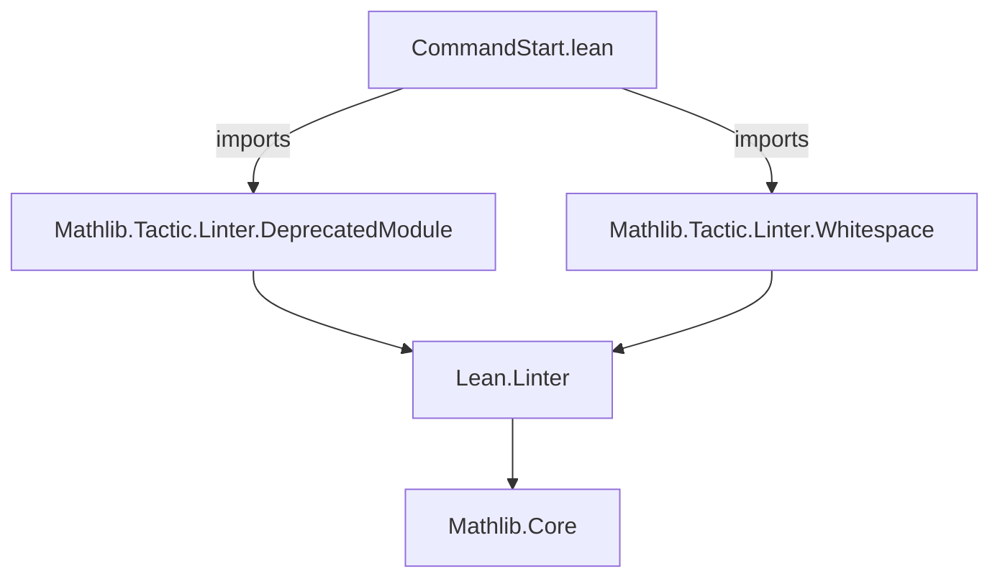
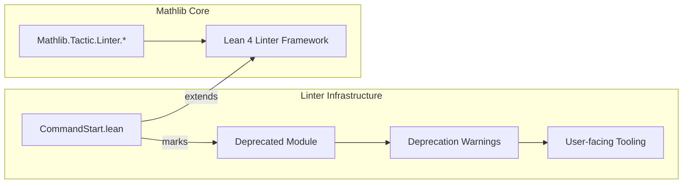

```markdown
# Technical Metadata Brief: `CommandStart.lean`

## 1. Key Definitions & Theorems  
- **`deprecated_module`**: A *command* (not a definition or theorem) used to mark the current module as deprecated.  
  - **Type**: `deprecated_module (since := "2026-01-07")`  
  - **Purpose**: Informs the Lean 4 linter and tooling that this module is deprecated as of the specified date (`2026-01-07`), triggering warnings when imported or used.

> ⚠️ *Note*: This file contains no definitions or theorems—only a single top-level command.

---

## 2. Naming Conventions  
- **Prefixes/Suffixes**: None applicable (no user-defined identifiers).  
- **Command syntax**: Uses named argument syntax `(since := "2026-01-07")`, consistent with Lean 4’s attribute/command style (e.g., `@[deprecated]`, `@[simproc]`).

---

## 3. Tactic Stack  
- **Tactics used**: None (no proofs or tactic blocks present).  
- **Linter imports**:  
  - `Mathlib.Tactic.Linter.DeprecatedModule` — provides the `deprecated_module` command.  
  - `Mathlib.Tactic.Linter.Whitespace` — likely imported for whitespace linting, though unused in this snippet.

---

## 4. Proof Logic  
- **Not applicable** — no proofs or logical reasoning occur in this file.

---

## 5. Imports  
- `Mathlib.Tactic.Linter.DeprecatedModule`  
- `Mathlib.Tactic.Linter.Whitespace`  
- *(Implicit)* `Lean` core (via `module` declaration and command infrastructure).

> 🔍 **Scope**: This module belongs to the *Mathlib linter infrastructure*, specifically for managing deprecation metadata.

---

## 8. Dependency & Theory Overview  

### Mermaid Diagram: Module Dependencies  


### Mermaid Diagram: Theory Context  


### Overview  
- **Purpose**: This file is a minimal placeholder or stub module used to trigger deprecation warnings for legacy code paths.  
- **Role in Mathlib**: Part of the *linter ecosystem* ensuring backward-compatibility hygiene—specifically, it flags modules that should no longer be used.  
- **Future Use**: Likely a temporary or transitional artifact (e.g., a migration stub before full removal), given the future `since` date (`2026-01-07`).
```
