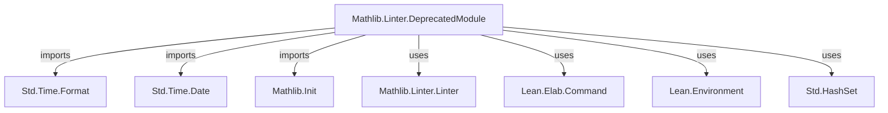
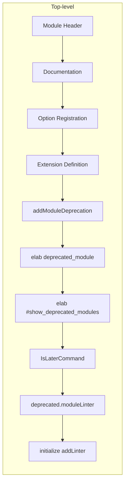
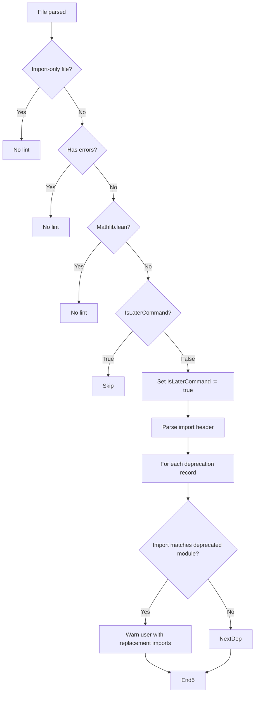

**Technical Brief: `DeprecatedModule.lean`**

---

### 1. KEY DEFINITIONS & THEOREMS

| Name | Type / Kind | Purpose |
|------|-------------|---------|
| `linter.deprecated.module` | `Option Bool → Options → Bool` (via `register_option`) | Configurable switch to enable/disable the `deprecated.module` linter. Default: `true`. |
| `deprecatedModuleExt` | `SimplePersistentEnvExtension (Name × Array Name × Option String) (HashSet _)` | Global environment extension storing deprecation records: `(deprecated_module, preferred_modules, optional_msg)`. |
| `addModuleDeprecation` | `m Unit [Monad m] [MonadEnv m]` | Adds current module’s deprecation info to `deprecatedModuleExt`, filtering out `Init` and self-imports. |
| `deprecated_modules` (elab command) | `CommandElabM Unit` | Elaborates `deprecated_module "msg" (since := "yyyy-mm-dd")` syntax, registers deprecation, and disables linter in the deprecating file. |
| `#show_deprecated_modules` (elab command) | `CommandElabM Unit` | Prints all registered deprecations in human-readable format. |
| `IsLaterCommand` | `IO.Ref Bool` | Tracks whether a non-import command has been processed in the current file; used to ensure deprecation checks run only once per file. |
| `deprecated.moduleLinter` | `Linter` | Main linter implementation: checks imports against `deprecatedModuleExt`, emits warnings if deprecated modules are imported. |

---

### 2. NAMING CONVENTIONS

- **Prefixes**:
  - `linter.deprecated.module` — option name for enabling/disabling.
  - `deprecatedModuleExt` — extension name (camelCase, `Ext` suffix).
  - `addModuleDeprecation` — action verb + target (`add...Deprecation`).
  - `IsLaterCommand` — predicate-style name (`Is...`) for stateful flag.

- **Suffixes**:
  - `Ext` — for `SimplePersistentEnvExtension` instances.
  - `Linter` — for linter definitions (`deprecated.moduleLinter`).
  - `Command` — for stateful flags (`IsLaterCommand`).

- **Syntax**:
  - `deprecated_module` — user-facing command (snake_case).
  - `#show_deprecated_modules` — diagnostic command (prefixed with `#`).

---

### 3. TACTIC STACK

This file is **meta/implementation-level**, so it uses **elaborator tactics** and **Lean metaprogramming utilities**, not proof tactics:

| Tactic / Utility | Usage |
|------------------|-------|
| `elab` / `elabCommand` | To define custom syntax (`deprecated_module`, `#show_deprecated_modules`). |
| `modifyEnv`, `getEnv`, `getMainModule` | Environment introspection/modification. |
| `filterMap`, `foldl`, `fold` | Collection transformations over imports and deprecations. |
| `IO.mkRef`, `IO.Ref.get`, `IO.Ref.set` | Mutable state for `IsLaterCommand`. |
| `withSetOptionIn` | Temporarily sets options (e.g., disables linter in deprecating file). |
| `logInfo`, `throwError` | Diagnostic output and error reporting. |
| `Parser.parseHeader`, `getImportIds` | Parse import header and extract module names. |
| `mkNullNode`, `` `(set_option ...) `` | AST construction for embedded commands. |

No proof tactics (`simp`, `rw`, `induction`, etc.) are used.

---

### 4. PROOF LOGIC

Not applicable — this is **not a proof file**. It is a **metaprogramming module** implementing a linter.

**Execution flow** of the linter:
1. On file parse, `IsLaterCommand` starts as `false`.
2. When first non-import command is processed, `IsLaterCommand.set true`.
3. At end-of-file, if `IsLaterCommand = true`, the linter:
   - Skips if errors exist or file is `Mathlib.lean`.
   - Parses import header.
   - Checks each imported module against `deprecatedModuleExt`.
   - Emits warning if match found, suggesting replacement imports.

---

### 5. IMPORTS

| Module | Role |
|--------|------|
| `Std.Time.Format`, `Std.Time.Date` | Parse and validate `since := "yyyy-mm-dd"` date. |
| `Mathlib.Init` | Core Lean + Mathlib initialization (required for `Lean`/`Elab`/`Linter`). |
| `Std.Time.PlainDate` | Used in `Std.Time.PlainDate.fromLeanDateString`. |

> Note: `Mathlib/Tactic/Linter/DeprecatedModule.lean` is *self-imported* in the `addModuleDeprecation` filter, but only to avoid registering itself as deprecated.

---

### 6. DEPENDENCY & OVERVIEW DIAGRAMS

#### 📦 Module Dependency Graph (simplified)



#### 🧠 Overview of File Structure



#### 🔄 Linter Execution Flow



---

### 7. USAGE EXAMPLE (from docstring)

```lean
-- File: Mathlib/Test/Deprecated.lean
import Mathlib.Tactic.Linter.DocPrime
import Mathlib.Tactic.Linter.DocString

deprecated_module "This module is split" (since := "2025-04-01")
```

Any file with `import Mathlib.Test.Deprecated` will get:

```
'Mathlib.Test.Deprecated' has been deprecated: please replace this import by

import Mathlib.Tactic.Linter.DocPrime
import Mathlib.Tactic.Linter.DocString
```

---

### 8. DESIGN NOTES

- **Idempotency**: `IsLaterCommand` ensures linter runs only once per file.
- **Self-exclusion**: The current file (`DeprecatedModule.lean`) is filtered out to avoid self-deprecation.
- **Safety**: Skips files with errors or `Mathlib.lean` (auto-generated).
- **Extensibility**: `deprecatedModuleExt` is a persistent environment extension, so deprecations survive across files and builds.

--- 

Let me know if you'd like a formal specification of the linter semantics or a test suite sketch.
