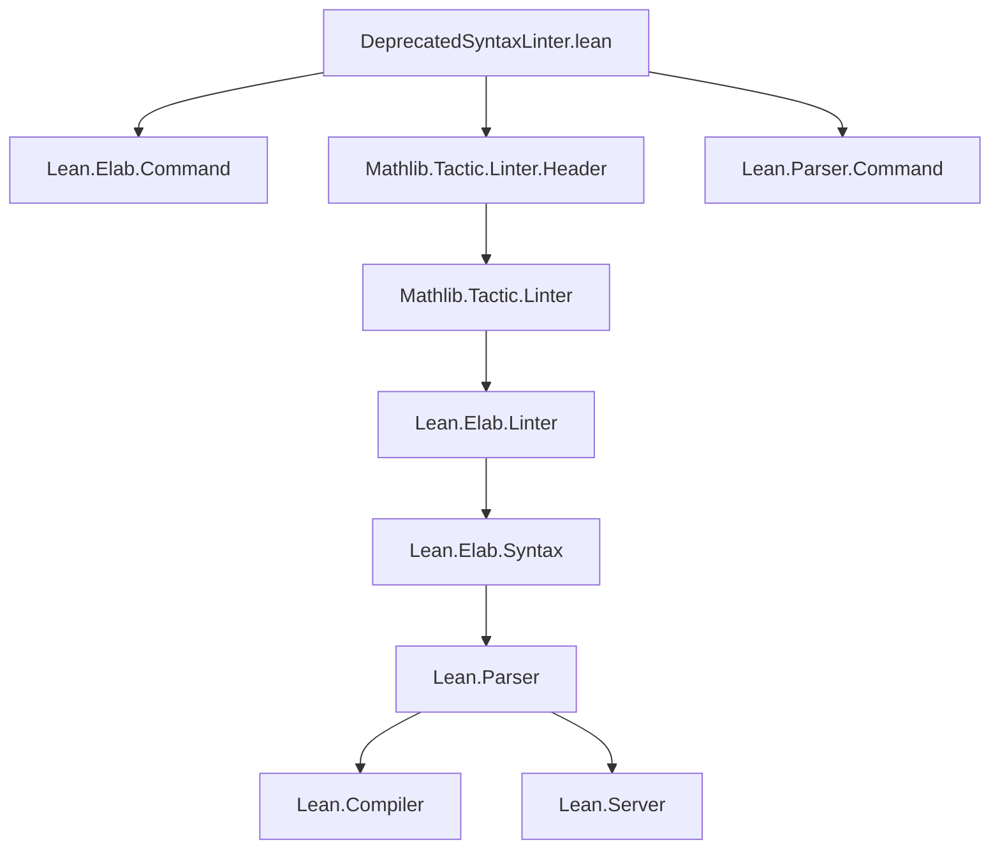

**Technical Brief: `DeprecatedSyntaxLinter.lean`**

---

### 1. KEY DEFINITIONS & THEOREMS

| Name | Type | Purpose |
|------|------|---------|
| `linter.style.refine` | `Option Bool` | Controls whether usage of `refine'` triggers a linter warning. |
| `linter.style.cases` | `Option Bool` | Controls whether usage of `cases'` triggers a linter warning. |
| `linter.style.induction` | `Option Bool` | Controls whether usage of `induction'` triggers a linter warning. |
| `linter.style.admit` | `Option Bool` | Controls whether usage of `admit` triggers a linter warning. |
| `linter.style.nativeDecide` | `Option Bool` | Controls whether usage of `native_decide` or `decide +native` triggers a linter warning. |
| `linter.style.maxHeartbeats` | `Option Bool` | Controls whether `set_option ... maxHeartbeats ...` without a comment triggers a linter warning. |
| `getSetOptionMaxHeartbeatsComment` | `Syntax → Option (Name × Nat × Substring.Raw)` | Extracts option name, numeric value, and trailing comment from `set_option ... maxHeartbeats ... in ...` syntax. |
| `isDecideNative` | `Syntax → Bool` | Detects whether a `decide` tactic call uses the `native` configuration (e.g., `decide +native`). |
| `getDeprecatedSyntax` | `Syntax → Array (SyntaxNodeKind × Syntax × MessageData)` | Recursively traverses syntax tree and collects all deprecated syntax usages with diagnostic messages. |
| `deprecatedSyntaxLinter` | `Linter` | Main linter entrypoint: runs `getDeprecatedSyntax`, filters by enabled options, and logs warnings via `Linter.logLintIf`. |
| `initialize addLinter deprecatedSyntaxLinter` | `IO Unit` | Registers the linter with Lean’s linter infrastructure. |

---

### 2. NAMING CONVENTIONS

- **Prefixes**:
  - `linter.style.` — for option names (e.g., `linter.style.refine`)
  - `get...` — for extraction/parsing functions (`getSetOptionMaxHeartbeatsComment`)
  - `is...` — for boolean predicates (`isDecideNative`)
- **Suffixes**:
  - `'` — used in deprecated tactic names (`refine'`, `cases'`, `induction'`)
  - `Linter` — for linter definitions (`deprecatedSyntaxLinter`)
- **Module/namespace**:
  - `Mathlib.Linter.Style` — all linter logic lives here.

---

### 3. TACTIC STACK

The file is **not tactic-based** — it is a *meta-level* linter implemented in Lean’s metaprogramming framework.

- **Core tactics used in linter logic (not in proofs)**:
  - `withSetOptionIn` — to evaluate `set_option` blocks before linting.
  - `Linter.logLintIf` — conditional logging of linter warnings.
  - `getLinterValue` — to check if a linter option is enabled.
  - `stx.find?`, `stx.getTrailing?`, `stx.getId`, `stx.getAtomVal` — syntax introspection utilities.
  - Pattern matching on syntax trees (`match stx with | .node ... | ...`)

No proof tactics (`aesop`, `ring`, `simp`, etc.) appear — this is purely a *static analysis* tool.

---

### 4. PROOF LOGIC

This is **not a proof file** — it is a *linter implementation*. Its logic flow is:

1. **Option check**: If *none* of the linter options are enabled, exit early.
2. **Error guard**: Skip linting if the file already has errors (to avoid noise).
3. **Syntax traversal**: `getDeprecatedSyntax` recursively walks the syntax tree:
   - Matches on tactic/command syntax nodes (`refine'`, `cases'`, `induction'`, `admit`, `decide`, `native_decide`, `set_option ... maxHeartbeats`).
   - For each match, appends a diagnostic message to the result array.
4. **Conditional logging**:
   - For each detected deprecated syntax, `Linter.logLintIf` logs a warning *only if* the corresponding linter option is enabled.
5. **Special handling**:
   - `maxHeartbeats`: filters out duplicate `MaxHeartbeats` entries, only flags the outermost one *if* no comment follows `in`.
   - `decide`: checks config args for `+native`/`-native` or `{native := ...}`.

---

### 5. IMPORTS

| Import | Purpose |
|--------|---------|
| `Lean.Elab.Command` | For command elaboration and syntax manipulation. |
| `Mathlib.Tactic.Linter.Header` | Ensures valid copyright/module header (via `shake: keep`). |
| `Lean.Parser.Command` | For parsing command syntax (e.g., `set_option`). |
| `open Lean Elab Linter` | Brings key types/tactics into scope (`Syntax`, `Linter`, `logLintIf`, etc.). |

---

### 6. DEPENDENCY DIAGRAM (Mermaid)

**Overview**:  
The linter is a *self-contained module* that depends on Lean’s parser, elaborator, and linter infrastructure. It does not depend on core mathlib theorems — only on meta-level utilities.

---

### 7. THEORY OVERVIEW

This file implements a **static analysis linter** for detecting deprecated Lean 3–style syntax in Lean 4 codebases (especially mathlib). Its purpose is *not* to enforce correctness, but to encourage modern, readable, and safe tactics:

- **Deprecation rationale**:
  - `refine'` → `refine`/`apply`: better metavariable handling & readability.
  - `cases'`/`induction'` → `cases`/`obtain`/`rcases`: case-separated variable binding improves clarity.
  - `admit` → `sorry`: stylistic preference.
  - `native_decide`/`decide +native`: unsafe (bypasses kernel trust).
  - `set_option ... maxHeartbeats`: requires justification to avoid performance regressions.

- **Design philosophy**:
  - **Opt-in**: Each linter is disabled by default (`defValue := false`).
  - **Non-blocking**: Reports warnings, not errors.
  - **Context-aware**: Handles `set_option` scoping and config parsing.

---

### 8. SUMMARY

This is a **meta-programming module** implementing a configurable linter to discourage use of deprecated Lean 3 tactics and unsafe constructs in Lean 4. It leverages Lean’s syntax tree API to detect and warn about patterns like `refine'`, `cases'`, `admit`, `native_decide`, and `set_option maxHeartbeats` without comments — all while respecting user preferences via `register_option`.
